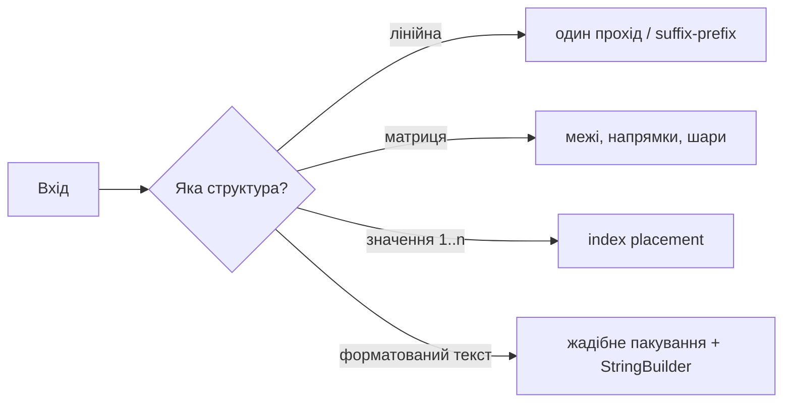

# 01. Масиви та рядки

[← Індекс](README.md) · Код: [`src/topic01_arrays_strings`](../../src/topic01_arrays_strings)

## Що ви повинні вміти після цього уроку

Після читання не потрібно пам’ятати всі реалізації напам’ять. Важливіше навчитися дивитися на умову й ставити правильні питання:

- Чи достатньо одного проходу з кількома змінними?
- Чи залежить відповідь для позиції `i` від усього, що було ліворуч або праворуч?
- Чи можна використати сам масив як місце для збереження стану?
- Чи задача про координати матриці, а отже треба явно контролювати межі та напрямок?
- Чи рядок треба лише прочитати, чи побудувати новий?
- Чи є в умові слова «без додаткової пам’яті», «in-place», «за один прохід»?

Це фундаментальна тема. Масиви зустрічаються й усередині hash table, heap, dynamic programming, graph adjacency lists та багатьох інших структур.

## 1. Масив із самого початку

Уявіть ряд пронумерованих комірок:

```algoviz
{
  "type": "array",
  "title": "Як індекс указує на комірку масиву",
  "values": [7, 12, -3, 8, 5],
  "steps": [
    {
      "label": "Починаємо з першої комірки: nums[0] = 7",
      "note": "Індекс — це адреса позиції, а 7 — значення, записане за цією адресою.",
      "pointer": 0,
      "prediction": {
        "prompt": "Який індекс буде наступним при русі зліва направо?",
        "options": ["0", "1", "4", "5"],
        "answer": 1,
        "explanation": "Після i=0 звичайний for-loop збільшує i на один."
      }
    },
    {
      "label": "Переходимо до nums[1] = 12",
      "note": "Щоб прочитати елемент, Java одразу обчислює адресу потрібної комірки.",
      "pointer": 1,
      "visited": [0],
      "prediction": {
        "prompt": "Яке значення прочитає nums[2]?",
        "options": ["12", "-3", "8", "Помилка"],
        "answer": 1,
        "explanation": "Індекс 2 адресує третю комірку зі значенням -3."
      }
    },
    {
      "label": "nums[2] містить від’ємне значення -3",
      "note": "Індекс не залежить від самого значення: позиція 2 залишається позицією 2.",
      "pointer": 2,
      "visited": [0, 1],
      "prediction": {
        "prompt": "Який порядковий номер має елемент з індексом 3?",
        "options": ["Третій", "Четвертий", "П’ятий", "Нульовий"],
        "answer": 1,
        "explanation": "Через zero-based indexing порядковий номер дорівнює index + 1."
      }
    },
    {
      "label": "nums[3] = 8 — це четверта комірка",
      "note": "Лічба індексів починається з нуля, тому порядковий номер на один більший.",
      "pointer": 3,
      "visited": [0, 1, 2],
      "prediction": {
        "prompt": "Який останній валідний індекс масиву довжини 5?",
        "options": ["3", "4", "5", "6"],
        "answer": 1,
        "explanation": "Останній індекс завжди length - 1."
      }
    },
    {
      "label": "Останній валідний індекс — length - 1 = 4",
      "note": "Для масиву довжини 5 звернення nums[5] уже вийде за межі масиву.",
      "pointer": 4,
      "visited": [0, 1, 2, 3]
    }
  ]
}
```

Індекс — це адреса комірки. Саме тому `nums[3]` читається за `O(1)`: програмі не треба переглядати попередні елементи. Але вставити значення на початок складно: усі інші елементи треба посунути, тому операція коштує `O(n)`.

У задачах важливо розділяти:

- **значення** — що лежить у комірці;
- **індекс** — де воно лежить;
- **довжину** — кількість комірок;
- **останній валідний індекс** — `length - 1`.

Звідси походить більшість `off-by-one` помилок. Якщо довжина дорівнює 5, індексу 5 не існує.

## 2. Перший універсальний інструмент: один прохід

Почнемо із задачі Highest Altitude. Стартова висота — 0. Наївно можна створити новий масив усіх висот, а потім шукати максимум. Але майбутньому потрібні лише дві речі: поточна висота та найвища побачена.

```algoviz
{
  "type": "array",
  "title": "Один прохід: стан стискає весь префікс",
  "values": [-5, 1, 5, 0, -7],
  "steps": [
    {"label": "Перед циклом current=0, best=0", "pointer": 0},
    {"label": "delta=-5 → current=-5, best=0", "pointer": 0, "visited": [0]},
    {"label": "delta=1 → current=-4, best=0", "pointer": 1, "visited": [0, 1]},
    {"label": "delta=5 → current=1, best=1", "pointer": 2, "visited": [0, 1, 2], "prediction": {"prompt": "Чи потрібен масив усіх проміжних висот, щоб продовжити?", "options": ["Так", "Ні, достатньо current і best"], "answer": 1, "explanation": "Майбутні рішення залежать лише від поточної висоти та найкращої вже побаченої."}},
    {"label": "delta=0 → current=1, best=1", "pointer": 3, "visited": [0, 1, 2, 3]},
    {"label": "delta=-7 → current=-6; відповідь best=1", "pointer": 4, "visited": [0, 1, 2, 3, 4]}
  ]
}
```

```java
int current = 0;
int best = 0;
for (int delta : gain) {
    current += delta;
    best = Math.max(best, current);
}
return best;
```

Після кожної ітерації істинне твердження: `current` дорівнює висоті після вже прочитаних змін, а `best` — максимуму серед усіх уже відвіданих висот. Це і є **інваріант циклу**.

### Як упізнати такий тип задачі

Шукайте формулювання «найбільший/найменший елемент», «порахувати», «чи виконується властивість для всіх», «поточний баланс». Спершу спробуйте один прохід і невеликий агрегований стан: `sum`, `count`, `min`, `max`, кілька boolean-прапорців.

## 3. Коли треба знати майбутнє: prefix і suffix

У Replace Elements кожну позицію треба замінити найбільшим значенням **праворуч**. Якщо для кожного `i` щоразу переглядати правий хвіст, отримаємо `O(n²)`.

Краще йти справа наліво. Змінна `rightMax` стискає весь уже пройдений суфікс до одного числа.

```algoviz
{
  "type": "array",
  "title": "Суфіксний максимум без додаткового масиву",
  "values": [17, 18, 5, 4, 6, 1],
  "steps": [
    {"label": "rightMax=-1; починаємо з кінця", "pointer": 5},
    {"label": "Записуємо -1; з оригінального 1 оновлюємо rightMax=1", "pointer": 5, "values": [17,18,5,4,6,-1], "visited": [5]},
    {"label": "Записуємо 1; rightMax стає 6", "pointer": 4, "values": [17,18,5,4,1,-1], "visited": [4,5]},
    {"label": "Для 4 і 5 відповідь дорівнює 6", "pointer": 2, "values": [17,18,6,6,1,-1], "visited": [2,3,4,5]},
    {"label": "На 18 записуємо 6, а rightMax стає 18", "pointer": 1, "values": [17,6,6,6,1,-1], "visited": [1,2,3,4,5], "prediction": {"prompt": "Що запишемо на індекс 0?", "options": ["17", "18", "6"], "answer": 1, "explanation": "Увесь суфікс праворуч від 0 уже стиснуто до rightMax=18."}},
    {"label": "Результат [18,6,6,6,1,-1]", "pointer": 0, "values": [18,6,6,6,1,-1], "visited": [0,1,2,3,4,5]}
  ]
}
```

Важливий порядок: спочатку зберегти старе `nums[i]`, потім записати відповідь, лише після цього оновити `rightMax`. Інакше оригінальне значення буде втрачено.

### Product Except Self як дві половини інформації

Для позиції `i` потрібен добуток усіх ліворуч і всіх праворуч:

```text
nums   = [1, 2, 3, 4]
left   = [1, 1, 2, 6]
right  = [24,12,4, 1]
answer = [24,12,8, 6]
```

```algoviz
{
  "type": "array",
  "title": "Два проходи Product Except Self",
  "values": [1, 2, 3, 4],
  "steps": [
    {"label": "Prefix pass записує нейтральну 1 на index 0", "pointer": 0, "values": [1,0,0,0]},
    {"label": "Ліві добутки готові: [1,1,2,6]", "pointer": 3, "values": [1,1,2,6], "visited": [0,1,2,3]},
    {"label": "Suffix=1: answer[3] залишається 6", "pointer": 3, "values": [1,1,2,6]},
    {"label": "Suffix=4: answer[2] стає 8", "pointer": 2, "values": [1,1,8,6], "visited": [2,3]},
    {"label": "Suffix=12: answer[1] стає 12", "pointer": 1, "values": [1,12,8,6], "visited": [1,2,3], "prediction": {"prompt": "Що містить suffix перед index 0?", "options": ["1", "4", "24"], "answer": 2, "explanation": "Це добуток усіх елементів строго праворуч: 2×3×4."}},
    {"label": "Фінальна відповідь [24,12,8,6]", "pointer": 0, "values": [24,12,8,6], "visited": [0,1,2,3]}
  ]
}
```

Окремі `left[]` та `right[]` зрозумілі, але займають `O(n)` додаткової пам’яті. Оптимізація приходить лише після розуміння базової версії: записати left products одразу в answer, а right product тримати в одній змінній під час зворотного проходу.

Слова-ознаки: «для кожної позиції все ліворуч/праворуч», «range без поточного елемента», «не можна використовувати ділення». Кандидати: prefix/suffix arrays або два проходи зі стисненою пам’яттю.

## 4. Масив як карта: index placement

Розглянемо `nums = [3, 4, -1, 1]`. Потрібне найменше відсутнє додатне число.

Спочатку корисно довести межу відповіді. Для масиву довжини `n`:

- якщо присутні `1,2,...,n`, відповідь `n+1`;
- інакше відповідь — одна з позицій `1..n`.

Отже числа `<1` та `>n` не впливають. А число `x` із `1..n` має природну комірку `x-1`:

```text
значення 1 → індекс 0
значення 2 → індекс 1
значення 3 → індекс 2
```

```algoviz
{
  "type": "sorting",
  "title": "Index placement перетворює значення на адресу",
  "values": [3, 4, -1, 1],
  "steps": [
    {"label": "3 має адресу 2 — міняємо індекси 0 і 2", "pointers": {"i": 0, "target": 2}, "compare": [0,2]},
    {"label": "Стан [-1,4,3,1]; 3 уже на своєму місці", "pointer": 0, "values": [-1,4,3,1], "visited": [2]},
    {"label": "4 має адресу 3 — міняємо індекси 1 і 3", "pointers": {"i": 1, "target": 3}, "values": [-1,1,3,4], "visited": [2,3]},
    {"label": "1 має адресу 0 — міняємо індекси 1 і 0", "pointers": {"i": 1, "target": 0}, "values": [1,-1,3,4], "visited": [0,2,3]},
    {"label": "Перша невідповідність: index=1 не містить value=2", "pointer": 1, "values": [1,-1,3,4], "visited": [0], "prediction": {"prompt": "Яка відповідь?", "options": ["1", "2", "5"], "answer": 1, "explanation": "Індекс 1 є природною коміркою числа 2; воно відсутнє."}}
  ]
}
```

Тепер масив стає власною hash table.

| Стан | Поточний індекс | Дія |
|---|---:|---|
| `[3,4,-1,1]` | 0 | 3 має стояти на 2 → swap |
| `[-1,4,3,1]` | 0 | -1 ігноруємо |
| `[-1,4,3,1]` | 1 | 4 має стояти на 3 → swap |
| `[-1,1,3,4]` | 1 | 1 має стояти на 0 → swap |
| `[1,-1,3,4]` | 1 | -1 ігноруємо |

Другий прохід знаходить першу невідповідність: на індексі 1 мало бути 2, отже відповідь 2.

Чому цикл лінійний, хоча всередині є повторні swap? Кожен успішний swap ставить принаймні одне валідне число на його остаточну позицію. Таких позицій лише `n`. Не забудьте перевірку `nums[target] != nums[i]`, інакше `[1,1]` зациклиться.

## 5. Матриця без магії координат

Матриця — це масив рядків. Для `matrix[r][c]`:

- `r` змінює рядок, рухається вертикально;
- `c` змінює колонку, рухається горизонтально;
- кількість рядків — `matrix.length`;
- кількість колонок — `matrix[0].length`.

### Spiral Matrix

Не намагайтеся керувати одним складним напрямком із багатьма винятками. Думайте про прямокутну рамку:

```algoviz
{
  "type": "matrix",
  "title": "Спіраль — це послідовність рамок",
  "columns": 4,
  "values": [1,2,3,4,5,6,7,8,9,10,11,12],
  "steps": [
    {"label": "Початкова рамка: top=0, right=3, bottom=2, left=0", "active": [0,1,2,3,4,5,6,7,8,9,10,11]},
    {"label": "Верх: 1,2,3,4", "active": [0,1,2,3], "visited": [0,1,2,3]},
    {"label": "Праворуч: 8,12", "active": [7,11], "visited": [0,1,2,3,7,11]},
    {"label": "Низ назад: 11,10,9", "active": [8,9,10], "visited": [0,1,2,3,7,8,9,10,11]},
    {"label": "Ліворуч угору: 5", "active": [4], "visited": [0,1,2,3,4,7,8,9,10,11], "prediction": {"prompt": "Яка область залишилася?", "options": ["[6,7]", "[5,6,7,8]", "Жодна"], "answer": 0, "explanation": "Після звуження меж залишається внутрішній рядок між left=1 і right=2."}},
    {"label": "Внутрішня рамка: 6,7; обхід завершено", "active": [5,6], "visited": [0,1,2,3,4,5,6,7,8,9,10,11]}
  ]
}
```

За одну ітерацію: верхній рядок → права колонка → нижній рядок назад → ліва колонка вгору. Потім `top++`, `right--`, `bottom--`, `left++`. Перед нижнім і лівим проходом треба перевірити, що рамка ще існує: це захищає матриці з одним рядком або однією колонкою.

### Rotate Image

Поворот на 90° за годинниковою стрілкою можна вивести на координатах `(r,c) → (c,n-1-r)`, але реалізувати простіше двома знайомими операціями:

1. транспонувати відносно головної діагоналі;
2. розвернути кожен рядок.

Для in-place транспонування міняйте лише елементи над діагоналлю (`c > r`), інакше кожна пара поміняється двічі.

## 6. Рядок у Java

`String` незмінний. Метод `replace`, `substring` або `+` не змінює старий об’єкт, а створює результат. Тому такий код може копіювати дедалі довший рядок на кожному кроці:

```java
String result = "";
for (char ch : chars) result += ch; // потенційно O(n²)
```

Для побудови використовуйте `StringBuilder`. Для лише читання — `charAt(i)`, `length()`, `Character.isDigit(...)` або чітко визначений ASCII-контракт.

### Atoi як автомат, а не набір випадкових if

Розбийте процес на фази:

1. пропустити початкові пробіли;
2. прочитати необов’язковий знак;
3. читати цифри до першого іншого символу;
4. під час накопичення контролювати overflow;
5. застосувати знак і clamp.

```algoviz
{
  "type": "graph",
  "title": "Стани atoi та дозволені переходи",
  "values": ["SPACE", "SIGN", "DIGITS", "STOP"],
  "edges": [[0,0],[0,1],[0,2],[1,2],[2,2],[2,3]],
  "positions": [[0.15,0.28],[0.4,0.28],[0.65,0.28],[0.86,0.7]],
  "steps": [
    {"label": "SPACE: пропускаємо лише початкові пробіли", "active": [0]},
    {"label": "SIGN: необов'язково читаємо один + або -", "active": [1], "visited": [0]},
    {"label": "DIGITS: накопичуємо value й перевіряємо overflow", "active": [2], "visited": [0,1], "prediction": {"prompt": "Куди перейти на першому нецифровому символі після цифр?", "options": ["SPACE", "SIGN", "STOP"], "answer": 2, "explanation": "Числовий префікс завершився; повторно шукати цифри не можна."}},
    {"label": "STOP: повертаємо sign × value або clamp", "active": [3], "visited": [0,1,2,3]}
  ]
}
```

Приклад `"   -42abc"`: після spaces індекс на `-`; знак стає `-1`; цифри будують `4`, потім `42`; `a` завершує читання; результат `-42`. Символи після цифр не є помилкою — вони просто не входять у число, якщо саме такий контракт задачі.

## 7. Як вибрати метод за описом

| Якщо в умові є… | Подумайте про… | Контрольне питання |
|---|---|---|
| максимум/сума/перевірка всіх | один scan | Який мінімальний стан треба нести? |
| для кожного елемента дані зліва/справа | prefix/suffix | Чи можна зробити два проходи? |
| числа з обмеженого діапазону `1..n` і `O(1)` memory | index placement | Чи значення має природний індекс? |
| квадратна матриця in-place | coordinate transform/layers | Яка геометрична відповідність? |
| обхід по спіралі/діагоналі | boundaries/directions | Які межі змінюються після фази? |
| парсинг формату | state machine | Які допустимі фази й переходи? |
| побудова довгого рядка | StringBuilder | Чи копіюється старий результат? |

## 8. Навчальний маршрут теми

1. HighestAltitude — навчіться формулювати інваріант одного проходу.
2. PlusOne — carry і ранній вихід.
3. ReplaceElements — рух у правильному напрямку.
4. ProductExceptSelf — prefix/suffix і стиснення пам’яті.
5. SpiralMatrix — явні межі.
6. RotateImage — in-place геометрія.
7. StringIntegerAtoi — автомат і overflow.
8. FirstMissingPositive — масив як hash table.
9. TextJustification — жадібне пакування та обережна побудова рядка.

Для кожної задачі спочатку намалюйте 4–6 елементів і випишіть стан після кожної ітерації. Лише потім пишіть Java-код.

## 9. Як доводити правильність, а не лише «бачити, що працює»

Для масивів найкоротший надійний доказ зазвичай складається з трьох частин:

1. **Ініціалізація.** Інваріант істинний до першої ітерації. Наприклад, порожній префікс має суму `0`, а порожній добуток — `1`.
2. **Збереження.** Якщо інваріант був істинним перед кроком, покажіть, що одна зміна стану робить його істинним і після кроку.
3. **Завершення.** Коли цикл зупинився, інваріант разом з умовою виходу означає потрібний результат.

| Алгоритм | Інваріант | Що гарантує прогрес |
|---|---|---|
| Highest Altitude | `current` — сума прочитаного префікса, `best` — його максимум | `i` збільшується |
| Replace Elements | `rightMax` — максимум оригінального суфікса строго праворуч | `i` зменшується |
| Spiral Matrix | поза активними межами все записано рівно один раз | після сторони одна межа звужується |
| First Missing Positive | значення на завершених природних позиціях більше не треба рухати | успішний swap фіналізує позицію |
| Atoi | `value` дорівнює числу з уже прочитаних цифр і ще не overflow | `i` рухається або парсер зупиняється |

Корисна звичка: сформулюйте інваріант одним реченням **до** написання циклу. Якщо речення виходить розмитим, найімовірніше, стан алгоритму ще не визначений.

## 10. Межі складності: що саме рахуємо

- Один послідовний scan — `O(n)`, навіть якщо всередині кілька операцій `Math.max`, порівнянь або append.
- Два послідовні проходи — `O(n) + O(n) = O(n)`, а не `O(n²)`.
- Вкладений цикл по матриці `r × c` — `O(r·c)`. Для квадратної `n × n` це `O(n²)`.
- Внутрішній `while` у cyclic placement не означає автоматично `O(n²)`: потрібна амортизована оцінка кількості успішних swap.
- Побудова immutable-рядка через `result += part` у циклі може скопіювати `1 + 2 + … + n` символів і дати `O(n²)`.
- `O(1)` auxiliary space не включає масив, який за контрактом треба повернути, але включає будь-які додаткові prefix/suffix копії.

### Як відрізняти найгірший випадок від амортизованого

Для окремого `StringBuilder.append` інколи потрібне розширення внутрішнього буфера й копіювання. Але capacity росте геометрично, тому серія з `n` append коштує `O(n)` сумарно. Аналогічно, окрема позиція First Missing Positive може спричинити ланцюг swap, але глобальна кількість корисних перестановок обмежена кількістю позицій.

## 11. Системний дизайн тестів

Не збирайте edge cases випадково. Побудуйте їх від гілок алгоритму:

| Категорія | Приклад | Яку помилку ловить |
|---|---|---|
| мінімальний розмір | `[5]`, `1×1`, `""` | неправильна ініціалізація або доступ до сусіда |
| усі однакові | `[2,2,2]` | строгі замість нестрогих порівнянь |
| відповідь на початку/в кінці | carry через усі `9`; максимум на index 0 | off-by-one й ранній return |
| вироджена геометрія | матриця `1×n` або `n×1` | повторний обхід нижньої/лівої сторони |
| дублікати | `[1,1]` у index placement | нескінченний swap |
| нулі та знаки | Product Except Self з 0; atoi з `+/-` | некоректне ділення або стан парсера |
| числова межа | `2147483647`, `2147483648` | overflow до перевірки |
| пробіли | лише пробіли; останній рядок justification | неправильна фаза форматування |

Для in-place алгоритмів перевіряйте дві речі окремо: правильний вміст **і** те, що метод не підмінив об’єкт новою структурою, якщо контракт цього забороняє.

## 12. Java-деталі, які змінюють алгоритм

### Масиви

- `array.length` — поле, без дужок; `String.length()` — метод.
- `Arrays.copyOf` створює копію: це вже `O(n)` часу й пам’яті.
- `int[][]` у Java — масив посилань на рядки; прямокутність не гарантована мовою. Задача має явно гарантувати однакову довжину рядків або код повинен її перевірити.
- Ініціалізація `int[]` заповнює його нулями. Plus One використовує це: для `999` достатньо створити масив довжини 4 й записати `result[0] = 1`.

### Рядки й символи

- `char` — UTF-16 code unit, а не завжди повний Unicode-символ. Для LeetCode-задач контракт часто ASCII; у production-тексті можуть знадобитися code points.
- `Character.isDigit(ch)` розпізнає більше символів, ніж ASCII `'0' <= ch && ch <= '9'`. Для `atoi` вибір має відповідати контракту.
- `substring` у сучасній Java створює новий рядок; не розраховуйте на view поверх старого масиву.
- `StringBuilder` не синхронізований. У звичайному локальному алгоритмі це перевага; ділити один builder між потоками без координації не можна.

## 13. Контрольний алгоритмічний маршрут

Розв’язуйте задачі шарами, і на кожному шарі вголос називайте стан:

1. **Scan:** Highest Altitude → Even Number of Digits → Monotonic Array.
2. **Напрямок має значення:** Plus One → Length of Last Word → Replace Elements.
3. **Два проходи:** Product Except Self.
4. **Координати:** Diagonal Sum → Diagonal Traverse → Spiral Matrix → Rotate Image.
5. **Масив як адресний простір:** First Missing Positive.
6. **Стан і контракт API:** Atoi → Read4.
7. **Greedy + formatting:** Text Justification.

Після кожної задачі дайте відповіді на п’ять запитань: який стан; який інваріант; що рухається; чому цикл завершується; який тест зламає найімовірнішу помилку.

## Ментальна модель

Масив дає `O(1)` доступ за індексом, але вставка всередину коштує `O(n)`. У Java `String` незмінний, тому багато конкатенацій у циклі можуть стати `O(n²)`; для побудови результату потрібен `StringBuilder`. Головна сила масиву — можливість використати **позицію як частину алгоритму**.



## Основні патерни

### Один прохід і агрегований стан

Зберігайте лише те, що потрібно майбутньому: поточну суму, максимум праворуч, carry, стан парсера. Для `Replace Elements` суфіксний максимум оновлюється справа наліво; для `Product Except Self` відповідь спочатку містить добуток префікса, а потім домножується на суфікс.

```java
int prefix = 1;
for (int i = 0; i < n; i++) {
    answer[i] = prefix;
    prefix *= nums[i];
}
int suffix = 1;
for (int i = n - 1; i >= 0; i--) {
    answer[i] *= suffix;
    suffix *= nums[i];
}
```

Інваріант другого циклу: до обробки `i`, `answer[i]` уже містить добуток зліва, а `suffix` — добуток строго справа. Час `O(n)`, додаткова пам’ять `O(1)` без урахування відповіді.

### Матриці: межі, напрямок, шар

Для spiral traversal підтримуйте `top`, `bottom`, `left`, `right`; після проходу сторони звужуйте прямокутник і перед зворотними проходами повторно перевіряйте межі. Для rotate image: транспонування + reverse кожного рядка. Це розкладає складне перетворення на дві прості інволюції.

```algoviz
{
  "type": "matrix",
  "title": "Дві інволюції утворюють поворот",
  "columns": 2,
  "values": [1,2,3,4],
  "steps": [
    {"label": "Початок", "values": [1,2,3,4]},
    {"label": "Transpose: обмін (0,1) і (1,0)", "compare": [1,2], "values": [1,3,2,4]},
    {"label": "Reverse rows: [3,1; 4,2]", "values": [3,1,4,2], "visited": [0,1,2,3]}
  ]
}
```

### Index placement / cyclic sort

Якщо значення `x` з діапазону `1..n` природно належить індексу `x - 1`, сам масив може бути hash table. Міняйте елементи, доки поточне значення можна поставити на місце. Обов’язкова перевірка дубліката `nums[target] != nums[i]`, інакше можливий нескінченний цикл. Кожен успішний swap фіналізує позицію, тому сумарно `O(n)`.

### Парсер рядка як скінченний автомат

`atoi` зручно мислити станами: пробіли → знак → цифри → стоп. Перед `value = value * 10 + digit` перевіряйте переповнення або накопичуйте в `long` з коректним clamp.

Інтерактивний граф переходів вище навмисно не має ребер назад із `DIGITS`: після першого нецифрового символу парсер зупиняється, а не шукає наступний числовий фрагмент.

## Карта задач репозиторію

Кожен task-документ тепер має окремий блок **«Інженерний контекст»**: абстракцію патерну, класи реальних застосувань, межі аналогії та критерії, які перевіряє співбесіда.

| Родина | Задачі | Алгоритмічний метод | Загальна інженерна абстракція |
|---|---|---|---|
| Streaming aggregate | HighestAltitude, EvenNumberOfDigits, LargestNumberTwice | акумулятор, classifier, top-2 | fold над event stream, sufficient statistics |
| Carry/цифри | PlusOne | прохід справа, ранній вихід | каскадне поширення стану між розрядами |
| Scan-and-build | DefangIPAddress | `StringBuilder`, mapping символів | streaming transducer, escaping/encoding |
| Demand-driven parsing | LengthOfLastWord | reverse scan | читати лише фрагмент, потрібний query |
| Властивість послідовності | MonotonicArray | falsifiable boolean flags | validation через монотонний стан |
| Rule composition | FizzBuzz | predicates + labels | маленький rule engine |
| Суфікс/префікс | ReplaceElements, ProductExceptSelf | накопичення з одного/двох боків | exclusion aggregation без повторного scan та inverse |
| Sparse coordinates | MatrixDiagonalSum | формули індексів | генерувати лише релевантні адреси |
| Matrix transforms | RotateImage | transpose/reverse або cycles | coordinate transform + data movement |
| Boundary traversal | SpiralMatrix | чотири межі | compact state замість `visited[][]` |
| Wavefront | DiagonalTraverse | `row + column = const` | dependency levels і parallel anti-diagonals |
| In-place mapping | FirstMissingPositive | cyclic placement | input як implicit hash table |
| Stateful adapter | Read4 | persistent leftover buffer | узгодження різної granularity producer/consumer |
| Parser | StringIntegerAtoi | finite-state machine | text-to-type на trust boundary |
| Жадібне форматування | TextJustification | packing + rendering | двофазний layout pipeline |

### Як переносити розв’язок у новий домен

Коли бачите схожий production problem, не копіюйте код LeetCode буквально. Перевірте:

1. **Операцію:** вона асоціативна? Який neutral element? Чи існує безпечний inverse?
2. **Напрямок:** відповідь залежить від past, future чи обох частин?
3. **Режим даних:** batch, stream, distributed partitions або updates між queries?
4. **Контракт пам’яті:** input mutable? Чи можна використати output як workspace?
5. **Представлення:** `int`, `long`, exact decimal, Unicode code points, matrix stride?
6. **Failure policy:** error, clamp, skip, retry або partial result?
7. **Конкурентність:** state локальний, shared чи partitioned?
8. **Межу аналогії:** яка властивість навчальної задачі не переноситься у production?

## Типові помилки

- Плутати підмасив (неперервний), підпослідовність (порядок збережено) і підмножину.
- Не врахувати центральний елемент двічі в діагональній сумі.
- Робити `s += part` у великому циклі.
- Множити або сумувати в `int`, коли межі вимагають `long`.
- Змінювати вхід, не погодивши in-place контракт.

## Коли тему засвоєно

Ви можете без підглядання написати `ProductExceptSelf`, spiral traversal, rotation in-place, безпечний `atoi` та пояснити, чому cyclic sort лінійний попри вкладений `while`.
