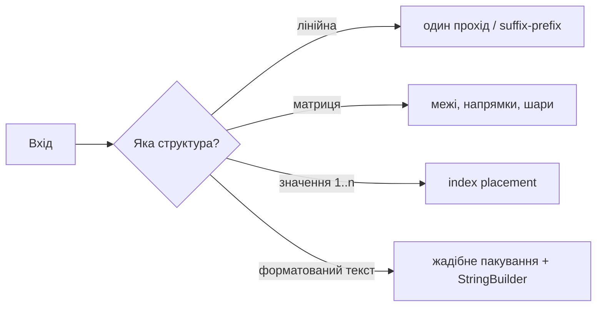
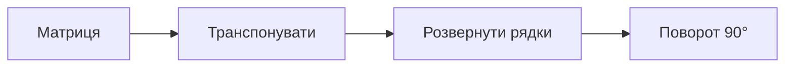
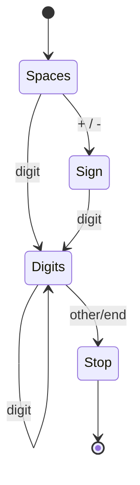

# 01. Масиви та рядки

[← Індекс](README.md) · Код: [`src/topic01_arrays_strings`](../../src/topic01_arrays_strings)

## Що ви повинні вміти після цього уроку

Після читання не потрібно пам’ятати всі реалізації напам’ять. Важливіше навчитися дивитися на умову й ставити правильні питання:

- Чи достатньо одного проходу з кількома змінними?
- Чи залежить відповідь для позиції `i` від усього, що було ліворуч або праворуч?
- Чи можна використати сам масив як місце для збереження стану?
- Чи задача про координати матриці, а отже треба явно контролювати межі та напрямок?
- Чи рядок треба лише прочитати, чи побудувати новий?
- Чи є в умові слова «без додаткової пам’яті», «in-place», «за один прохід»?

Це фундаментальна тема. Масиви зустрічаються й усередині hash table, heap, dynamic programming, graph adjacency lists та багатьох інших структур.

## 1. Масив із самого початку

Уявіть ряд пронумерованих комірок:

```text
індекс:    0    1    2    3    4
значення: [7] [12] [-3] [8] [5]
```

Індекс — це адреса комірки. Саме тому `nums[3]` читається за `O(1)`: програмі не треба переглядати попередні елементи. Але вставити значення на початок складно: усі інші елементи треба посунути, тому операція коштує `O(n)`.

У задачах важливо розділяти:

- **значення** — що лежить у комірці;
- **індекс** — де воно лежить;
- **довжину** — кількість комірок;
- **останній валідний індекс** — `length - 1`.

Звідси походить більшість `off-by-one` помилок. Якщо довжина дорівнює 5, індексу 5 не існує.

## 2. Перший універсальний інструмент: один прохід

Почнемо із задачі Highest Altitude. Дано зміни висоти:

```text
gain = [-5, 1, 5, 0, -7]
```

Стартова висота — 0. Наївно можна створити новий масив усіх висот, а потім шукати максимум. Але майбутньому потрібні лише дві речі: поточна висота та найвища побачена.

| Крок | Зміна | Поточна висота | Максимум |
|---:|---:|---:|---:|
| старт | — | 0 | 0 |
| 1 | -5 | -5 | 0 |
| 2 | +1 | -4 | 0 |
| 3 | +5 | 1 | 1 |
| 4 | 0 | 1 | 1 |
| 5 | -7 | -6 | 1 |

```java
int current = 0;
int best = 0;
for (int delta : gain) {
    current += delta;
    best = Math.max(best, current);
}
return best;
```

Після кожної ітерації істинне твердження: `current` дорівнює висоті після вже прочитаних змін, а `best` — максимуму серед усіх уже відвіданих висот. Це і є **інваріант циклу**.

### Як упізнати такий тип задачі

Шукайте формулювання «найбільший/найменший елемент», «порахувати», «чи виконується властивість для всіх», «поточний баланс». Спершу спробуйте один прохід і невеликий агрегований стан: `sum`, `count`, `min`, `max`, кілька boolean-прапорців.

## 3. Коли треба знати майбутнє: prefix і suffix

У Replace Elements кожну позицію треба замінити найбільшим значенням **праворуч**. Якщо для кожного `i` щоразу переглядати правий хвіст, отримаємо `O(n²)`.

Краще йти справа наліво. Змінна `rightMax` стискає весь уже пройдений суфікс до одного числа.

```text
input = [17, 18, 5, 4, 6, 1]

рух справа наліво:
i=5: записати -1, rightMax=max(-1,1)=1
i=4: записати  1, rightMax=max(1,6)=6
i=3: записати  6, rightMax=max(6,4)=6
i=2: записати  6, rightMax=max(6,5)=6
i=1: записати  6, rightMax=max(6,18)=18
i=0: записати 18
```

Важливий порядок: спочатку зберегти старе `nums[i]`, потім записати відповідь, лише після цього оновити `rightMax`. Інакше оригінальне значення буде втрачено.

### Product Except Self як дві половини інформації

Для позиції `i` потрібен добуток усіх ліворуч і всіх праворуч:

```text
nums   = [1, 2, 3, 4]
left   = [1, 1, 2, 6]
right  = [24,12,4, 1]
answer = [24,12,8, 6]
```

Окремі `left[]` та `right[]` зрозумілі, але займають `O(n)` додаткової пам’яті. Оптимізація приходить лише після розуміння базової версії: записати left products одразу в answer, а right product тримати в одній змінній під час зворотного проходу.

Слова-ознаки: «для кожної позиції все ліворуч/праворуч», «range без поточного елемента», «не можна використовувати ділення». Кандидати: prefix/suffix arrays або два проходи зі стисненою пам’яттю.

## 4. Масив як карта: index placement

Розглянемо `nums = [3, 4, -1, 1]`. Потрібне найменше відсутнє додатне число.

Спочатку корисно довести межу відповіді. Для масиву довжини `n`:

- якщо присутні `1,2,...,n`, відповідь `n+1`;
- інакше відповідь — одна з позицій `1..n`.

Отже числа `<1` та `>n` не впливають. А число `x` із `1..n` має природну комірку `x-1`:

```text
значення 1 → індекс 0
значення 2 → індекс 1
значення 3 → індекс 2
```

Тепер масив стає власною hash table.

| Стан | Поточний індекс | Дія |
|---|---:|---|
| `[3,4,-1,1]` | 0 | 3 має стояти на 2 → swap |
| `[-1,4,3,1]` | 0 | -1 ігноруємо |
| `[-1,4,3,1]` | 1 | 4 має стояти на 3 → swap |
| `[-1,1,3,4]` | 1 | 1 має стояти на 0 → swap |
| `[1,-1,3,4]` | 1 | -1 ігноруємо |

Другий прохід знаходить першу невідповідність: на індексі 1 мало бути 2, отже відповідь 2.

Чому цикл лінійний, хоча всередині є повторні swap? Кожен успішний swap ставить принаймні одне валідне число на його остаточну позицію. Таких позицій лише `n`. Не забудьте перевірку `nums[target] != nums[i]`, інакше `[1,1]` зациклиться.

## 5. Матриця без магії координат

Матриця — це масив рядків. Для `matrix[r][c]`:

- `r` змінює рядок, рухається вертикально;
- `c` змінює колонку, рухається горизонтально;
- кількість рядків — `matrix.length`;
- кількість колонок — `matrix[0].length`.

### Spiral Matrix

Не намагайтеся керувати одним складним напрямком із багатьма винятками. Думайте про прямокутну рамку:

```text
left=0          right=3
      1  →  2  →  3  →  4   top=0
      ↑                 ↓
      12                5
      ↑                 ↓
      11 ← 10 ← 9  ←   6   bottom=2
```

За одну ітерацію: верхній рядок → права колонка → нижній рядок назад → ліва колонка вгору. Потім `top++`, `right--`, `bottom--`, `left++`. Перед нижнім і лівим проходом треба перевірити, що рамка ще існує: це захищає матриці з одним рядком або однією колонкою.

### Rotate Image

Поворот на 90° за годинниковою стрілкою можна вивести на координатах `(r,c) → (c,n-1-r)`, але реалізувати простіше двома знайомими операціями:

1. транспонувати відносно головної діагоналі;
2. розвернути кожен рядок.

Для in-place транспонування міняйте лише елементи над діагоналлю (`c > r`), інакше кожна пара поміняється двічі.

## 6. Рядок у Java

`String` незмінний. Метод `replace`, `substring` або `+` не змінює старий об’єкт, а створює результат. Тому такий код може копіювати дедалі довший рядок на кожному кроці:

```java
String result = "";
for (char ch : chars) result += ch; // потенційно O(n²)
```

Для побудови використовуйте `StringBuilder`. Для лише читання — `charAt(i)`, `length()`, `Character.isDigit(...)` або чітко визначений ASCII-контракт.

### Atoi як автомат, а не набір випадкових if

Розбийте процес на фази:

1. пропустити початкові пробіли;
2. прочитати необов’язковий знак;
3. читати цифри до першого іншого символу;
4. під час накопичення контролювати overflow;
5. застосувати знак і clamp.

Приклад `"   -42abc"`: після spaces індекс на `-`; знак стає `-1`; цифри будують `4`, потім `42`; `a` завершує читання; результат `-42`. Символи після цифр не є помилкою — вони просто не входять у число, якщо саме такий контракт задачі.

## 7. Як вибрати метод за описом

| Якщо в умові є… | Подумайте про… | Контрольне питання |
|---|---|---|
| максимум/сума/перевірка всіх | один scan | Який мінімальний стан треба нести? |
| для кожного елемента дані зліва/справа | prefix/suffix | Чи можна зробити два проходи? |
| числа з обмеженого діапазону `1..n` і `O(1)` memory | index placement | Чи значення має природний індекс? |
| квадратна матриця in-place | coordinate transform/layers | Яка геометрична відповідність? |
| обхід по спіралі/діагоналі | boundaries/directions | Які межі змінюються після фази? |
| парсинг формату | state machine | Які допустимі фази й переходи? |
| побудова довгого рядка | StringBuilder | Чи копіюється старий результат? |

## 8. Навчальний маршрут теми

1. HighestAltitude — навчіться формулювати інваріант одного проходу.
2. PlusOne — carry і ранній вихід.
3. ReplaceElements — рух у правильному напрямку.
4. ProductExceptSelf — prefix/suffix і стиснення пам’яті.
5. SpiralMatrix — явні межі.
6. RotateImage — in-place геометрія.
7. StringIntegerAtoi — автомат і overflow.
8. FirstMissingPositive — масив як hash table.
9. TextJustification — жадібне пакування та обережна побудова рядка.

Для кожної задачі спочатку намалюйте 4–6 елементів і випишіть стан після кожної ітерації. Лише потім пишіть Java-код.

## Ментальна модель

Масив дає `O(1)` доступ за індексом, але вставка всередину коштує `O(n)`. У Java `String` незмінний, тому багато конкатенацій у циклі можуть стати `O(n²)`; для побудови результату потрібен `StringBuilder`. Головна сила масиву — можливість використати **позицію як частину алгоритму**.



## Основні патерни

### Один прохід і агрегований стан

Зберігайте лише те, що потрібно майбутньому: поточну суму, максимум праворуч, carry, стан парсера. Для `Replace Elements` суфіксний максимум оновлюється справа наліво; для `Product Except Self` відповідь спочатку містить добуток префікса, а потім домножується на суфікс.

```java
int prefix = 1;
for (int i = 0; i < n; i++) {
    answer[i] = prefix;
    prefix *= nums[i];
}
int suffix = 1;
for (int i = n - 1; i >= 0; i--) {
    answer[i] *= suffix;
    suffix *= nums[i];
}
```

Інваріант другого циклу: до обробки `i`, `answer[i]` уже містить добуток зліва, а `suffix` — добуток строго справа. Час `O(n)`, додаткова пам’ять `O(1)` без урахування відповіді.

### Матриці: межі, напрямок, шар

Для spiral traversal підтримуйте `top`, `bottom`, `left`, `right`; після проходу сторони звужуйте прямокутник і перед зворотними проходами повторно перевіряйте межі. Для rotate image: транспонування + reverse кожного рядка. Це розкладає складне перетворення на дві прості інволюції.



### Index placement / cyclic sort

Якщо значення `x` з діапазону `1..n` природно належить індексу `x - 1`, сам масив може бути hash table. Міняйте елементи, доки поточне значення можна поставити на місце. Обов’язкова перевірка дубліката `nums[target] != nums[i]`, інакше можливий нескінченний цикл. Кожен успішний swap фіналізує позицію, тому сумарно `O(n)`.

### Парсер рядка як скінченний автомат

`atoi` зручно мислити станами: пробіли → знак → цифри → стоп. Перед `value = value * 10 + digit` перевіряйте переповнення або накопичуйте в `long` з коректним clamp.



## Карта задач репозиторію

| Родина | Задачі | Метод |
|---|---|---|
| Простий прохід | HighestAltitude, EvenNumberOfDigits, LargestNumberTwice, FizzBuzz | акумулятор, лічильник, максимум |
| Carry/цифри | PlusOne | прохід справа, ранній вихід |
| Рядки | DefangIPAddress, LengthOfLastWord, StringIntegerAtoi | builder, scan, state machine |
| Суфікс/префікс | ReplaceElements, ProductExceptSelf | накопичення з двох боків |
| Властивість масиву | MonotonicArray | прапорці напрямків |
| Матриці | MatrixDiagonalSum, RotateImage, SpiralMatrix, DiagonalTraverse | координати, межі, шари |
| In-place mapping | FirstMissingPositive | cyclic sort |
| Жадібне форматування | TextJustification | пакування слів, розподіл пробілів |

## Типові помилки

- Плутати підмасив (неперервний), підпослідовність (порядок збережено) і підмножину.
- Не врахувати центральний елемент двічі в діагональній сумі.
- Робити `s += part` у великому циклі.
- Множити або сумувати в `int`, коли межі вимагають `long`.
- Змінювати вхід, не погодивши in-place контракт.

## Коли тему засвоєно

Ви можете без підглядання написати `ProductExceptSelf`, spiral traversal, rotation in-place, безпечний `atoi` та пояснити, чому cyclic sort лінійний попри вкладений `while`.
