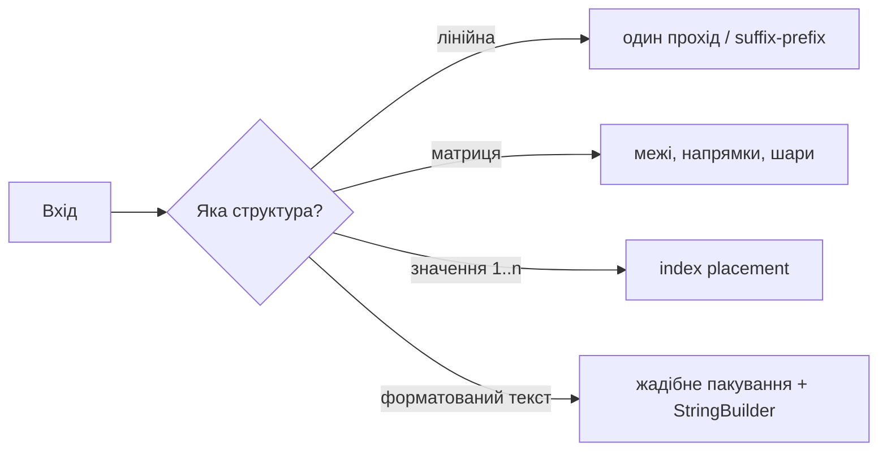
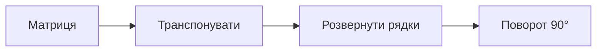
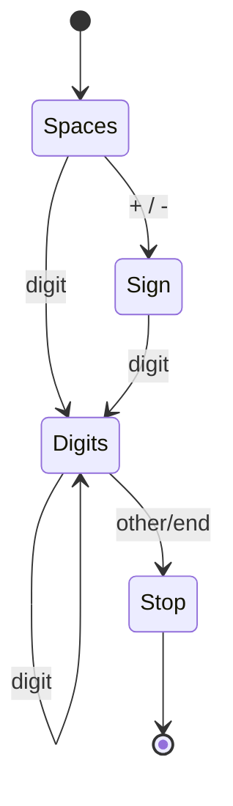

# 01. Масиви та рядки

[← Індекс](README.md) · Код: [`src/topic01_arrays_strings`](../../src/topic01_arrays_strings)

## Ментальна модель

Масив дає `O(1)` доступ за індексом, але вставка всередину коштує `O(n)`. У Java `String` незмінний, тому багато конкатенацій у циклі можуть стати `O(n²)`; для побудови результату потрібен `StringBuilder`. Головна сила масиву — можливість використати **позицію як частину алгоритму**.



## Основні патерни

### Один прохід і агрегований стан

Зберігайте лише те, що потрібно майбутньому: поточну суму, максимум праворуч, carry, стан парсера. Для `Replace Elements` суфіксний максимум оновлюється справа наліво; для `Product Except Self` відповідь спочатку містить добуток префікса, а потім домножується на суфікс.

```java
int prefix = 1;
for (int i = 0; i < n; i++) {
    answer[i] = prefix;
    prefix *= nums[i];
}
int suffix = 1;
for (int i = n - 1; i >= 0; i--) {
    answer[i] *= suffix;
    suffix *= nums[i];
}
```

Інваріант другого циклу: до обробки `i`, `answer[i]` уже містить добуток зліва, а `suffix` — добуток строго справа. Час `O(n)`, додаткова пам’ять `O(1)` без урахування відповіді.

### Матриці: межі, напрямок, шар

Для spiral traversal підтримуйте `top`, `bottom`, `left`, `right`; після проходу сторони звужуйте прямокутник і перед зворотними проходами повторно перевіряйте межі. Для rotate image: транспонування + reverse кожного рядка. Це розкладає складне перетворення на дві прості інволюції.



### Index placement / cyclic sort

Якщо значення `x` з діапазону `1..n` природно належить індексу `x - 1`, сам масив може бути hash table. Міняйте елементи, доки поточне значення можна поставити на місце. Обов’язкова перевірка дубліката `nums[target] != nums[i]`, інакше можливий нескінченний цикл. Кожен успішний swap фіналізує позицію, тому сумарно `O(n)`.

### Парсер рядка як скінченний автомат

`atoi` зручно мислити станами: пробіли → знак → цифри → стоп. Перед `value = value * 10 + digit` перевіряйте переповнення або накопичуйте в `long` з коректним clamp.



## Карта задач репозиторію

| Родина | Задачі | Метод |
|---|---|---|
| Простий прохід | HighestAltitude, EvenNumberOfDigits, LargestNumberTwice, FizzBuzz | акумулятор, лічильник, максимум |
| Carry/цифри | PlusOne | прохід справа, ранній вихід |
| Рядки | DefangIPAddress, LengthOfLastWord, StringIntegerAtoi | builder, scan, state machine |
| Суфікс/префікс | ReplaceElements, ProductExceptSelf | накопичення з двох боків |
| Властивість масиву | MonotonicArray | прапорці напрямків |
| Матриці | MatrixDiagonalSum, RotateImage, SpiralMatrix, DiagonalTraverse | координати, межі, шари |
| In-place mapping | FirstMissingPositive | cyclic sort |
| Жадібне форматування | TextJustification | пакування слів, розподіл пробілів |

## Типові помилки

- Плутати підмасив (неперервний), підпослідовність (порядок збережено) і підмножину.
- Не врахувати центральний елемент двічі в діагональній сумі.
- Робити `s += part` у великому циклі.
- Множити або сумувати в `int`, коли межі вимагають `long`.
- Змінювати вхід, не погодивши in-place контракт.

## Коли тему засвоєно

Ви можете без підглядання написати `ProductExceptSelf`, spiral traversal, rotation in-place, безпечний `atoi` та пояснити, чому cyclic sort лінійний попри вкладений `while`.

