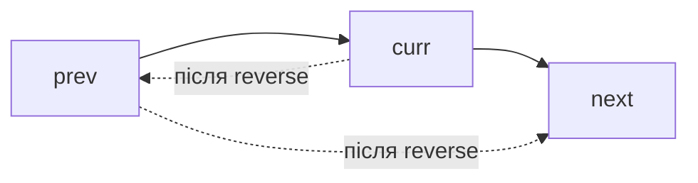
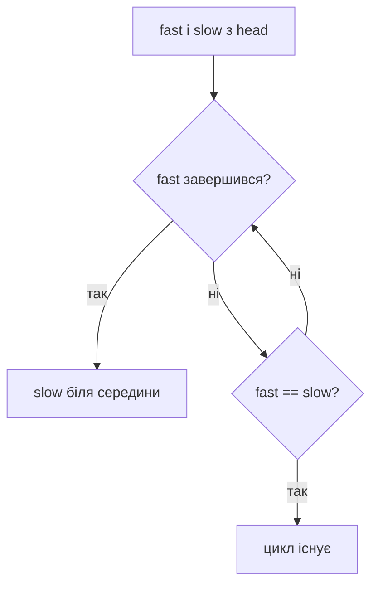

# 02. Зв’язані списки

[← Індекс](README.md) · Код: [`src/topic02_linked_lists`](../../src/topic02_linked_lists)

## Ментальна модель

Вузол — це значення та посилання. Доступ до `i`-го елемента коштує `O(i)`, зате локальне перепідключення — `O(1)`. Майже кожна помилка тут є втраченим посиланням, неправильним хвостом або неповною обробкою голови.



Перед зміною `curr.next` завжди збережіть `next = curr.next`.

## Базові інструменти

### Dummy sentinel

Фіктивна голова уніфікує видалення/вставку на початку й усередині: `dummy.next = head`, результат — `dummy.next`. Інваріант: `prev` завжди вказує на останній вузол уже сформованої частини.

### Fast/slow pointers

- `slow += 1`, `fast += 2`: середина або цикл.
- Відстань `n`: спочатку просунути `fast`, потім рухати обох — `slow` опиниться перед вузлом, який треба видалити.
- Після зустрічі в циклі один вказівник повертається на head; однаковий темп знаходить вхід у цикл.



### Reverse як примітив

```java
ListNode prev = null;
ListNode curr = head;
while (curr != null) {
    ListNode next = curr.next;
    curr.next = prev;
    prev = curr;
    curr = next;
}
return prev;
```

Після кожного кроку `prev` — правильно розвернутий префікс, `curr` — перший необроблений вузол.

### Merge і pointer weaving

Merge двох відсортованих списків щоразу приєднує меншу голову. Reorder List складається з трьох перевірених фаз: знайти середину → reverse другої половини → почергово зшити. Не змішуйте їх в один цикл, доки не довели кожну фазу.

### K-group

Перед розворотом групи переконайтеся, що існує `k` вузлів. Використовуйте напіввідкритий діапазон `[groupStart, groupNext)`, після reverse стара голова стає хвостом. Час `O(n)`, стек не потрібен.

### Random pointer

Два методи: hash map `old → copy` за `O(n)` пам’яті; або вплести копії після оригіналів, встановити random через `original.random.next`, потім розділити списки — `O(1)` додаткової пам’яті.

## Карта задач

| Патерн | Задачі |
|---|---|
| Sentinel і видалення | RemoveElements, RemoveDuplicates, RemoveNthFromEnd |
| Merge | MergeTwoSortedLists, MergeKSortedLists |
| Fast/slow | LinkedListCycle, MiddleOfLinkedList, PalindromeLinkedList |
| Локальна зміна | DeleteNode, SwapNodesInPairs, OddEvenLinkedList |
| Reverse + weave | ReorderList, ReverseNodesInKGroup |
| Паралельний прохід | IntersectionOfTwoLists, BinaryToInteger, AddTwoNumbers, MergeNodes |
| Клонування графоподібних зв’язків | CopyListWithRandomPointer |

Для Merge K списків порівняйте heap `O(N log k)` з divide-and-conquer `O(N log k)`. Heap простіший для потоку списків; попарне злиття має менше об’єктів черги.

## Типові помилки

- Викликати `start`/`next` після того, як посилання вже переписано.
- Не розірвати першу половину перед reorder, створивши цикл.
- Порівнювати вузли за значенням у задачі intersection; потрібна тотожність об’єкта.
- Забути carry після завершення обох списків.
- Не визначити, яка «середина» потрібна для парної довжини.

## Контроль засвоєння

Намалюйте всі посилання для `1→2→3→4`, вручну виконайте reverse, swap pairs і reorder. Якщо кожне перепідключення можна пояснити інваріантом — база готова.

