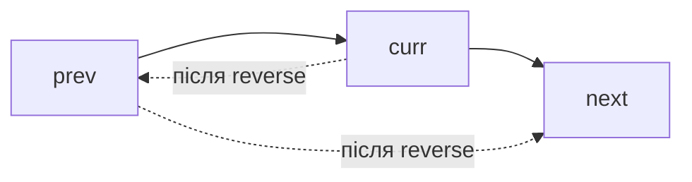
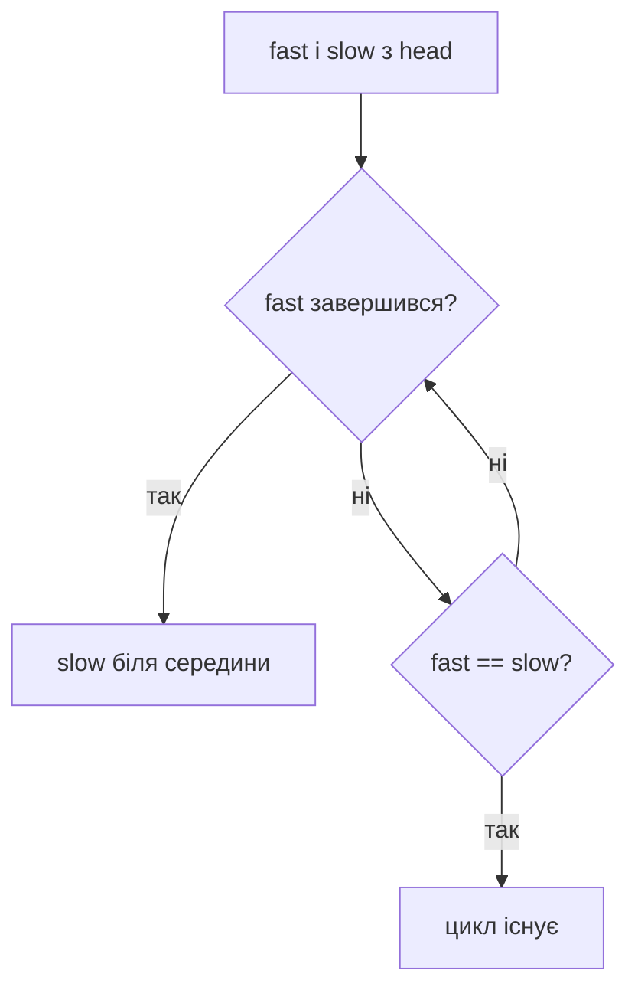

# 02. Зв’язані списки

[← Індекс](README.md) · Код: [`src/topic02_linked_lists`](../../src/topic02_linked_lists)

## Що треба зрозуміти, перш ніж писати код

Зв’язаний список не є «масивом без індексів». У масиві сусідство задає пам’ять, у списку — посилання `next`. Якщо посилання переписано і стару адресу ніде не збережено, решта списку може стати недоступною назавжди.

```java
class ListNode {
    int val;
    ListNode next;
}
```

Змінна `head` не містить увесь список. Вона містить посилання лише на перший вузол, а вже з нього можна перейти до другого, третього тощо.

```text
head
 │
 ▼
[10 | •] ──► [20 | •] ──► [30 | null]
```

Три базові запитання перед будь-якою зміною:

1. Яке посилання я зараз переписую?
2. Чи зберіг я адресу частини, яка була за ним?
3. Хто після операції буде головою й хвостом зміненої частини?

## 1. Обхід списку

```java
ListNode current = head;
while (current != null) {
    // використовуємо current.val
    current = current.next;
}
```

Інваріант: усі вузли до `current` уже опрацьовані, `current` — перший необроблений. Перехід до `current.next` коштує `O(1)`, але дістатися `i`-го вузла можна лише через попередні, тому `O(i)`.

На порожньому списку `head == null`. Завжди перевіряйте, чи код не звертається до `head.next` раніше, ніж переконається, що head існує.

## 2. Навіщо потрібен dummy node

Задача: видалити всі вузли зі значенням 6.

```text
6 → 1 → 6 → 2
```

Без dummy видалення першого вузла змінює сам `head`, а видалення всередині змінює `prev.next`. Це дві різні гілки. Dummy створює штучний вузол перед head:

```text
dummy → 6 → 1 → 6 → 2
```

Тепер кожен справжній вузол має попередника.

```java
ListNode dummy = new ListNode(0, head);
ListNode prev = dummy;
ListNode curr = head;

while (curr != null) {
    if (curr.val == target) {
        prev.next = curr.next;
    } else {
        prev = curr;
    }
    curr = curr.next;
}
return dummy.next;
```

Чому `prev` не рухається після видалення? Бо наступний `curr` теж може вимагати видалення, а `prev` усе ще має бути останнім збереженим вузлом.

Dummy особливо корисний для remove, merge, partition, swap pairs, reverse groups. Це не «зайвий хак», а спосіб прибрати окремий крайовий випадок голови.

## 3. Reverse: головний примітив теми

Потрібно перетворити:

```text
1 → 2 → 3 → null
```

на:

```text
null ← 1 ← 2 ← 3
```

На вузлі `2` не можна одразу виконати `2.next = 1`, бо тоді посилання на `3` буде втрачено. Тому порядок завжди такий:

1. зберегти `next`;
2. розвернути стрілку;
3. просунути `prev`;
4. просунути `curr`.

| Крок | `prev` — готова частина | `curr` — необроблена частина |
|---:|---|---|
| старт | `null` | `1→2→3` |
| 1 | `1→null` | `2→3` |
| 2 | `2→1→null` | `3` |
| 3 | `3→2→1→null` | `null` |

Коли `curr == null`, старий список повністю вичерпано, а `prev` є новою головою.

### Рекурсивний reverse

Рекурсивна версія каже: «нехай хвіст уже розвернутий; приєднаємо поточний head у кінець». Вона елегантна, але використовує `O(n)` stack і легше переповнює його. Для співбесіди важливо розуміти обидві, для production великих списків ітеративна безпечніша.

## 4. Два вказівники з різною швидкістю

### Пошук середини

`slow` рухається на один вузол, `fast` — на два. Коли fast доходить до кінця, slow пройшов приблизно половину.

```text
1 → 2 → 3 → 4 → 5
S,F

після 1 кроку: S=2, F=3
після 2 кроку: S=3, F=5
далі fast не може зробити два кроки → middle=3
```

Для парної довжини умова циклу визначає, яку середину отримаємо. `while (fast != null && fast.next != null)` зазвичай приводить slow до другої середини.

### Пошук циклу

Якщо fast наздогнав slow, список містить цикл. Чому? Усередині циклу fast за кожен крок скорочує кругову відстань до slow на один. Якщо циклу немає, fast зустріне `null`.

Для знаходження входу в цикл після зустрічі поставте один вказівник на head і рухайте обох по одному. Алгебра довжин показує, що вони зустрінуться саме біля входу.

### Remove Nth From End

Створіть між fast і slow відстань `n` вузлів. Коли fast дійде до кінця, slow буде біля вузла перед тим, який треба видалити. Dummy знову дозволяє видалити сам head без окремої гілки.

## 5. Merge двох відсортованих списків

На кожному кроці менша з двох голів є найменшим елементом, що лишився взагалі. Приєднуємо її до хвоста результату й просуваємо лише відповідний список.

```text
A: 1 → 4 → 7
B: 2 → 3 → 8

вибір: 1(A), 2(B), 3(B), 4(A), 7(A), потім хвіст B: 8
```

```java
ListNode dummy = new ListNode();
ListNode tail = dummy;
while (a != null && b != null) {
    if (a.val <= b.val) {
        tail.next = a;
        a = a.next;
    } else {
        tail.next = b;
        b = b.next;
    }
    tail = tail.next;
}
tail.next = (a != null) ? a : b;
return dummy.next;
```

Merge K списків: лінійно шукати найменшу голову кожного разу коштує `O(Nk)`. Min-heap з `k` поточних голів зменшує це до `O(N log k)`. Інша стратегія — попарно зливати списки як merge sort.

## 6. Reorder List як композиція трьох простих кроків

Для `1→2→3→4→5` потрібне `1→5→2→4→3`.

Не вигадуйте один надскладний цикл. Розкладіть:

1. fast/slow знаходить середину;
2. другу половину від’єднати й reverse;
3. почергово вплітати вузли двох половин.

```text
після split:   1→2→3    і    4→5
після reverse: 1→2→3    і    5→4
weave:         1→5→2→4→3
```

Від’єднання (`slow.next = null`) важливе: без нього старе посилання може утворити цикл.

## 7. Reverse Nodes in K Group

Це reverse не всього списку, а послідовних блоків. Для кожної групи:

1. від `groupPrev` пройти `k` кроків і знайти `kth`;
2. якщо `kth == null`, неповний хвіст лишити як є;
3. запам’ятати `groupNext = kth.next`;
4. reverse діапазон до `groupNext`;
5. з’єднати попередню частину з новою головою групи;
6. стара голова групи стала новим хвостом і новим `groupPrev`.

Найкраще малювати вузли та стрілки для `1→2→3→4→5`, `k=2`. Без малюнка легко змішати голову групи, її хвіст і наступну групу.

## 8. Copy Random List: коли список майже граф

`random` може дивитися на будь-який вузол, тому простого послідовного копіювання недостатньо.

Найзрозуміліший метод:

1. перший прохід створює копію кожного вузла й map `original → copy`;
2. другий встановлює `copy.next = map.get(original.next)` і так само random.

Час `O(n)`, пам’ять `O(n)`. Оптимізація `O(1)` вплітає кожну копію одразу після оригіналу, завдяки чому копія `original.random` доступна як `original.random.next`. Але спершу треба впевнено розуміти map-версію.

## 9. Як розпізнати інструмент

| Формулювання | Ймовірний інструмент |
|---|---|
| видалити/вставити, особливо біля head | dummy + prev/curr |
| середина, цикл, n-й з кінця | slow/fast або gap pointers |
| palindrome list | middle + reverse half + compare |
| merge sorted lists | dummy + tail |
| переставити/розвернути частину | reverse primitive + boundaries |
| вузли мають довільні додаткові links | map original→copy або graph cloning |
| k sorted lists | min-heap або divide-and-conquer merge |

## 10. Порядок практики

Почніть із RemoveElements і MergeTwoSortedLists. Потім окремо напишіть reverse, хоча в репозиторії він може бути частиною складнішої задачі. Далі Middle, Cycle, Palindrome, RemoveNthFromEnd. Лише після цього переходьте до Reorder, SwapPairs і KGroup. CopyRandom завершує тему, бо додає графове мислення.

## Ментальна модель

Вузол — це значення та посилання. Доступ до `i`-го елемента коштує `O(i)`, зате локальне перепідключення — `O(1)`. Майже кожна помилка тут є втраченим посиланням, неправильним хвостом або неповною обробкою голови.



Перед зміною `curr.next` завжди збережіть `next = curr.next`.

## Базові інструменти

### Dummy sentinel

Фіктивна голова уніфікує видалення/вставку на початку й усередині: `dummy.next = head`, результат — `dummy.next`. Інваріант: `prev` завжди вказує на останній вузол уже сформованої частини.

### Fast/slow pointers

- `slow += 1`, `fast += 2`: середина або цикл.
- Відстань `n`: спочатку просунути `fast`, потім рухати обох — `slow` опиниться перед вузлом, який треба видалити.
- Після зустрічі в циклі один вказівник повертається на head; однаковий темп знаходить вхід у цикл.



### Reverse як примітив

```java
ListNode prev = null;
ListNode curr = head;
while (curr != null) {
    ListNode next = curr.next;
    curr.next = prev;
    prev = curr;
    curr = next;
}
return prev;
```

Після кожного кроку `prev` — правильно розвернутий префікс, `curr` — перший необроблений вузол.

### Merge і pointer weaving

Merge двох відсортованих списків щоразу приєднує меншу голову. Reorder List складається з трьох перевірених фаз: знайти середину → reverse другої половини → почергово зшити. Не змішуйте їх в один цикл, доки не довели кожну фазу.

### K-group

Перед розворотом групи переконайтеся, що існує `k` вузлів. Використовуйте напіввідкритий діапазон `[groupStart, groupNext)`, після reverse стара голова стає хвостом. Час `O(n)`, стек не потрібен.

### Random pointer

Два методи: hash map `old → copy` за `O(n)` пам’яті; або вплести копії після оригіналів, встановити random через `original.random.next`, потім розділити списки — `O(1)` додаткової пам’яті.

## Карта задач

| Патерн | Задачі |
|---|---|
| Sentinel і видалення | RemoveElements, RemoveDuplicates, RemoveNthFromEnd |
| Merge | MergeTwoSortedLists, MergeKSortedLists |
| Fast/slow | LinkedListCycle, MiddleOfLinkedList, PalindromeLinkedList |
| Локальна зміна | DeleteNode, SwapNodesInPairs, OddEvenLinkedList |
| Reverse + weave | ReorderList, ReverseNodesInKGroup |
| Паралельний прохід | IntersectionOfTwoLists, BinaryToInteger, AddTwoNumbers, MergeNodes |
| Клонування графоподібних зв’язків | CopyListWithRandomPointer |

Для Merge K списків порівняйте heap `O(N log k)` з divide-and-conquer `O(N log k)`. Heap простіший для потоку списків; попарне злиття має менше об’єктів черги.

## Типові помилки

- Викликати `start`/`next` після того, як посилання вже переписано.
- Не розірвати першу половину перед reorder, створивши цикл.
- Порівнювати вузли за значенням у задачі intersection; потрібна тотожність об’єкта.
- Забути carry після завершення обох списків.
- Не визначити, яка «середина» потрібна для парної довжини.

## Контроль засвоєння

Намалюйте всі посилання для `1→2→3→4`, вручну виконайте reverse, swap pairs і reorder. Якщо кожне перепідключення можна пояснити інваріантом — база готова.
