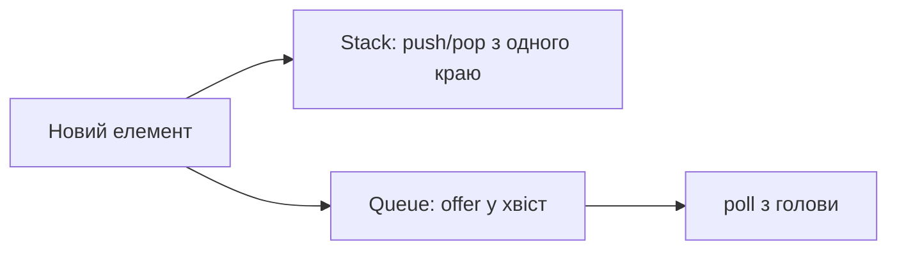

# 03. Стеки та черги

[← Індекс](README.md) · Код: [`src/topic03_stacks_queues`](../../src/topic03_stacks_queues)

## Вибір порядку

- **Stack (LIFO):** незавершені контексти, вкладеність, undo, найближчий кандидат.
- **Queue (FIFO):** порядок прибуття, рівні BFS, fair processing.
- **Deque:** обидва краї; монотонна черга та sliding maximum.



У Java зазвичай використовуйте `ArrayDeque`, а не застарілий `Stack`; `offer/poll/peek` повертають спеціальне значення замість винятку.

## Шаблони

### Монотонний стек

Стек зберігає **індекси** елементів, відповідь для яких ще не відома. Для next greater підтримуйте спадні значення: поточний більший елемент закриває всі менші вершини.

```java
Deque<Integer> stack = new ArrayDeque<>();
for (int i = 0; i < a.length; i++) {
    while (!stack.isEmpty() && a[stack.peek()] < a[i]) {
        int j = stack.pop();
        answer[j] = i - j;
    }
    stack.push(i);
}
```

Кожен індекс входить і виходить один раз: амортизовано `O(n)`, не `O(n²)`.

### Histogram

Стек містить індекси стовпців зі зростаючими висотами. Коли нова висота нижча, стовпець `mid` завершується; права межа — `i`, ліва — нова вершина стека. Додайте уявний нуль наприкінці, щоб виштовхнути залишок.

### Монотонна deque

Для максимуму вікна: видалити з голови індекси поза вікном; з хвоста — елементи не більші за новий; голова завжди є максимумом. У deque зберігайте індекси, щоб перевіряти давність.

### Парсинг виразів

RPN: операнд → push, оператор → pop `right`, потім `left` (порядок критичний). Для інфіксного calculator стек зберігає попередній результат і знак перед дужками або використовується схема operand/operator з пріоритетами.

### Дві структури з амортизацією

Queue через два stacks: `in` приймає, `out` віддає; переносити лише коли `out` порожній. Кожен елемент переноситься один раз, тому операція амортизовано `O(1)`. Stack через queue після `push` може ротацією ставити новий елемент у голову.

## Карта задач

| Патерн | Задачі |
|---|---|
| Емуляція | ImplementStackUsingQueues, ImplementQueueUsingStacks, DesignCircularQueue |
| Стек станів | MinStack, SimplifyPath, EvaluateRPN, BasicCalculator |
| Cancellation | MakeStringGreat, BackspaceStringCompare, RemoveAdjacentDuplicates, AsteroidCollision |
| Черга подій | CrawlerLogFolder, TimeNeededToBuyTickets |
| Monotonic stack | FinalPrices, NextGreaterElementI, DailyTemperatures, LargestRectangleInHistogram |
| Monotonic deque | SlidingWindowMaximum |

## Пастки

- Зберігати лише значення, коли потрібен індекс/час життя.
- Переплутати порядок операндів для `-` і `/`.
- Видалити з deque за значенням і не розрізнити дублікати.
- У circular queue не відрізнити порожній стан від повного; зберігайте `size` або резервуйте слот.
- Застосувати монотонний стек, але не визначити строгість (`<` чи `<=`) для дублікатів.

## Доказ монотонного стека

Коли `a[i]` виштовхує `a[j]`, усі елементи між ними були не більші за кандидат або вже оброблені, отже `i` — перший придатний індекс. Після push порядок відновлено. Це і є центральний доказ, який треба вміти адаптувати.

