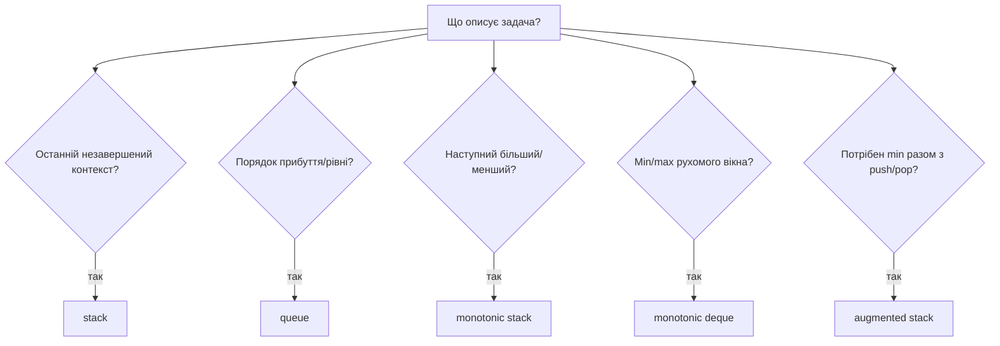
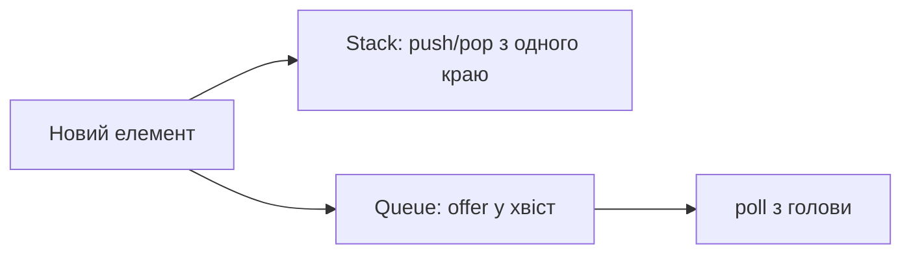

# 03. Стеки та черги

[← Індекс](README.md) · Код: [`src/topic03_stacks_queues`](../../src/topic03_stacks_queues)

## Інтуїція з повсякденних ситуацій

**Стек** схожий на стопку тарілок: останню покладену тарілку знімаємо першою. **Черга** схожа на людей біля каси: перший, хто прийшов, обслуговується першим.

```algoviz
{
  "type": "stack",
  "title": "Stack · останній доданий виходить першим",
  "values": [1, 2, 3],
  "steps": [
    {"label": "Після push(1), push(2), push(3) значення 3 лежить на top", "active": [2], "prediction": {"prompt": "Що поверне перший pop()?", "options": ["1", "2", "3", "null"], "answer": 2}},
    {"label": "pop() видаляє 3, новою вершиною стає 2", "active": [1], "visited": [2]},
    {"label": "Наступний pop() поверне 2", "active": [1], "visited": [2]}
  ]
}
```

```algoviz
{
  "type": "queue",
  "title": "Queue · перший доданий виходить першим",
  "values": [1, 2, 3],
  "steps": [
    {"label": "head дивиться на 1, tail — на 3", "pointers": {"head": 0, "tail": 2}, "prediction": {"prompt": "Що поверне poll()?", "options": ["1", "2", "3", "null"], "answer": 0}},
    {"label": "poll() видалив 1, тому head переходить до 2", "pointers": {"head": 1, "tail": 2}, "visited": [0]}
  ]
}
```

Ці структури не просто зберігають дані. Вони обмежують порядок, у якому дані можна отримати, і саме цей порядок часто є розв’язком.

У Java майже завжди починайте з:

```java
Deque<Integer> stack = new ArrayDeque<>();
stack.push(x);       // додати на вершину
int x = stack.pop(); // забрати вершину
int x = stack.peek();// подивитися без видалення

Deque<Integer> queue = new ArrayDeque<>();
queue.offer(x);      // додати в хвіст
int x = queue.poll();// забрати з голови
int x = queue.peek();// подивитися на голову
```

`ArrayDeque` не приймає `null`, що корисно: `poll()` може повернути `null` лише для порожньої структури.

## 1. Стек як пам’ять незавершених дій

Уявіть перевірку дужок `([{}])`. Коли бачимо відкривальну дужку, ще не знаємо, де вона закриється, тому кладемо її у stack. Закривальна повинна відповідати **останній незакритій**.

| Символ | Стек після символу | Пояснення |
|---|---|---|
| `(` | `(` | чекаємо `)` |
| `[` | `( [` | квадратна вкладена у круглу |
| `{` | `( [ {` | остання незакрита — `{` |
| `}` | `( [` | `{` закрита |
| `]` | `(` | `[` закрита |
| `)` | empty | усе правильно |

Цей приклад дає загальну ознаку: якщо нова подія завершує **останній незавершений контекст**, потрібен stack. Так працюють вкладені вирази, шляхи, undo, рекурсивний DFS в ітеративній формі.

## 2. Cancellation stack

У Remove Adjacent Duplicates символ або додається, або скасовує вершину:

```text
input: abbaca

a  → [a]
b  → [a,b]
b  → [a]      (пара bb зникла)
a  → []       (після зникнення bb утворилася aa)
c  → [c]
a  → [c,a]
```

Важливо, що видалення може створити нове сусідство, тому один звичайний scan із порівнянням `s[i]` та `s[i+1]` незручний. Stack автоматично показує останній символ уже очищеного префікса.

Asteroid Collision — той самий принцип, але умови зіткнення складніші. Конфлікт можливий лише коли вершина рухається вправо (`>0`), а новий астероїд — вліво (`<0`). У `while` менший зникає; рівні зникають обидва; якщо новий пережив усі зіткнення, його додають.

## 3. Min Stack: зберігати достатньо історії

Звичайний stack не може знайти minimum за `O(1)` без перегляду. Рішення — разом із кожним значенням зберігати minimum на момент push:

```text
push 5 → (value=5, min=5)
push 2 → (value=2, min=2)
push 4 → (value=4, min=2)
pop 4  → вершина знову каже min=2
pop 2  → вершина каже min=5
```

Альтернатива — окремий minStack. При дублікованих minima потрібно додавати `<=`, а видаляти лише коли popped value дорівнює вершині minStack.

## 4. Монотонний стек — від brute force до O(n)

Daily Temperatures: для кожного дня знайти перший тепліший праворуч.

Наївно для кожного `i` рухатися праворуч: у спадному масиві це `O(n²)`. Замість цього stack тримає індекси днів, які ще чекають відповідь.

```text
temps = [73, 74, 75, 71, 69, 72, 76]
```

| `i`, температура | Дії зі стеком | Відповіді, що стали відомі | Стек індексів |
|---|---|---|---|
| 0, 73 | push 0 | — | `[0]` |
| 1, 74 | pop 0, push 1 | ans[0]=1 | `[1]` |
| 2, 75 | pop 1, push 2 | ans[1]=1 | `[2]` |
| 3, 71 | push 3 | — | `[2,3]` |
| 4, 69 | push 4 | — | `[2,3,4]` |
| 5, 72 | pop 4, pop 3, push 5 | ans[4]=1, ans[3]=2 | `[2,5]` |
| 6, 76 | pop 5, pop 2 | ans[5]=1, ans[2]=4 | `[6]` |

Стек монотонно спадний за температурами. Чому кожна відповідь перша? Якби між `j` і `i` був раніший тепліший день, він уже виштовхнув би `j`.

### Як визначити напрям і строгість

- «наступний більший» → стек зазвичай спадний;
- «наступний менший» → зростаючий;
- «перший» → зберігайте індекси;
- дублікати змушують свідомо вибрати `<` або `<=` відповідно до слова «більший» чи «не менший».

## 5. Largest Rectangle in Histogram

Кожен стовпець може бути найнижчим у деякому прямокутнику. Треба знайти, як далеко цей прямокутник простягається ліворуч і праворуч до першої меншої висоти.

Монотонно зростаючий stack індексів зберігає стовпці, права межа яких ще не знайдена. Коли приходить нижчий стовпець `i`, для popped `mid`:

- права межа — `i` (не входить);
- ліва менша межа — нова вершина стека;
- ширина — `stack.empty ? i : i - stack.peek() - 1`.

Додатковий sentinel height 0 наприкінці змушує порахувати прямокутники, що тягнуться до кінця. Почніть із прикладу `[2,1,5,6,2,3]` і вручну простежте, як прихід 2 закриває висоти 6 та 5.

## 6. Черга і симуляція часу

У Time Needed to Buy Tickets люди обслуговуються циклічно. Пряма queue simulation відтворює процес, але може зробити дуже багато операцій, якщо числа великі. Часто можна вивести формулу: кожна людина до або на позиції `k` купить не більше `tickets[k]`, після `k` — не більше `tickets[k]-1`. Важливий урок: queue добре моделює порядок, але після розуміння моделі іноді її можна замінити математичним scan.

## 7. Queue через два stacks і амортизація

Stack `in` приймає нові елементи. Stack `out` віддає найстаріші. Коли `out` порожній, усі елементи переносяться з `in` в `out`, що розвертає порядок.

```text
offer 1,2,3:
in  top→ [3,2,1]
out empty

перший poll: переносимо
in empty
out top→ [1,2,3]
```

Один poll іноді `O(n)`, але кожен елемент проходить `in → out` лише один раз. На послідовності `m` операцій загальна робота `O(m)`, отже амортизовано `O(1)`.

## 8. Монотонна deque для максимуму вікна

Для вікна розміру `k` максимум змінюється при кожному зсуві. Heap може дати `O(n log k)`, але deque дає `O(n)`.

Deque зберігає індекси потенційних максимумів у спадному порядку значень:

1. з голови видалити індекс, який вийшов за ліву межу;
2. з хвоста видалити всі значення `<=` нового — вони старіші й слабші, тому ніколи вже не стануть максимумом;
3. додати новий індекс;
4. голова є максимумом.

У `[1,3,-1,-3,5,3,6,7]`, `k=3`, коли приходить 3, значення 1 видаляється як доміноване. Коли приходить 5, вона видаляє -1 і -3. Кожен індекс входить і виходить не більше одного разу.

## 9. Вирази й порядок операндів

У Reverse Polish Notation `2 1 + 3 *`:

```text
push 2, push 1
'+': right=1, left=2 → push 3
push 3
'*': right=3, left=3 → push 9
```

Для віднімання та ділення порядок pop критичний: спершу дістаємо правий операнд, потім лівий.

Basic Calculator додає вкладені дужки. Один підхід зберігає в stack результат і знак **до** відкривальної дужки. Коли бачимо `)`, обчислений внутрішній результат множиться на збережений знак і додається до зовнішнього.

## 10. Дерево вибору



Після вибору структури проговоріть, **що саме лежить усередині**: значення, індекс, пара зі станом, оператор чи незавершений контекст. Це часто важливіше за саму назву «stack».

## Вибір порядку

- **Stack (LIFO):** незавершені контексти, вкладеність, undo, найближчий кандидат.
- **Queue (FIFO):** порядок прибуття, рівні BFS, fair processing.
- **Deque:** обидва краї; монотонна черга та sliding maximum.



У Java зазвичай використовуйте `ArrayDeque`, а не застарілий `Stack`; `offer/poll/peek` повертають спеціальне значення замість винятку.

## Шаблони

### Монотонний стек

Стек зберігає **індекси** елементів, відповідь для яких ще не відома. Для next greater підтримуйте спадні значення: поточний більший елемент закриває всі менші вершини.

```java
Deque<Integer> stack = new ArrayDeque<>();
for (int i = 0; i < a.length; i++) {
    while (!stack.isEmpty() && a[stack.peek()] < a[i]) {
        int j = stack.pop();
        answer[j] = i - j;
    }
    stack.push(i);
}
```

Кожен індекс входить і виходить один раз: амортизовано `O(n)`, не `O(n²)`.

### Histogram

Стек містить індекси стовпців зі зростаючими висотами. Коли нова висота нижча, стовпець `mid` завершується; права межа — `i`, ліва — нова вершина стека. Додайте уявний нуль наприкінці, щоб виштовхнути залишок.

### Монотонна deque

Для максимуму вікна: видалити з голови індекси поза вікном; з хвоста — елементи не більші за новий; голова завжди є максимумом. У deque зберігайте індекси, щоб перевіряти давність.

### Парсинг виразів

RPN: операнд → push, оператор → pop `right`, потім `left` (порядок критичний). Для інфіксного calculator стек зберігає попередній результат і знак перед дужками або використовується схема operand/operator з пріоритетами.

### Дві структури з амортизацією

Queue через два stacks: `in` приймає, `out` віддає; переносити лише коли `out` порожній. Кожен елемент переноситься один раз, тому операція амортизовано `O(1)`. Stack через queue після `push` може ротацією ставити новий елемент у голову.

## Карта задач

| Патерн | Задачі |
|---|---|
| Емуляція | ImplementStackUsingQueues, ImplementQueueUsingStacks, DesignCircularQueue |
| Стек станів | MinStack, SimplifyPath, EvaluateRPN, BasicCalculator |
| Cancellation | MakeStringGreat, BackspaceStringCompare, RemoveAdjacentDuplicates, AsteroidCollision |
| Черга подій | CrawlerLogFolder, TimeNeededToBuyTickets |
| Monotonic stack | FinalPrices, NextGreaterElementI, DailyTemperatures, LargestRectangleInHistogram |
| Monotonic deque | SlidingWindowMaximum |

## Пастки

- Зберігати лише значення, коли потрібен індекс/час життя.
- Переплутати порядок операндів для `-` і `/`.
- Видалити з deque за значенням і не розрізнити дублікати.
- У circular queue не відрізнити порожній стан від повного; зберігайте `size` або резервуйте слот.
- Застосувати монотонний стек, але не визначити строгість (`<` чи `<=`) для дублікатів.

## Доказ монотонного стека

Коли `a[i]` виштовхує `a[j]`, усі елементи між ними були не більші за кандидат або вже оброблені, отже `i` — перший придатний індекс. Після push порядок відновлено. Це і є центральний доказ, який треба вміти адаптувати.
