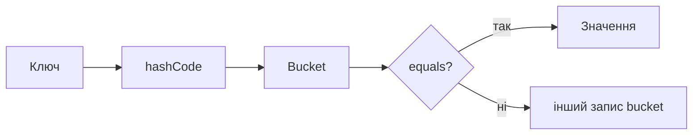
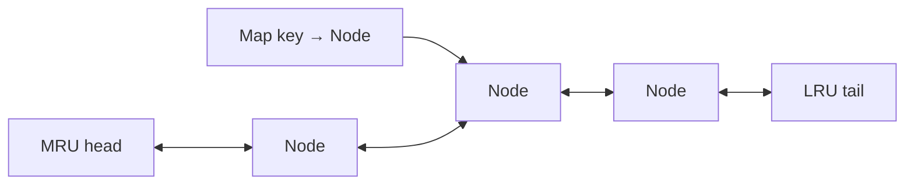

# 04. Хеш-таблиці

[← Індекс](README.md) · Код: [`src/topic04_hash_tables`](../../src/topic04_hash_tables)

## Чому hash table взагалі потрібна

У масиві знайти довільне значення означає, у загальному випадку, переглянути всі елементи. Hash table намагається перетворити сам ключ на адресу bucket, тому `contains/get/put` у середньому працюють за `O(1)`.

Думайте про дві базові форми:

- `Set<T>` відповідає на запитання **«чи є / чи вже бачили?»**;
- `Map<K,V>` відповідає **«яка інформація пов’язана з цим ключем?»**.

Приклади значення `V`:

- кількість появ;
- останній або перший індекс;
- список об’єктів однієї групи;
- вузол іншої структури;
- найкращий стан, відомий для ключа.

## 1. Від подвійного циклу до Set

Contains Duplicate наївно порівнює кожну пару — `O(n²)`. Але для поточного `x` нам не потрібні всі попередні значення окремо; потрібна відповідь «чи бачили x».

```java
Set<Integer> seen = new HashSet<>();
for (int x : nums) {
    if (!seen.add(x)) return true;
}
return false;
```

`add` повертає `false`, якщо елемент уже існує. Інваріант: перед обробкою `nums[i]` set містить усі елементи префікса `[0,i)`.

Contains Duplicate II додає відстань `k`. Тут одного membership недостатньо: map `value → lastIndex` дозволяє перевірити `i-lastIndex <= k`, а потім оновити індекс. Альтернатива — sliding set останніх `k` елементів.

## 2. Що відбувається всередині

`hashCode()` не є унікальним. Різні ключі можуть потрапити в один bucket — це collision. Тоді `equals()` визначає точний збіг. Звідси контракт Java:

- якщо `a.equals(b)`, їхні `hashCode` мусять бути однаковими;
- однаковий hash не означає equals;
- поля, що впливають на hash/equals, не можна змінювати, поки об’єкт є ключем.

Для стандартних immutable ключів (`String`, `Integer`, records з immutable components) це вже реалізовано. Для масиву `int[]` звичайний `equals` порівнює identity, тому масив — поганий ключ без wrapper/нормалізації.

## 3. Frequency map

Valid Anagram: два рядки є анаграмами, якщо частоти кожного символу однакові.

```text
s = "anagram"  → a:3, n:1, g:1, r:1, m:1
t = "nagaram"  → a:3, n:1, g:1, r:1, m:1
```

Для lowercase English letters зручно `int[26]`; для довільного алфавіту — map. Це важливий вибір: array швидший і компактніший, але працює лише коли діапазон ключів малий та відомий.

First Unique Character також використовує дві фази: спершу порахувати, потім пройти рядок у початковому порядку й знайти першу частоту 1. Hash map сама не гарантує потрібного порядку відповіді, тому другий scan необхідний.

## 4. Canonical key для групування

Group Anagrams вимагає перетворити кожне слово на однаковий ключ для всієї групи.

### Варіант A: відсортовані символи

```text
"eat" → "aet"
"tea" → "aet"
"tan" → "ant"
```

Просто й універсально, час для слова довжини `m` — `O(m log m)`.

### Варіант B: вектор частот

Для 26 літер ключ описує кількість кожної. Час `O(m)`, але ключ треба серіалізувати без неоднозначності. Роздільники потрібні: частоти `[1,11]` і `[11,1]` не повинні обидві стати рядком `"111"`.

Загальна ідея canonicalization: складний об’єкт перетворюється на стабільне представлення, де еквівалентні об’єкти мають однаковий ключ. Те саме використовується для normalized slope, board state, signature підзадачі.

## 5. Prefix sum + map: детальний розбір

Задача Subarray Sum Equals K: `nums=[1,2,1,2]`, `k=3`.

Якби підмасив `[l..r]` мав суму 3, то:

```text
prefix[r] - prefix[l-1] = 3
prefix[l-1] = prefix[r] - 3
```

На поточному префіксі `p` треба знати, скільки попередніх префіксів дорівнювали `p-k`.

| прочитане `x` | `prefix` | шукаємо `prefix-k` | попередня кількість | нова відповідь | map після кроку |
|---:|---:|---:|---:|---:|---|
| старт | 0 | — | — | 0 | `{0:1}` |
| 1 | 1 | -2 | 0 | 0 | `{0:1,1:1}` |
| 2 | 3 | 0 | 1 | 1 | `...,3:1` |
| 1 | 4 | 1 | 1 | 2 | `...,4:1` |
| 2 | 6 | 3 | 1 | 3 | `...,6:1` |

Чому map зберігає count, а не boolean? Якщо той самий prefix трапився кілька разів, кожен дає інший початок підмасиву. Чому на старті `{0:1}`? Це уявний порожній префікс перед масивом, завдяки якому підмасив від індексу 0 теж буде знайдений.

Цей метод працює з від’ємними числами, на відміну від звичайного sliding window для заданої суми.

## 6. Longest Consecutive без сортування

Для кожного `x` можна було б рахувати `x+1,x+2...`, але якщо робити це з кожної внутрішньої точки, робота повторюється. Ключове відсікання: починати лише якщо `x-1` відсутній.

```text
set = {100,4,200,1,3,2}

100: 99 немає  → початок, довжина 1
4:   3 є       → не початок
200: 199 немає → початок, довжина 1
1:   0 немає   → 1,2,3,4 → довжина 4
```

Кожен елемент входить у розширення рівно однієї послідовності, тому очікувано `O(n)`.

## 7. Isomorphic Strings і двобічне відображення

Перевірки `sChar → tChar` недостатньо. Наприклад, різні символи `a` і `b` не повинні обидва відображатися в `x`. Потрібні дві map або додаткова set використаних target-символів.

Завжди запитайте: mapping має бути many-to-one, one-to-many чи bijection? Word Pattern має ту саму структуру між символом шаблону та словом.

## 8. Комбінування структур для O(1)

### RandomizedSet

Потрібні insert, delete і random за `O(1)`.

- HashMap дає швидкий пошук/видалення, але не random index.
- ArrayList дає random index, але видалення всередині `O(n)`.

Комбінація: list зберігає values, map — `value→index`. Для видалення переносимо останній елемент у дірку, оновлюємо його індекс і видаляємо хвіст.

```text
list = [10,20,30,40], remove 20 (index 1)
swap with last → [10,40,30,20]
remove last    → [10,40,30]
map[40] = 1
```

### LRU Cache

Потрібні `get/put O(1)` і видалення найдавніше використаного.

- map `key→node` знаходить запис;
- doubly linked list дає `O(1)` remove/move-to-front;
- dummy head/tail прибирають крайові випадки.

На кожному успішному get вузол стає most recently used. На put нового при переповненні видаляється `tail.prev`. Тут чудово видно, як теми курсу складаються: hash table + linked list.

## 9. Exactly K через різницю

Підмасиви з рівно K різними значеннями складно рахувати одним window: при правому краї існує не одна ліва межа. Але легко порахувати `atMost(K)`.

Після shrink вікно `[left,right]` має не більше K різних. Тоді всі підмасиви, що закінчуються в `right` і починаються від `left` до `right`, валідні — їх `right-left+1`.

```text
exactly(K) = atMost(K) - atMost(K-1)
```

Це загальна математична техніка: «рівно» інколи отримують різницею двох монотонних «не більше».

## 10. Як вибрати структуру

| Потреба | Що зберігати |
|---|---|
| чи бачили значення | HashSet |
| скільки разів | Map value→count |
| де бачили востаннє/вперше | Map value→index |
| групи еквівалентних об’єктів | Map canonicalKey→list |
| зв’язок між двома наборами | одна або дві map |
| стан кожного prefix | Map prefixState→count/index |
| O(1) design з порядком | map + linked list/array/heap |

Перед використанням map одним реченням назвіть значення: «ключ — це ..., value — це ...». Якщо цього не вдається зробити, структура ще не продумана.

## Ментальна модель

Hash table міняє пам’ять на швидкий пошук. `HashMap<K,V>` відповідає «що відомо про ключ?», `HashSet<K>` — «чи бачили ключ?». Очікувана складність `get/put` — `O(1)`, але якість залежить від коректних `equals/hashCode` та розподілу ключів.



## Патерни

### Frequency map і canonical key

Anagram/grouping: або відсортувати символи `O(m log m)`, або побудувати вектор частот `O(m)` для фіксованого алфавіту. Ключ має бути незмінним і однозначним: наприклад `#1#0#12...`, щоб `[1,11]` не злився з `[11,1]`.

### Prefix state → count

Для `Subarray Sum Equals K`: якщо поточна префіксна сума `p`, потрібний попередній префікс `p-k`. Map зберігає **кількість**, не лише наявність, бо різні початки дають різні підмасиви.

```java
Map<Long, Integer> count = new HashMap<>();
count.put(0L, 1);
long prefix = 0;
long answer = 0;
for (int x : nums) {
    prefix += x;
    answer += count.getOrDefault(prefix - k, 0);
    count.merge(prefix, 1, Integer::sum);
}
```

Початкове `0 → 1` представляє порожній префікс.

### Hash set як межа послідовності

У Longest Consecutive запускайте лічбу лише з `x`, для якого немає `x-1`. Тоді кожна послідовність проходиться один раз; повторний огляд внутрішніх елементів зникне.

### O(1) design через комбінацію структур

- `RandomizedSet`: `ArrayList` + `value→index`; delete міняє елемент з останнім.
- LRU: `key→node` + двозв’язний список; map знаходить, список підтримує recency.
- Twitter: map авторів/підписок + timestamp + heap для k-way merge стрічок.



### Геометричний ключ

Для Max Points on a Line нормалізуйте нахил як пару `(dy/gcd, dx/gcd)`, а не `double`. Уніфікуйте знаки та окремо обробіть вертикалі/дублікати.

### Exactly K

Число підмасивів із рівно `K` різними: `atMost(K) - atMost(K-1)`. Функція `atMost` — стандартне ковзне вікно, яке додає `right-left+1` валідних підмасивів із кожним правим краєм.

## Карта задач

| Родина | Задачі |
|---|---|
| Membership/frequency | ContainsDuplicate, ContainsDuplicateII, ValidAnagram, Intersection, FirstUniqueChar |
| Відображення | IsomorphicStrings, WordPattern, GroupAnagrams |
| Цикл станів | HappyNumber |
| Реалізація структури | DesignHashSet, DesignHashMap, RandomizedSet, LRUCache, DesignTwitter |
| Prefix + map | SubarraySumEqualsK |
| Set boundaries | LongestConsecutiveSequence |
| Нормалізований ключ | MaxPointsOnLine |
| Window + frequency | SubarraysWithKDifferent |

## Пастки

- Мутувати об’єкт після використання як ключа.
- Не синхронізувати list і map під час swap-delete.
- Вважати найгірший час hash table гарантованим `O(1)`.
- Використовувати `double` як точний ключ відношення.
- Оновити map префіксів до підрахунку й випадково дозволити порожній підмасив.
