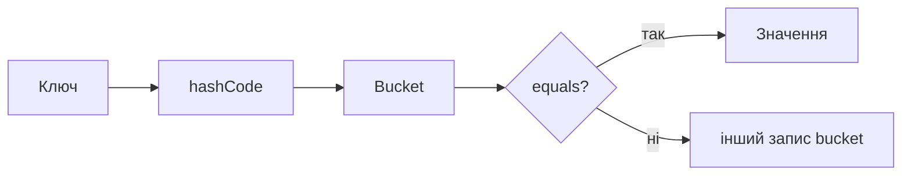
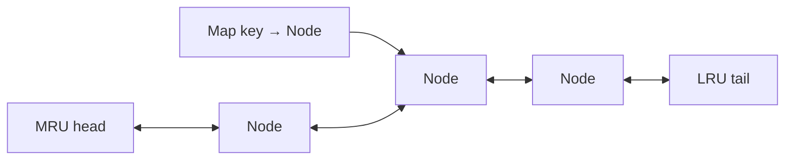

# 04. Хеш-таблиці

[← Індекс](README.md) · Код: [`src/topic04_hash_tables`](../../src/topic04_hash_tables)

## Ментальна модель

Hash table міняє пам’ять на швидкий пошук. `HashMap<K,V>` відповідає «що відомо про ключ?», `HashSet<K>` — «чи бачили ключ?». Очікувана складність `get/put` — `O(1)`, але якість залежить від коректних `equals/hashCode` та розподілу ключів.



## Патерни

### Frequency map і canonical key

Anagram/grouping: або відсортувати символи `O(m log m)`, або побудувати вектор частот `O(m)` для фіксованого алфавіту. Ключ має бути незмінним і однозначним: наприклад `#1#0#12...`, щоб `[1,11]` не злився з `[11,1]`.

### Prefix state → count

Для `Subarray Sum Equals K`: якщо поточна префіксна сума `p`, потрібний попередній префікс `p-k`. Map зберігає **кількість**, не лише наявність, бо різні початки дають різні підмасиви.

```java
Map<Long, Integer> count = new HashMap<>();
count.put(0L, 1);
long prefix = 0;
long answer = 0;
for (int x : nums) {
    prefix += x;
    answer += count.getOrDefault(prefix - k, 0);
    count.merge(prefix, 1, Integer::sum);
}
```

Початкове `0 → 1` представляє порожній префікс.

### Hash set як межа послідовності

У Longest Consecutive запускайте лічбу лише з `x`, для якого немає `x-1`. Тоді кожна послідовність проходиться один раз; повторний огляд внутрішніх елементів зникне.

### O(1) design через комбінацію структур

- `RandomizedSet`: `ArrayList` + `value→index`; delete міняє елемент з останнім.
- LRU: `key→node` + двозв’язний список; map знаходить, список підтримує recency.
- Twitter: map авторів/підписок + timestamp + heap для k-way merge стрічок.



### Геометричний ключ

Для Max Points on a Line нормалізуйте нахил як пару `(dy/gcd, dx/gcd)`, а не `double`. Уніфікуйте знаки та окремо обробіть вертикалі/дублікати.

### Exactly K

Число підмасивів із рівно `K` різними: `atMost(K) - atMost(K-1)`. Функція `atMost` — стандартне ковзне вікно, яке додає `right-left+1` валідних підмасивів із кожним правим краєм.

## Карта задач

| Родина | Задачі |
|---|---|
| Membership/frequency | ContainsDuplicate, ContainsDuplicateII, ValidAnagram, Intersection, FirstUniqueChar |
| Відображення | IsomorphicStrings, WordPattern, GroupAnagrams |
| Цикл станів | HappyNumber |
| Реалізація структури | DesignHashSet, DesignHashMap, RandomizedSet, LRUCache, DesignTwitter |
| Prefix + map | SubarraySumEqualsK |
| Set boundaries | LongestConsecutiveSequence |
| Нормалізований ключ | MaxPointsOnLine |
| Window + frequency | SubarraysWithKDifferent |

## Пастки

- Мутувати об’єкт після використання як ключа.
- Не синхронізувати list і map під час swap-delete.
- Вважати найгірший час hash table гарантованим `O(1)`.
- Використовувати `double` як точний ключ відношення.
- Оновити map префіксів до підрахунку й випадково дозволити порожній підмасив.

