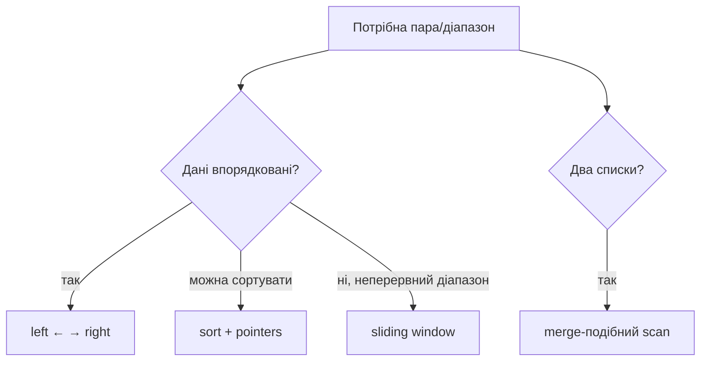

# 05. Два вказівники

[← Індекс](README.md) · Код: [`src/topic05_two_pointers`](../../src/topic05_two_pointers)

## Ідея простими словами

Наївний пошук пари часто виглядає як два вкладені цикли: беремо перший елемент і пробуємо його з усіма наступними. Це `O(n²)`. Два вказівники допомагають, коли після одного порівняння можна зробити висновок не про одну пару, а про цілу групу пар.

Найтиповіші розташування:

```text
1. Назустріч:      L → [ ... ... ... ] ← R
2. В одному боці:  W,R → [ ... ... ... ]
3. Два джерела:    A[i] і B[j]
4. Різна швидкість slow / fast
```

Головне питання не «чи можна поставити два індекси?», а **чому рух конкретного вказівника не втрачає правильну відповідь**.

## 1. Valid Palindrome: найпростіший приклад

Для рядка `"A man, a plan, a canal: Panama"` порівнюються лише літери й цифри без урахування регістру.

Алгоритм:

1. `left` шукає наступний значущий символ зліва;
2. `right` — справа;
3. нормалізовані символи порівнюються;
4. якщо різні — `false`; якщо однакові — обидва рухаються.

Не обов’язково будувати очищений рядок `O(n)` пам’яті. Вказівники дозволяють читати оригінал.

```java
while (left < right) {
    while (left < right && !Character.isLetterOrDigit(s.charAt(left))) left++;
    while (left < right && !Character.isLetterOrDigit(s.charAt(right))) right--;
    if (Character.toLowerCase(s.charAt(left)) !=
        Character.toLowerCase(s.charAt(right))) return false;
    left++;
    right--;
}
return true;
```

Valid Palindrome II дозволяє видалити не більше одного символу. При першій невідповідності є рівно два кандидати: пропустити лівий або правий і перевірити залишок звичайною palindrome-функцією. Не треба жадібно обирати один: обидві гілки можуть виглядати локально однаково.

## 2. Two Sum у відсортованому масиві

```text
nums = [1, 2, 4, 6, 10], target = 8
        L              R    sum=11 > 8 → R--
        L          R        sum=7  < 8 → L++
           L       R        sum=8 → знайдено
```

### Чому рух безпечний

Якщо `nums[L]+nums[R] > target`, то пара `L,R` завелика. Для будь-якого індексу `j` між L і R пара `j,R` буде не меншою, бо масив відсортований. Отже `R` не може брати участь у правильній парі з поточним або правішим лівим кандидатом — його можна відкинути.

Якщо сума замала, аналогічно відкидається `L`: з будь-яким ще лівішим правим кандидатом сума не стане більшою.

Без сортування цей доказ зникає. Тоді кандидатом є hash map. Якщо сортувати дозволено, пам’ять може зменшитися, але початкові індекси треба зберегти.

## 3. Read/write pointers для in-place фільтрації

У Remove Element `read` переглядає кожну позицію, а `write` вказує, куди записати наступне значення, яке треба залишити.

```text
nums=[3,2,2,3], remove=3

read=0: 3 пропускаємо, write=0
read=1: 2 → nums[0]=2, write=1
read=2: 2 → nums[1]=2, write=2
read=3: 3 пропускаємо

значущий префікс: [2,2], нова довжина 2
```

Після кожного кроку `[0,write)` містить рівно ті з уже прочитаних елементів, які треба зберегти, у правильному порядку.

Move Zeroes використовує ту саму схему: спочатку стиснути ненульові, потім заповнити хвіст нулями. Remove Duplicates у sorted array залишає значення, якщо воно відрізняється від останнього записаного.

### Merge Sorted Array — чому рух із кінця

Якщо `nums1` має вільне місце в кінці, merge спереду перезапише ще не прочитані елементи. Тому `i` та `j` дивляться на кінці реальних частин, а `write` — на останню комірку. Більший елемент записується назад. Усе, що ще не оброблено, лишається безпечним ліворуч.

## 4. Squares of a Sorted Array

Відсортований масив `[-7,-3,2,4,8]` після піднесення до квадрата не лишається відсортованим, бо великі за модулем від’ємні числа стають великими додатними.

Найбільший квадрат завжди на одному з країв. Порівнюйте `abs(nums[left])` і `abs(nums[right])`, записуйте більший квадрат у результат справа наліво.

Це типовий сигнал: масив відсортований за значенням, але перетворення має V-подібну або іншу монотонну форму; екстремум знаходиться на краях.

## 5. ThreeSum: від O(n³) до O(n²)

Після сортування фіксуємо перше число `nums[i]`. Решта задачі — Two Sum на суфіксі для target `-nums[i]`.

```text
[-4,-1,-1,0,1,2]

i=0, value=-4: шукаємо суму 4 у правій частині
i=1, value=-1: L=-1, R=2 → sum трійки 0 → [-1,-1,2]
                 L=0,  R=1 → sum трійки 0 → [-1,0,1]
i=2 має те саме -1 → пропускаємо, щоб не дублювати трійки
```

### Дублікати

- якщо `i>0 && nums[i]==nums[i-1]`, пропустити весь anchor;
- після знайденої трійки рухати L/R і пропускати однакові сусідні значення;
- не пропускайте дублікати хаотично до збереження відповіді.

Сортування коштує `O(n log n)`, але домінує `O(n²)` scan. Додаткова пам’ять залежить від алгоритму сортування, не рахуючи output.

## 6. Container With Most Water: доказ руху нижчої стінки

Площа між `left` і `right`:

```text
width = right-left
height = min(h[left],h[right])
area = width*height
```

Після кожного руху ширина зменшується. Щоб площа могла зрости, мінімальна висота повинна зрости. Якщо ліва стінка нижча, рух правої лишає ліву мінімумом або робить мінімум ще нижчим, а ширина вже менша. Тому такі варіанти не поліпшать поточну площу. Єдина надія — відкинути нижчу ліву стінку.

Це зразок правильного two-pointer proof: ми не просто рухаємо «менше число», а доводимо, що всі пари з відкинутим краєм доміновані вже перевіреною парою.

## 7. Trapping Rain Water

Вода над позицією `i` визначається:

```text
min(maxLeft[i], maxRight[i]) - height[i]
```

Найпростіше спершу побудувати два масиви maxima — це зрозумілий `O(n)` time, `O(n)` memory розв’язок. Лише потім стискати пам’ять двома вказівниками.

Якщо `leftMax <= rightMax`, то для поточної лівої позиції точно є права межа не нижча за `leftMax`. Її вода вже остаточно визначена `leftMax-height[left]`; детальне майбутнє праворуч не потрібне. Аналогічно для правої сторони.

```text
height:   [0,1,0,2]
leftMax:  [0,1,1,2]
rightMax: [2,2,2,2]
water:    [0,0,1,0]
```

## 8. Два списки інтервалів

Нехай поточні інтервали `[aStart,aEnd]` і `[bStart,bEnd]`.

```text
intersectionStart = max(aStart,bStart)
intersectionEnd   = min(aEnd,bEnd)
```

Якщо start ≤ end, перетин існує. Далі просувається інтервал, який закінчився раніше: він уже не може перетнутися з наступними інтервалами іншого списку, бо вони починаються ще пізніше.

Цей pattern працює для merge-like задач із двома відсортованими потоками: версії, календарі, списки подій.

## 9. Boats to Save People як greedy + pointers

Після сортування беремо найважчу людину `right`. Вона обов’язково вирушить зараз або пізніше. Якщо найлегша `left` може сісти з нею, це найкраще використання залишкового місця. Якщо навіть найлегша не може, ніхто інший теж не може — важка пливе сама. Такий exchange argument доводить greedy.

## 10. Find Duplicate як функціональний граф

За умовами значення лежать у діапазоні індексів. Розгляньте `next(i)=nums[i]`. З кожної вершини виходить рівно одне ребро, тому шлях зрештою входить у цикл. Два різні індекси, що вказують на однакове значення-дублікат, створюють вхід у цей цикл.

Floyd:

1. slow робить один перехід, fast — два, доки не зустрінуться;
2. slow повертається на старт, fast лишається в точці зустрічі;
3. обидва рухаються по одному; зустріч — duplicate.

Цей метод доречний лише через спеціальний контракт значень. Не застосовуйте його до довільного масиву «бо там є дублікат».

## 11. Two pointers чи sliding window?

Вони споріднені, але не однакові:

- two pointers часто відкидають краї завдяки **порядку значень**;
- sliding window підтримує стан **усього неперервного діапазону** і рухає left, щоб відновити валідність;
- Minimum Window Substring логічно належить до sliding window, навіть якщо використовує два індекси.

Якщо умова питає пару у sorted array — two pointers. Якщо питає найдовший/найкоротший substring/subarray із властивістю — перевіряйте sliding window.

## 12. Самоперевірка вибору

Перед кодом дайте відповіді:

1. Де стоять вказівники на старті?
2. Що означає область між/до них?
3. Яка умова рухає кожен?
4. Чому відкинута область більше не потрібна?
5. Коли цикл завершується?

Якщо пункт 4 не має чіткого доказу, можливо, two pointers тут не працює.

## Ментальна модель

Два вказівники стискають квадратичний перебір, коли порядок дозволяє після одного порівняння **назавжди відкинути** цілу групу пар. Вони можуть рухатися назустріч, в одному напрямку з різною швидкістю або по двох колекціях.



## Патерни й докази

### Назустріч у відсортованому масиві

Для target sum: якщо сума мала, жодна пара з поточним `left` і правішим елементом не врятує її краще, ніж поточний `right`; але зсув `left` збільшує суму. Аналогічно велика сума змушує зсунути `right`. Це доказ безпечного відкидання.

### Read/write pointers

`read` переглядає кожен елемент, `write` позначає наступну позицію результату. Інваріант: `[0, write)` вже є правильним стисненим результатом. Так працюють remove element, move zeroes, deduplication.

```java
int write = 0;
for (int read = 0; read < nums.length; read++) {
    if (keep(nums[read])) nums[write++] = nums[read];
}
```

### ThreeSum

Сортування + фіксація `i` + два вказівники. Дублікати пропускайте на кожному рівні лише після збереження відповіді. Час `O(n²)`; lower bound тут не долається простим hash set без інших компромісів.

### Container / trapping water

Container: площу обмежує нижча стінка, тому рух вищої не може поліпшити мінімальну висоту при меншій ширині — рухайте нижчу.

Trapping Rain Water: якщо `leftMax <= rightMax`, вода над `left` вже визначена `leftMax`, бо справа гарантовано є не нижча межа. Накопичуйте `max(0, leftMax-height[left])` і рухайте цей бік.

### Floyd cycle detection

У Find Duplicate масив задає функціональний граф `i → nums[i]`. Дублікат — вхід у цикл. Спершу знайдіть зустріч slow/fast, потім один вказівник поставте на старт; однакова швидкість приводить обох до входу. Це не binary search і не модифікує масив.

### Два потоки інтервалів

Перетин `[a1,a2]` та `[b1,b2]` — `[max(a1,b1), min(a2,b2)]`, якщо початок ≤ кінець. Інтервал, який закінчується раніше, більше не перетнеться з поточним іншим — його вказівник просувається.

## Карта задач

| Рух | Задачі |
|---|---|
| Назустріч | ValidPalindrome, TwoSumSorted, SquaresSorted, ValidPalindromeII, Container, TrappingRainWater |
| Read/write | ReverseString, RemoveDuplicates, MoveZeroes, MergeSortedArray, RemoveElement |
| Sort + pointers | Intersection, ThreeSum, BoatsToSavePeople |
| Два списки | IntervalListIntersections, CompareVersionNumbers |
| Functional graph | FindDuplicateNumber |
| Window + frequency | MinimumWindowSubstring |

## Пастки

- Застосувати two pointers до невідсортованих даних без монотонної властивості.
- Пропускати дублікати до фіксації ThreeSum-відповіді.
- Перезаписати ще не прочитані значення при merge; тому merge масивів іде з кінця.
- Для palindrome пропускати більше одного символу без branching.
- Не пояснити, чому рух певного краю безпечний — це сигнал, що патерн обрано навмання.
