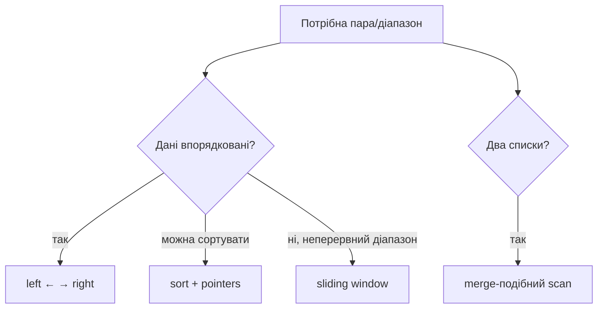

# 05. Два вказівники

[← Індекс](README.md) · Код: [`src/topic05_two_pointers`](../../src/topic05_two_pointers)

## Ментальна модель

Два вказівники стискають квадратичний перебір, коли порядок дозволяє після одного порівняння **назавжди відкинути** цілу групу пар. Вони можуть рухатися назустріч, в одному напрямку з різною швидкістю або по двох колекціях.



## Патерни й докази

### Назустріч у відсортованому масиві

Для target sum: якщо сума мала, жодна пара з поточним `left` і правішим елементом не врятує її краще, ніж поточний `right`; але зсув `left` збільшує суму. Аналогічно велика сума змушує зсунути `right`. Це доказ безпечного відкидання.

### Read/write pointers

`read` переглядає кожен елемент, `write` позначає наступну позицію результату. Інваріант: `[0, write)` вже є правильним стисненим результатом. Так працюють remove element, move zeroes, deduplication.

```java
int write = 0;
for (int read = 0; read < nums.length; read++) {
    if (keep(nums[read])) nums[write++] = nums[read];
}
```

### ThreeSum

Сортування + фіксація `i` + два вказівники. Дублікати пропускайте на кожному рівні лише після збереження відповіді. Час `O(n²)`; lower bound тут не долається простим hash set без інших компромісів.

### Container / trapping water

Container: площу обмежує нижча стінка, тому рух вищої не може поліпшити мінімальну висоту при меншій ширині — рухайте нижчу.

Trapping Rain Water: якщо `leftMax <= rightMax`, вода над `left` вже визначена `leftMax`, бо справа гарантовано є не нижча межа. Накопичуйте `max(0, leftMax-height[left])` і рухайте цей бік.

### Floyd cycle detection

У Find Duplicate масив задає функціональний граф `i → nums[i]`. Дублікат — вхід у цикл. Спершу знайдіть зустріч slow/fast, потім один вказівник поставте на старт; однакова швидкість приводить обох до входу. Це не binary search і не модифікує масив.

### Два потоки інтервалів

Перетин `[a1,a2]` та `[b1,b2]` — `[max(a1,b1), min(a2,b2)]`, якщо початок ≤ кінець. Інтервал, який закінчується раніше, більше не перетнеться з поточним іншим — його вказівник просувається.

## Карта задач

| Рух | Задачі |
|---|---|
| Назустріч | ValidPalindrome, TwoSumSorted, SquaresSorted, ValidPalindromeII, Container, TrappingRainWater |
| Read/write | ReverseString, RemoveDuplicates, MoveZeroes, MergeSortedArray, RemoveElement |
| Sort + pointers | Intersection, ThreeSum, BoatsToSavePeople |
| Два списки | IntervalListIntersections, CompareVersionNumbers |
| Functional graph | FindDuplicateNumber |
| Window + frequency | MinimumWindowSubstring |

## Пастки

- Застосувати two pointers до невідсортованих даних без монотонної властивості.
- Пропускати дублікати до фіксації ThreeSum-відповіді.
- Перезаписати ще не прочитані значення при merge; тому merge масивів іде з кінця.
- Для palindrome пропускати більше одного символу без branching.
- Не пояснити, чому рух певного краю безпечний — це сигнал, що патерн обрано навмання.

