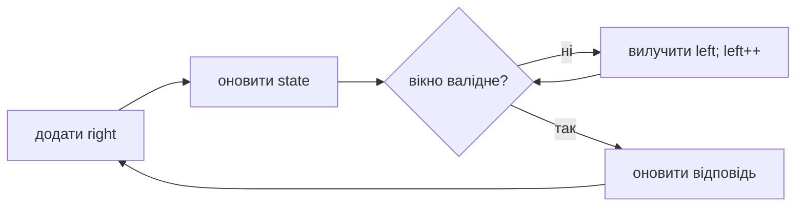
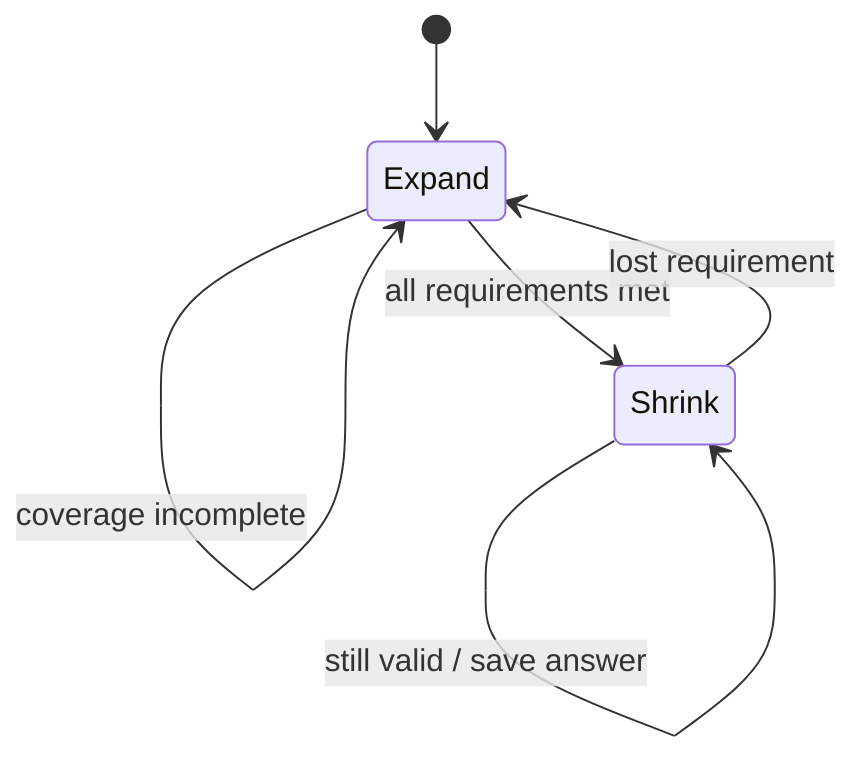

# 06. Ковзне вікно

[← Індекс](README.md) · Код: [`src/topic06_sliding_window`](../../src/topic06_sliding_window)

## Що таке вікно

Вікно `[left,right]` — поточний неперервний шматок масиву або рядка. Замість заново обчислювати його властивості, ми:

1. додаємо новий елемент справа;
2. за потреби видаляємо один чи кілька елементів зліва;
3. підтримуємо sum/count/frequency/max candidates;
4. оновлюємо відповідь.

```algoviz
{
  "type": "sliding-window",
  "title": "Як рухається ковзне вікно",
  "values": ["a", "b", "c", "d", "e", "f", "g"],
  "steps": [
    {
      "label": "Початкове вікно містить c, d, e",
      "note": "Left і right завжди описують неперервний фрагмент масиву.",
      "pointers": {"L": 2, "R": 4},
      "range": [2, 4],
      "prediction": {
        "prompt": "Що змінюється першим під час розширення вікна?",
        "options": ["L рухається вліво", "R рухається вправо", "Обидві межі", "Масив сортується"],
        "answer": 1,
        "explanation": "Розширення додає новий елемент через праву межу."
      }
    },
    {
      "label": "Розширюємо вікно вправо й додаємо f",
      "note": "Оновлюємо sum, count або frequency тільки для нового елемента.",
      "pointers": {"L": 2, "R": 5},
      "active": [5],
      "range": [2, 5],
      "prediction": {
        "prompt": "Правило стало невалідним. Яка стандартна дія?",
        "options": ["Скинути все вікно", "Посунути L вправо", "Посунути R ще далі", "Відсортувати вікно"],
        "answer": 1,
        "explanation": "Left стискає вікно доти, доки інваріант валідності не відновиться."
      }
    },
    {
      "label": "Правило порушене — прибираємо c зліва",
      "note": "Елемент c залишає вікно назавжди, тому загальна кількість рухів залишається O(n).",
      "pointers": {"L": 3, "R": 5},
      "visited": [2],
      "range": [3, 5],
      "prediction": {
        "prompt": "Якщо після видалення c правило все ще порушене, що робимо?",
        "options": ["Зупиняємось", "Повертаємо c", "Ще раз рухаємо L", "Зменшуємо R"],
        "answer": 2,
        "explanation": "Саме тому shrink зазвичай записаний як while, а не if."
      }
    },
    {
      "label": "За потреби стискаємо ще раз і прибираємо d",
      "note": "Зупиняємо left одразу після відновлення валідності вікна.",
      "pointers": {"L": 4, "R": 5},
      "visited": [2, 3],
      "range": [4, 5]
    }
  ]
}
```

Успіх методу тримається на тому, що кожен індекс входить у вікно один раз через `right` і виходить не більше одного разу через `left`. Тому два вкладені цикли разом дають `O(n)`.

## 1. Як відрізнити три типи

### Фіксований розмір

Фрази: «кожен підмасив довжини k», «серед усіх підрядків розміру k». Межі рухаються синхронно; після додавання нового треба видалити рівно той, що вийшов.

### Найдовше валідне вікно

Фрази: «найдовший підрядок, де…», «максимальна кількість послідовних… після не більше k змін». Розширюйте right, а при порушенні стискайте, доки вікно знову валідне. Після цього оновлюйте maximum.

### Найкоротше вікно, яке покриває вимогу

Фрази: «мінімальна довжина з сумою не менше…», «найкоротший substring, що містить усі…». Розширюйте до валідності, потім у `while(valid)` зберігайте minimum і стискайте до першої невалідності.

## 2. Fixed window на прикладі Max Average

`nums=[1,12,-5,-6,50,3]`, `k=4`.

Перше вікно має суму `1+12-5-6=2`. Далі не треба знову додавати чотири числа:

| Вікно | Оновлення sum | sum |
|---|---|---:|
| `[1,12,-5,-6]` | початкова | 2 |
| `[12,-5,-6,50]` | `2 - 1 + 50` | 51 |
| `[-5,-6,50,3]` | `51 - 12 + 3` | 42 |

Максимальна середня — `51/4`. Суму краще порівнювати як integer/long і ділити один раз наприкінці, щоб не накопичувати floating-point шум.

Шаблон:

```java
long window = 0;
for (int i = 0; i < k; i++) window += nums[i];
long best = window;
for (int right = k; right < nums.length; right++) {
    window += nums[right] - nums[right-k];
    best = Math.max(best, window);
}
```

## 3. Longest valid: Max Consecutive Ones III

Можна перетворити не більше `k` нулів. Отже вікно валідне, якщо `zeroCount <= k`.

```text
nums = [1,1,1,0,0,0,1,1,1,1,0], k=2
```

Right розширює вікно. Коли нулів стає 3, left рухається, доки не видалить найлівіший нуль. Після shrink поточне вікно знову валідне і є найдовшим валідним із цим right, бо left зсунули лише настільки, наскільки необхідно.

```java
int left = 0, zeros = 0, best = 0;
for (int right = 0; right < nums.length; right++) {
    if (nums[right] == 0) zeros++;
    while (zeros > k) {
        if (nums[left++] == 0) zeros--;
    }
    best = Math.max(best, right-left+1);
}
```

Fruit Into Baskets — та сама структура, але валідність `frequencyMap.size() <= 2`. Longest K Distinct — `<=k` різних.

## 4. Character Replacement

У вікні довжини `len` найвигідніше залишити найчастіший символ, а всі інші замінити. Кількість замін:

```text
len - maxFrequency
```

Вікно валідне, якщо це `<=k`.

Приклад `AABABBA`, `k=1`: для `AABA` довжина 4, maxFreq(A)=3, потрібна одна заміна → валідно. Для більшого вікна частота й required replacements оновлюються.

У популярній оптимізації `maxFrequency` не зменшують при русі left. Це не точна частота поточного вікна, а найбільша частота, яка колись підтримувала вікно такої довжини. Така stale величина безпечна для maximum length, але цей трюк не можна механічно переносити в задачі, де потрібне саме поточне валідне вікно або його вміст.

## 5. Minimum Size Subarray Sum

Для **додатних** чисел сума монотонна:

- додавання справа не зменшує sum;
- видалення зліва не збільшує sum.

Тому при `sum >= target` можна стискати й шукати мінімум.

```text
nums=[2,3,1,2,4,3], target=7

[2,3,1,2] sum=8 → candidate length 4, remove 2
[3,1,2,4] ... при right=4 sum=10
стискаємо: length 4 → sum 7, length 3 → remove 1, sum 6
у кінці [4,3] дає length 2
```

Якщо дозволити від’ємні числа, після видалення від’ємного sum може зрости, а після додавання — впасти. Монотонність зникає; стандартний алгоритм більше не доведений. Можуть знадобитися prefix sums + monotonic deque.

## 6. Minimum Window Substring крок за кроком

Потрібно найкоротше вікно в `s`, що містить усі символи `t` з урахуванням кількостей.

Для `t="AABC"` недостатньо мати хоча б по одному A, B, C — потрібні два A.

Зберігаємо:

- `need[ch]` — скільки потрібно;
- `window[ch]` — скільки є;
- `required` — кількість різних потрібних символів;
- `formed` — для скількох символів кількість уже досягла need.

Коли додаємо символ і `window[ch] == need[ch]`, `formed++`. Не збільшуємо formed на кожну зайву копію. Під час shrink, якщо перед видаленням кількість дорівнювала need, після видалення вимога зламається й `formed--`.

Алгоритм має дві фази, що повторюються:

1. Expand до `formed==required`.
2. Поки валідно: записати candidate, вилучити left, можливо втратити валідність.

Зберігайте індекс і довжину найкращого вікна, а substring створіть один раз наприкінці; часті `substring` усередині циклу створюють зайві об’єкти.

## 7. Exactly K distinct

Розглянемо `atMost(K)`. Після shrink `[left,right]` має не більше K distinct. Тоді з фіксованим правим краєм валідні:

```text
[left..right], [left+1..right], ..., [right..right]
```

Їх `right-left+1`. Підсумовуючи по right, отримуємо число всіх підмасивів з at most K.

```text
exactly K = atMost(K) - atMost(K-1)
```

Наприклад, масиви з at most 2 включають підмасиви з 0, 1 і 2 distinct; з at most 1 — з 0 і 1. Різниця лишає рівно 2.

## 8. Sliding Maximum: чому frequency map недостатньо

Суму легко оновити відніманням outgoing. Maximum так не працює: якщо з вікна пішов максимум, треба знати наступний. Повторний scan кожного вікна — `O(nk)`, heap — `O(n log k)`, monotonic deque — `O(n)`.

Deque зберігає лише недомінованих кандидатів. Новий елемент `x` робить усі менші/рівні елементи позаду непотрібними: він не менший і проживе у вікні довше. Голова deque — найстаріший серед найбільших кандидатів.

## 9. Longest Nice Substring — приклад, де window незручне

Nice substring вимагає, щоб для кожної літери були обидва регістри. Якщо умова порушена конкретною літерою, жоден nice substring не може містити її в цьому фрагменті. Тому можна знайти таку літеру, розділити рядок навколо неї й рекурсивно розв’язати ліву та праву частини.

Це корисне нагадування: слово «substring» не гарантує sliding window. Потрібна властивість, яку можна підтримувати монотонним рухом left.

## 10. Чекліст перед кодом

1. Діапазон точно неперервний?
2. Розмір fixed чи залежить від валідності?
3. Який state додається/вилучається за `O(1)`?
4. Яка точна умова `valid()`?
5. Для maximum відповідь оновлюється після відновлення валідності?
6. Для minimum — усередині `while(valid)` до руйнування?
7. Чи не руйнують від’ємні числа/немонотонна умова сам доказ?

## Коли працює window

Ковзне вікно обробляє **неперервні** діапазони, якщо стан можна дешево оновити при додаванні справа та вилученні зліва. Ключова умова для змінного вікна: порушення має виправлятися монотонним рухом `left`; якщо від’ємні числа руйнують цю властивість, частіше потрібні prefix sums/deque.



## Фіксоване вікно

Обчисліть перше вікно, далі на кожному кроці `state += incoming - outgoing`. Час `O(n)`, пам’ять залежить від state. Так розв’язуються max average, vowels, k-beauty, diet score.

## Змінне вікно: longest valid

```java
int left = 0;
for (int right = 0; right < n; right++) {
    add(a[right]);
    while (!valid()) remove(a[left++]);
    answer = Math.max(answer, right - left + 1);
}
```

Після `while` вікно валідне; для кожного `right` воно є найдовшим валідним, що закінчується тут.

Character Replacement: нехай `maxFreq` — найбільша частота символу, яку бачили при розширенні. Потрібно замінити `windowSize-maxFreq`. `maxFreq` можна не зменшувати при shrink: його «застарілість» не створює завищеної глобальної відповіді, а лише відкладає стискання.

## Minimum covering window

Підтримуйте `need`, `window` і число виконаних типів `formed`. Після досягнення покриття стискайте в `while`, фіксуючи найкоротший результат **до** видалення критичного символу.



## Exactly K distinct

Безпосередньо рахувати «рівно K» незручно. Для `atMost(K)` кожне валідне вікно з правим краєм `r` дає `r-left+1` підмасивів. Тоді:

`exactly(K) = atMost(K) - atMost(K - 1)`.

## Монотонна deque

Sliding Window Maximum потребує не просто frequency state, а структуру кандидатів: індекси у спадному порядку значень. Прострочені й доміновані кандидати видаляються, кожен індекс обробляється `O(1)` амортизовано.

## Карта задач

| Тип | Задачі |
|---|---|
| Fixed | MaxAverageSubarray, DefuseBomb, MinDifference, KBeauty, MaxVowels, SubstringSizeThree, DietPlan |
| Longest valid | MaxConsecutiveOnes, CharacterReplacement, MaxConsecutiveOnesIII, FruitIntoBaskets, LongestSubstringKDistinct |
| Shortest valid | MinSizeSubarraySum, MinWindowSubstring |
| Membership | ContainsDuplicateII |
| Divide / recursive scan | LongestNiceSubstring |
| Exactly K | SubarraysKDifferent |
| Deque | SlidingWindowMaximum |

## Пастки

- Оновлювати minimum-відповідь після руйнування валідності.
- Використати `if` замість `while`, коли треба вилучити кілька елементів.
- Плутати число різних ключів з числом усіх символів.
- Припускати, що standard window працює для sum target з довільними від’ємними числами.
- Повертати довжину поточного, а не найкращого вікна.
