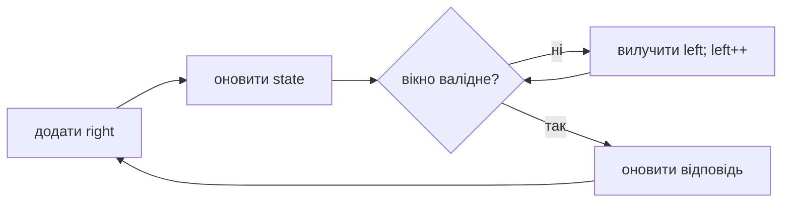
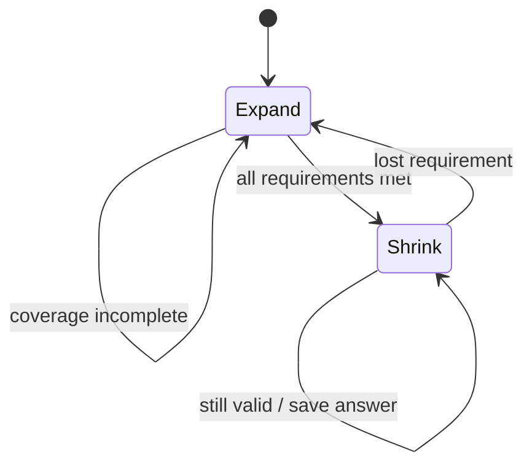

# 06. Ковзне вікно

[← Індекс](README.md) · Код: [`src/topic06_sliding_window`](../../src/topic06_sliding_window)

## Коли працює window

Ковзне вікно обробляє **неперервні** діапазони, якщо стан можна дешево оновити при додаванні справа та вилученні зліва. Ключова умова для змінного вікна: порушення має виправлятися монотонним рухом `left`; якщо від’ємні числа руйнують цю властивість, частіше потрібні prefix sums/deque.



## Фіксоване вікно

Обчисліть перше вікно, далі на кожному кроці `state += incoming - outgoing`. Час `O(n)`, пам’ять залежить від state. Так розв’язуються max average, vowels, k-beauty, diet score.

## Змінне вікно: longest valid

```java
int left = 0;
for (int right = 0; right < n; right++) {
    add(a[right]);
    while (!valid()) remove(a[left++]);
    answer = Math.max(answer, right - left + 1);
}
```

Після `while` вікно валідне; для кожного `right` воно є найдовшим валідним, що закінчується тут.

Character Replacement: нехай `maxFreq` — найбільша частота символу, яку бачили при розширенні. Потрібно замінити `windowSize-maxFreq`. `maxFreq` можна не зменшувати при shrink: його «застарілість» не створює завищеної глобальної відповіді, а лише відкладає стискання.

## Minimum covering window

Підтримуйте `need`, `window` і число виконаних типів `formed`. Після досягнення покриття стискайте в `while`, фіксуючи найкоротший результат **до** видалення критичного символу.



## Exactly K distinct

Безпосередньо рахувати «рівно K» незручно. Для `atMost(K)` кожне валідне вікно з правим краєм `r` дає `r-left+1` підмасивів. Тоді:

`exactly(K) = atMost(K) - atMost(K - 1)`.

## Монотонна deque

Sliding Window Maximum потребує не просто frequency state, а структуру кандидатів: індекси у спадному порядку значень. Прострочені й доміновані кандидати видаляються, кожен індекс обробляється `O(1)` амортизовано.

## Карта задач

| Тип | Задачі |
|---|---|
| Fixed | MaxAverageSubarray, DefuseBomb, MinDifference, KBeauty, MaxVowels, SubstringSizeThree, DietPlan |
| Longest valid | MaxConsecutiveOnes, CharacterReplacement, MaxConsecutiveOnesIII, FruitIntoBaskets, LongestSubstringKDistinct |
| Shortest valid | MinSizeSubarraySum, MinWindowSubstring |
| Membership | ContainsDuplicateII |
| Divide / recursive scan | LongestNiceSubstring |
| Exactly K | SubarraysKDifferent |
| Deque | SlidingWindowMaximum |

## Пастки

- Оновлювати minimum-відповідь після руйнування валідності.
- Використати `if` замість `while`, коли треба вилучити кілька елементів.
- Плутати число різних ключів з числом усіх символів.
- Припускати, що standard window працює для sum target з довільними від’ємними числами.
- Повертати довжину поточного, а не найкращого вікна.

