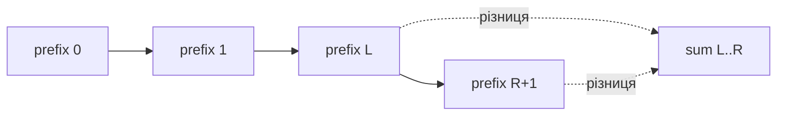
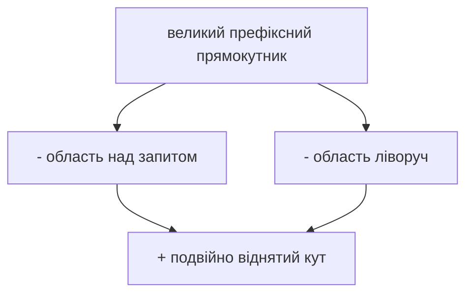

# 07. Префіксні суми та difference arrays

[← Індекс](README.md) · Код: [`src/topic07_prefix_sums`](../../src/topic07_prefix_sums)

## Головна формула

Нехай `prefix[i]` — сума перших `i` елементів, `prefix[0]=0`. Тоді напіввідкритий діапазон:

`sum(left, right) = prefix[right + 1] - prefix[left]`.

Додатковий нуль прибирає окрему гілку для `left=0`.

## Prefix + hash map

Властивість підмасиву перетворюється на відношення двох префіксів:

- sum `k`: `current - previous = k` → шукаємо `previous=current-k`;
- divisible by `k`: два префікси мають однаковий нормалізований залишок;
- equal 0/1: замініть `0` на `-1`, потрібна однакова префіксна сума;
- existence length ≥ 2: map зберігає **найперший індекс** залишку.

У Java залишок нормалізуйте: `((sum % k) + k) % k`, бо `%` для від’ємних повертає від’ємне.

## 2D prefix

`P[r+1][c+1]` — сума прямокутника від `(0,0)` до `(r,c)`. Запит — inclusion-exclusion:

`P[r2+1][c2+1] - P[r1][c2+1] - P[r2+1][c1] + P[r1][c1]`.

## Difference array

Щоб додати `delta` до всіх позицій `[l,r]`, запишіть `diff[l]+=delta`, `diff[r+1]-=delta`; один фінальний prefix scan відновить значення. Для flight bookings це 1D; для car pooling координата — час/зупинка. Метод придатний, коли всі range updates відомі до запитів.

## Максимальна сума прямокутника

Стисніть пари рядків або стовпців у 1D масив сум і застосуйте Kadane; складність `O(rows²·cols)` або симетрично — квадратуйте менший вимір.

## Карта задач

| Техніка | Задачі |
|---|---|
| Простий prefix | RunningSum, HighestAltitude, MinValuePositiveStep |
| Баланс ліво/право | FindMiddleIndex, LeftRightDifference, PivotIndex |
| Immutable range query | RangeSumQuery, MatrixBlockSum, RangeSumQuery2D |
| Prefix + map | SubarraySumEqualsK, DivisibleByK, ContiguousArray, CheckSubarraySum |
| Difference | CorporateFlightBookings, CarPooling |
| Dimension reduction | MaxSumRectangle |
| Exactly K decomposition | SubarraysKDifferentSums |

## Пастки

- Не закласти `prefix[0]=0` / map `0→1`.
- Переплутати inclusive і half-open індекси.
- Зберігати останній індекс, коли потрібна максимальна довжина від найпершого.
- Переповнити `int` сумою багатьох значень.
- Для `k=0` виконати modulo; цей контракт треба обробити окремо.

