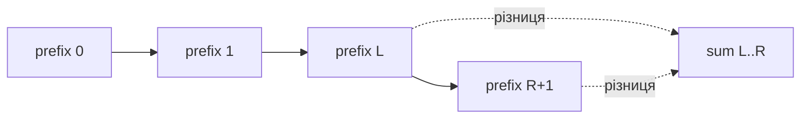
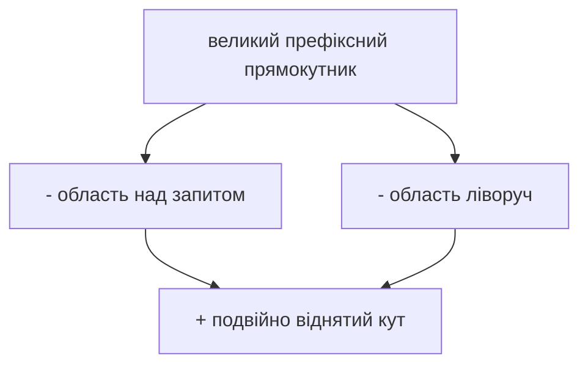

# 07. Префіксні суми та difference arrays

[← Індекс](README.md) · Код: [`src/topic07_prefix_sums`](../../src/topic07_prefix_sums)

## Ідея: заплатити один раз за майбутні запити

Якщо треба багато разів питати суму різних діапазонів, щоразу проходити діапазон дорого. Prefix sum заздалегідь накопичує суму від початку, після чого будь-який range перетворюється на віднімання.

Для `nums=[2,4,-1,3]` будуємо масив довжини `n+1`:

```text
prefix[0] = 0
prefix[1] = 2
prefix[2] = 2+4 = 6
prefix[3] = 2+4-1 = 5
prefix[4] = 2+4-1+3 = 8

prefix = [0,2,6,5,8]
```

Сума `nums[1..3] = 4-1+3` дорівнює `prefix[4]-prefix[1] = 8-2 = 6`. Ми беремо все до правої межі включно й відрізаємо все до лівої межі не включно.

Додатковий `prefix[0]=0` — не декоративний. Він дозволяє однаково обчислювати діапазон від індексу 0: `sum(0,r)=prefix[r+1]-prefix[0]`.

## 1. Running sum, altitude і balance

Running Sum просить повернути кожен префікс, тому результат і є prefix array. Highest Altitude використовує лише поточний prefix і максимум — весь масив зберігати не треба. Minimum Value to Get Positive Step-by-Step Sum шукає найменший prefix; стартове значення має компенсувати його так, щоб мінімальна поточна сума стала хоча б 1:

```text
startValue = 1 - minPrefix, якщо minPrefix < 0
```

Це показує різницю між технікою та структурою: інколи «prefix sum» — лише одна змінна, інколи масив для майбутніх queries, інколи ключ у hash map.

## 2. Pivot Index

На позиції `i`:

```text
leftSum = prefix до i
rightSum = total - leftSum - nums[i]
```

Можна обійтися total і running left. Після перевірки позиції додати `nums[i]` до left. Якщо додати раніше, current помилково потрапить у ліву суму.

```text
nums=[1,7,3,6,5,6], total=28
i=3, left=1+7+3=11
right=28-11-6=11 → pivot
```

## 3. Subarray Sum Equals K: алгебра замість перебору

Нехай `P[i]` — сума перших `i` елементів. Сума підмасиву `[l,r]`:

```text
P[r+1] - P[l] = k
P[l] = P[r+1] - k
```

Коли поточний prefix відомий, у map шукаємо кількість попередніх `prefix-k`. Порядок дій важливий:

1. додати `x` до prefix;
2. додати `count[prefix-k]` до відповіді;
3. збільшити `count[prefix]`.

Якби поточний prefix записали раніше, при `k=0` він міг би порахувати порожній підмасив.

Map стартує з `0→1`: існує один спосіб мати нульову суму до читання елементів.

### Count, first index чи last index?

Це залежить від питання:

- число підмасивів → зберігати **count** кожного prefix;
- найдовший підмасив → зберігати **перший** індекс стану;
- найкоротший може вимагати останнього індексу або складнішої структури.

Не копіюйте map-шаблон без визначення того, що означає value.

## 4. Divisibility і нормалізований залишок

Сума підмасиву ділиться на `k`, якщо два prefix мають однаковий залишок modulo k:

```text
P2 % k == P1 % k
=> (P2-P1) % k == 0
```

У Java `%` зберігає знак dividend, тому `-1 % 5 == -1`, а математично зручно мати класи `0..4`. Нормалізація:

```java
int rem = (int)(((prefix % k) + k) % k);
```

Subarray Sum Divisible by K зберігає count залишків. Check If Subarray Sum має вимогу довжини хоча б 2, тому map зберігає найперший індекс кожного remainder, а перед прийняттям перевіряється різниця індексів.

При `k==0` modulo неможливе. Контракт треба обробити окремо: зазвичай шукається підмасив суми 0 або два послідовні нулі залежно від обмежень.

## 5. Contiguous Array: перетворити умову на суму нуль

Потрібно однакова кількість 0 та 1. Замініть кожен 0 на -1. Тоді баланс підмасиву дорівнює нулю саме коли кількості рівні.

```text
bits:    [0,1,0,0,1,1]
values:  [-1,1,-1,-1,1,1]
prefix:  -1,0,-1,-2,-1,0
```

Коли той самий prefix повторюється, сума між позиціями нуль. Для максимальної довжини зберігайте перший індекс. Початковий баланс 0 вважається на індексі -1.

Це загальна стратегія: придумати числове кодування категорій так, щоб бажана рівність стала нульовою різницею prefix states.

## 6. 2D prefix sum без плутанини

Нехай `P[r+1][c+1]` — сума прямокутника від `(0,0)` до `(r,c)` включно.

Побудова:

```java
P[r+1][c+1] = matrix[r][c]
              + P[r][c+1]   // усе над клітинкою
              + P[r+1][c]   // усе ліворуч
              - P[r][c];    // кут додали двічі
```

Запит прямокутника `(r1,c1)..(r2,c2)`:

```text
великий prefix до bottom-right
- смуга над r1
- смуга ліворуч c1
+ верхній лівий кут, віднятий двічі
```

```java
P[r2+1][c2+1] - P[r1][c2+1] - P[r2+1][c1] + P[r1][c1]
```

Перевірте формулу на матриці 2×2 вручну. Якщо не можете пояснити кожен доданок геометрично, формулу ще рано запам’ятовувати.

Matrix Block Sum використовує той самий запит, але межі блоку обрізаються через `max(0, r-k)` та `min(rows-1, r+k)`.

## 7. Difference array — зворотна операція

Prefix відповідає на багато range queries після point values. Difference array ефективно виконує багато range updates, а потім один раз відновлює всі point values.

Хочемо додати 10 до індексів `[2,5]`:

```text
diff[2] += 10     // від цієї точки значення піднімається
diff[6] -= 10     // після правої межі повертається назад
```

Prefix scan по diff розносить зміну на весь діапазон. Для `r==n-1` позиції `r+1` у робочому масиві може не бути — або виділіть `n+1`, або перевіряйте межу.

### Corporate Flight Bookings

Booking `[first,last,seats]` додає seats до кожного flight у range. Замість проходити всі рейси кожного booking, робимо дві boundary updates. Після всіх bookings один prefix scan дає пасажирів кожного рейсу.

### Car Pooling

Пасажири сідають у `from` і виходять у `to`. Якщо інтервал поїздки `[from,to)`, робимо `diff[from]+=passengers`, `diff[to]-=passengers`. Під час prefix scan жодне значення не повинно перевищити capacity.

## 8. Max Sum Rectangle через стиснення виміру

2D brute force прямокутників дуже дорогий. Фіксуємо верхній рядок, поступово розширюємо нижній і підтримуємо суму кожної колонки між ними. Тепер будь-який прямокутник між цими рядками відповідає неперервному підмасиву column sums. На ньому запускаємо Kadane.

Якщо rows значно більший за cols, краще фіксувати пари колонок і квадратувати менший вимір. Це типовий прийом: зафіксувати частину координат і звести задачу на один вимір нижче.

## 9. Коли prefix, а коли window

| Умова | Краще почати з |
|---|---|
| багато immutable range sum queries | prefix array |
| count subarrays із точною сумою, є negatives | prefix + map |
| minimum/maximum window із додатними values та монотонною умовою | sliding window |
| багато range additions, потім фінальні values | difference array |
| mutable values і range queries | Fenwick/segment tree |

Ключова різниця: prefix порівнює стани двох меж; window активно підтримує один поточний діапазон.

## Головна формула

Нехай `prefix[i]` — сума перших `i` елементів, `prefix[0]=0`. Тоді напіввідкритий діапазон:

`sum(left, right) = prefix[right + 1] - prefix[left]`.



Додатковий нуль прибирає окрему гілку для `left=0`.

## Prefix + hash map

Властивість підмасиву перетворюється на відношення двох префіксів:

- sum `k`: `current - previous = k` → шукаємо `previous=current-k`;
- divisible by `k`: два префікси мають однаковий нормалізований залишок;
- equal 0/1: замініть `0` на `-1`, потрібна однакова префіксна сума;
- existence length ≥ 2: map зберігає **найперший індекс** залишку.

У Java залишок нормалізуйте: `((sum % k) + k) % k`, бо `%` для від’ємних повертає від’ємне.

## 2D prefix

`P[r+1][c+1]` — сума прямокутника від `(0,0)` до `(r,c)`. Запит — inclusion-exclusion:

`P[r2+1][c2+1] - P[r1][c2+1] - P[r2+1][c1] + P[r1][c1]`.



## Difference array

Щоб додати `delta` до всіх позицій `[l,r]`, запишіть `diff[l]+=delta`, `diff[r+1]-=delta`; один фінальний prefix scan відновить значення. Для flight bookings це 1D; для car pooling координата — час/зупинка. Метод придатний, коли всі range updates відомі до запитів.

## Максимальна сума прямокутника

Стисніть пари рядків або стовпців у 1D масив сум і застосуйте Kadane; складність `O(rows²·cols)` або симетрично — квадратуйте менший вимір.

## Карта задач

| Техніка | Задачі |
|---|---|
| Простий prefix | RunningSum, HighestAltitude, MinValuePositiveStep |
| Баланс ліво/право | FindMiddleIndex, LeftRightDifference, PivotIndex |
| Immutable range query | RangeSumQuery, MatrixBlockSum, RangeSumQuery2D |
| Prefix + map | SubarraySumEqualsK, DivisibleByK, ContiguousArray, CheckSubarraySum |
| Difference | CorporateFlightBookings, CarPooling |
| Dimension reduction | MaxSumRectangle |
| Exactly K decomposition | SubarraysKDifferentSums |

## Пастки

- Не закласти `prefix[0]=0` / map `0→1`.
- Переплутати inclusive і half-open індекси.
- Зберігати останній індекс, коли потрібна максимальна довжина від найпершого.
- Переповнити `int` сумою багатьох значень.
- Для `k=0` виконати modulo; цей контракт треба обробити окремо.
