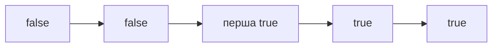

# 08. Бінарний пошук

[← Індекс](README.md) · Код: [`src/topic08_binary_search`](../../src/topic08_binary_search)

## Не «пошук у масиві», а пошук межі

Binary search працює на будь-якому просторі з монотонним предикатом: `false false false true true`. Головне — визначити межі, значення `mid`, умову збереження відповіді та контракт інтервалу.



## Шаблон lower bound

```java
int lo = 0, hi = n;              // [lo, hi)
while (lo < hi) {
    int mid = lo + (hi - lo) / 2;
    if (a[mid] >= target) hi = mid;
    else lo = mid + 1;
}
return lo;
```

Інваріант: усі індекси `< lo` точно не підходять, усі `>= hi` точно підходять. Для upper bound змініть предикат на `a[mid] > target`. First/last position утворюються з двох меж.

## Search on answer

1. Визначте мінімально й максимально можливу відповідь.
2. Напишіть `feasible(x)` за `O(n)`.
3. Доведіть: якщо `x` можливий, усі більші (або менші) також можливі.
4. Знайдіть першу можливу відповідь.

Koko: швидкість `s`, час `Σ ceil(pile/s)`; використовуйте `(pile+s-1)/s` у `long`. Split Array: `x` — максимальна дозволена сума частини, greedy рахує мінімальну кількість частин.

## Rotated sorted array

На кожному кроці щонайменше одна половина відсортована. Визначте її, перевірте належність target її діапазону, відкиньте іншу. З дублікатами `a[lo]==a[mid]==a[hi]` інформації немає — стискайте краї; найгірший час стає `O(n)`.

## Peak search

Порівнюйте `a[mid]` з `a[mid+1]`: якщо схил зростає, peak праворуч; інакше peak у `[lo,mid]`. Це пошук області, а не конкретного значення.

## Median двох масивів

Шукайте partition меншого масиву: ліва половина об’єднання має потрібний розмір, а `max(left parts) ≤ min(right parts)`. Якщо `Aleft > Bright`, partition A треба зсунути вліво; інакше вправо. Складність `O(log min(m,n))`.

## Карта задач

| Варіант | Задачі |
|---|---|
| Exact/lower bound | BinarySearch, SearchInsert, TargetIndices |
| Boundary predicate | FirstBadVersion, FindFirstLast |
| Numeric domain | PerfectSquare, Sqrt, GuessNumber |
| Structural property | PeakIndex, CountNegatives, CheckIfExist, FindPeakElement |
| Rotated | SearchRotatedArray, FindMinRotatedArray, FindMinRotatedArrayII |
| Answer space | KokoEatingBananas, SplitArrayLargestSum |
| Partition | MedianTwoSortedArrays |

## Пастки

- `mid=(lo+hi)/2` переповнюється; використовуйте `lo+(hi-lo)/2`.
- Змішувати `[lo,hi]` і `[lo,hi)` в одному шаблоні.
- Повернути одразу при `==`, коли потрібна перша/остання позиція.
- Не довести монотонність `feasible`.
- Використати `int` для суми або середнього двох великих чисел.

