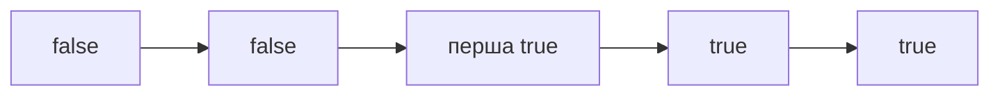

# 08. Бінарний пошук

[← Індекс](README.md) · Код: [`src/topic08_binary_search`](../../src/topic08_binary_search)

## Головна зміна мислення

Бінарний пошук — не просто спосіб знайти число у sorted array. Це спосіб знайти **межу між двома монотонними областями**.

```text
індекси:   0 1 2 3 4 5 6 7
predicate: F F F F T T T T
                    ↑
                 перша true
```

На кожному кроці перевірка середини дозволяє відкинути половину простору. Тому після `k` кроків лишається приблизно `n/2^k` кандидатів, а кількість кроків — `O(log n)`.

Але вся складність теми — не у формулі `mid`. Треба чітко відповісти:

1. Що лежить у просторі пошуку: індекси чи можливі відповіді?
2. Який інтервал використовується: `[lo,hi]` чи `[lo,hi)`?
3. Яка половина гарантовано не містить відповіді?
4. Потрібен будь-який збіг, перший, останній, minimum feasible чи maximum feasible?

## 1. Exact search у sorted array

Для `[1,3,5,7,9]`, target 7:

```algoviz
{
  "type": "binary-search",
  "title": "Exact binary search · target = 7",
  "values": [1, 3, 5, 7, 9],
  "steps": [
    {
      "label": "Область пошуку [0,4], mid=2 і a[mid]=5",
      "note": "5 < 7, тому mid і всю ліву половину можна відкинути.",
      "pointers": {"lo": 0, "mid": 2, "hi": 4},
      "compare": [2],
      "range": [0, 4],
      "prediction": {
        "prompt": "a[mid]=5 < target=7. Яка нова ліва межа?",
        "options": ["lo = mid", "lo = mid + 1", "lo = 0", "hi = mid - 1"],
        "answer": 1,
        "explanation": "mid уже перевірено й він замалий, тому відкидаємо його разом з усією лівою половиною."
      }
    },
    {
      "label": "Нова область [3,4], mid=3 і a[mid]=7",
      "note": "Значення дорівнює target — повертаємо індекс 3.",
      "pointers": {"lo": 3, "mid": 3, "hi": 4},
      "compare": [3],
      "visited": [0, 1, 2],
      "range": [3, 4]
    }
  ]
}
```

Inclusive шаблон:

```java
int lo = 0, hi = a.length - 1;
while (lo <= hi) {
    int mid = lo + (hi - lo) / 2;
    if (a[mid] == target) return mid;
    if (a[mid] < target) lo = mid + 1;
    else hi = mid - 1;
}
return -1;
```

Інваріант: якщо target існує і ще не знайдений, він лежить у `[lo,hi]`. Коли `lo>hi`, область порожня.

## 2. Lower bound — корисніший універсальний шаблон

Lower bound повертає перший індекс, де `a[i] >= target`, або `n`, якщо такого немає.

```text
a=[1,2,2,2,5], target=2
lower bound = 1
upper bound (first > 2) = 4
останній 2 = upperBound-1 = 3
```

Half-open шаблон `[lo,hi)`:

```java
int lo = 0, hi = a.length;
while (lo < hi) {
    int mid = lo + (hi - lo) / 2;
    if (a[mid] >= target) hi = mid;
    else lo = mid + 1;
}
return lo;
```

Чому `hi=mid`, а не `mid-1`? `mid` уже задовольняє predicate й може бути першою правильною позицією, тому його не можна викидати. Інтервал half-open закінчується, коли `lo==hi`; ця точка і є межею.

Search Insert Position — саме lower bound. First/Last Position: lower bound target і lower bound `target+1`/upper bound, з перевіркою існування target.

## 3. First Bad Version: пошук predicate

Версії мають вигляд good...good,bad...bad. Метод `isBadVersion(v)` — монотонний predicate. Якщо mid bad, перша bad може бути mid або лівіше → `hi=mid`. Якщо good, усі до mid включно відкидаються → `lo=mid+1`.

Це базова модель для production задач: timestamp першої помилки, мінімальний capacity, найраніший день, перший threshold breach.

## 4. Числовий простір: Sqrt і Perfect Square

Для `x` шукаємо найбільше `m`, де `m*m <= x`, або точний equality. Множення `int*int` може переповнитися ще до присвоєння в `long`, тому:

```java
long square = (long) mid * mid;
```

Альтернатива порівнювати `mid <= x/mid`, обережно з нулем. Межі можуть бути `[0,x]`, але для великих x їх можна звузити.

## 5. Rotated Sorted Array

Масив `[4,5,6,7,0,1,2]` складається з двох sorted частин. У кожному кроці принаймні одна половина навколо mid відсортована.

```text
lo=0 (4), mid=3 (7), hi=6 (2)
ліва [4,5,6,7] відсортована
target=0 не лежить у [4,7] → lo=mid+1
```

Алгоритм:

1. якщо `a[mid]==target`, готово;
2. якщо `a[lo] <= a[mid]`, ліва половина sorted;
3. перевірити, чи target у її межах; залишити її або відкинути;
4. інакше sorted права половина й робимо симетрично.

Дублікати створюють неоднозначність: `[1,0,1,1,1]`, де `lo`, `mid`, `hi` однакові. Тоді стискаємо рівні краї, але worst case стає `O(n)`. Це не недолік коду, а втрата інформації через дублікати.

### Find Minimum

Порівнюйте `a[mid]` з `a[hi]`:

- `a[mid] > a[hi]` → minimum строго правіше mid;
- `a[mid] < a[hi]` → mid може бути minimum, лишаємо `[lo,mid]`;
- з дублікатами `==` → можна безпечно `hi--`, але це лінійний worst case.

## 6. Peak Element без sorted array

Масив не відсортований, але локальний схил створює монотонне рішення:

- якщо `a[mid] < a[mid+1]`, ми стоїмо на висхідному схилі; праворуч гарантовано є peak;
- інакше peak є в `[lo,mid]`.

```text
[1,2,3,1]
mid=1: 2<3 → lo=2
lo=hi=2 → peak value 3
```

Ми не шукаємо конкретне число, а область, де існування peak гарантоване.

## 7. Binary Search on Answer

Це один із найважливіших interview patterns. Умова часто звучить так:

- мінімізувати найбільше навантаження;
- найменша швидкість/ємність/час, за якого роботу можна виконати;
- максимальна мінімальна відстань.

Процес:

1. Визначити `lo` — найменшу можливу відповідь.
2. Визначити `hi` — гарантовано достатню.
3. Написати `feasible(candidate)`.
4. Довести монотонність.
5. Знайти first true або last true.

### Koko Eating Bananas

Candidate — швидкість `s`. Час на pile `p`:

```text
ceil(p/s) = (p+s-1)/s
```

Якщо швидкість `s` дозволяє вкластися в `h`, будь-яка більша теж дозволяє. Маємо `false...false,true...true`; шукаємо first true.

```java
boolean canFinish(int[] piles, int h, int speed) {
    long hours = 0;
    for (int p : piles) hours += (p + (long)speed - 1) / speed;
    return hours <= h;
}
```

Межі: `lo=1`, `hi=maxPile`.

### Split Array Largest Sum

Candidate `limit` — максимальна дозволена сума однієї частини.

- `lo=max(nums)`, бо одна частина мусить містити найбільший елемент;
- `hi=sum(nums)`, бо одна велика частина завжди можлива;
- greedy проходить масив і створює нову частину, коли додавання перевищить limit;
- якщо потрібно не більше `k` частин, limit feasible.

Чому greedy дає мінімальну кількість частин? Кожна поточна частина заповнюється максимально довгим префіксом, тому раніший розріз не може зменшити загальну кількість потрібних частин.

## 8. Median of Two Sorted Arrays: partition idea

Це складна задача не через binary search як такий, а через правильний простір пошуку. Вибираємо, скільки елементів узяти в ліву половину з меншого масиву A; кількість із B тоді визначається загальним потрібним розміром.

Правильний partition виконує:

```text
Aleft <= Bright
Bleft <= Aright
```

Тоді всі елементи об’єднаної лівої половини не більші за праву. Для непарної довжини median — max(Aleft,Bleft); для парної — середнє цього max і min(Aright,Bright).

Якщо `Aleft > Bright`, взяли забагато з A → рух partition вліво. Якщо `Bleft > Aright`, взяли замало → вправо. Краї моделюються `-∞/+∞`.

Не починайте тему з цієї задачі. Спершу впевнено опануйте boundaries, first true, rotated arrays і answer search.

## 9. Типові симптоми binary search

| Симптом | Питання |
|---|---|
| sorted array і target | exact чи boundary? |
| перший/останній елемент з властивістю | чи predicate монотонний? |
| мінімально можливий capacity/speed/time | чи можна швидко перевірити candidate? |
| «розділити на k» і мінімізувати максимум | чи є greedy feasible check? |
| rotated sorted | яка половина точно sorted? |
| peak/локальна структура | який схил гарантує область із відповіддю? |

## 10. Як не застрягти в off-by-one

Не намагайтеся пам’ятати десять шаблонів. Оберіть один boundary template і на кожній гілці письмово скажіть:

- `mid` точно не може бути відповіддю → `lo=mid+1` або `hi=mid-1`;
- `mid` може бути boundary → залишити його через `hi=mid` або `lo=mid` у шаблоні, що гарантує прогрес;
- умова завершення відповідає виду інтервалу.

Перевіряйте на масивах довжини 0, 1, 2, target до/після діапазону та на всіх однакових значеннях.

## Не «пошук у масиві», а пошук межі

Binary search працює на будь-якому просторі з монотонним предикатом: `false false false true true`. Головне — визначити межі, значення `mid`, умову збереження відповіді та контракт інтервалу.



## Шаблон lower bound

```java
int lo = 0, hi = n;              // [lo, hi)
while (lo < hi) {
    int mid = lo + (hi - lo) / 2;
    if (a[mid] >= target) hi = mid;
    else lo = mid + 1;
}
return lo;
```

Інваріант: усі індекси `< lo` точно не підходять, усі `>= hi` точно підходять. Для upper bound змініть предикат на `a[mid] > target`. First/last position утворюються з двох меж.

## Search on answer

1. Визначте мінімально й максимально можливу відповідь.
2. Напишіть `feasible(x)` за `O(n)`.
3. Доведіть: якщо `x` можливий, усі більші (або менші) також можливі.
4. Знайдіть першу можливу відповідь.

Koko: швидкість `s`, час `Σ ceil(pile/s)`; використовуйте `(pile+s-1)/s` у `long`. Split Array: `x` — максимальна дозволена сума частини, greedy рахує мінімальну кількість частин.

## Rotated sorted array

На кожному кроці щонайменше одна половина відсортована. Визначте її, перевірте належність target її діапазону, відкиньте іншу. З дублікатами `a[lo]==a[mid]==a[hi]` інформації немає — стискайте краї; найгірший час стає `O(n)`.

## Peak search

Порівнюйте `a[mid]` з `a[mid+1]`: якщо схил зростає, peak праворуч; інакше peak у `[lo,mid]`. Це пошук області, а не конкретного значення.

## Median двох масивів

Шукайте partition меншого масиву: ліва половина об’єднання має потрібний розмір, а `max(left parts) ≤ min(right parts)`. Якщо `Aleft > Bright`, partition A треба зсунути вліво; інакше вправо. Складність `O(log min(m,n))`.

## Карта задач

| Варіант | Задачі |
|---|---|
| Exact/lower bound | BinarySearch, SearchInsert, TargetIndices |
| Boundary predicate | FirstBadVersion, FindFirstLast |
| Numeric domain | PerfectSquare, Sqrt, GuessNumber |
| Structural property | PeakIndex, CountNegatives, CheckIfExist, FindPeakElement |
| Rotated | SearchRotatedArray, FindMinRotatedArray, FindMinRotatedArrayII |
| Answer space | KokoEatingBananas, SplitArrayLargestSum |
| Partition | MedianTwoSortedArrays |

## Пастки

- `mid=(lo+hi)/2` переповнюється; використовуйте `lo+(hi-lo)/2`.
- Змішувати `[lo,hi]` і `[lo,hi)` в одному шаблоні.
- Повернути одразу при `==`, коли потрібна перша/остання позиція.
- Не довести монотонність `feasible`.
- Використати `int` для суми або середнього двох великих чисел.
