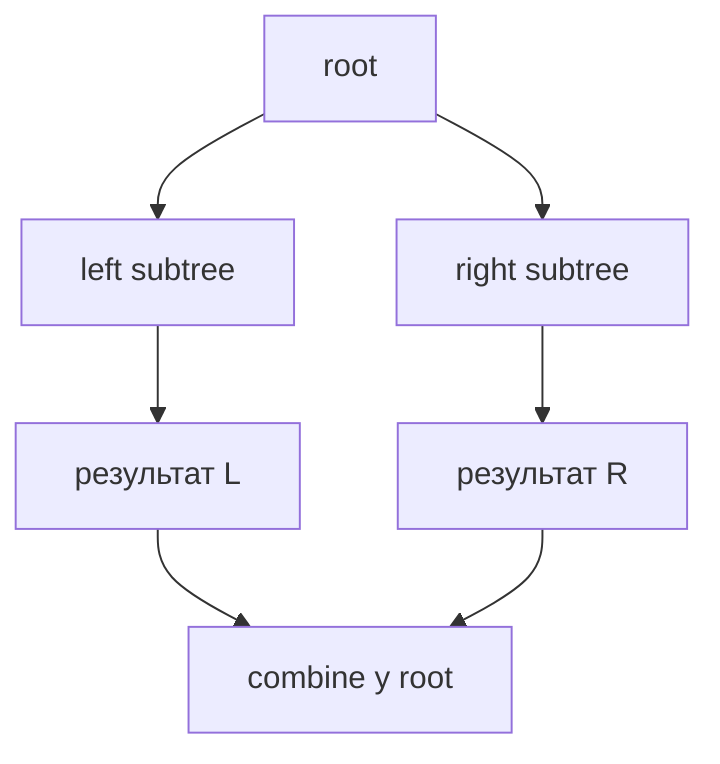
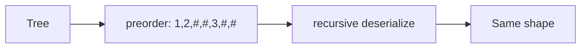

# 09. Дерева

[← Індекс](README.md) · Код: [`src/topic09_trees`](../../src/topic09_trees)

## 1. Словник і форма дерева

Бінарне дерево складається з вузлів, у кожного не більше двох дітей:

```algoviz
{
  "type": "tree",
  "title": "Root, children, depth і leaves",
  "values": [8, 3, 10, 1, 6, 14],
  "steps": [
    {"label": "Root 8 має depth 0", "active": [0], "prediction": {"prompt": "Які вузли мають depth 1?", "options": ["1 і 6", "3 і 10", "8 і 14", "Лише 3"], "answer": 1}},
    {"label": "Вузли 3 і 10 — діти root на depth 1", "active": [1, 2], "visited": [0]},
    {"label": "1, 6 і 14 не мають дітей, тому це leaves", "active": [3, 4, 5], "visited": [0, 1, 2]}
  ]
}
```

- **root** — вузол без батька;
- **leaf** — вузол без дітей;
- **subtree** — вузол разом з усіма нащадками;
- **depth** — відстань від root до вузла;
- **height** — найдовша відстань від вузла вниз до leaf;
- **path** — послідовність суміжних вузлів;
- **binary search tree (BST)** — для кожного вузла всі значення лівого піддерева менші, а правого більші (за стандартного контракту без дублікатів).

Висоту іноді рахують у вузлах, іноді в ребрах. Для одного вузла це відповідно 1 або 0. Перед формулою зафіксуйте конвенцію.

## 2. Чому рекурсія природна

Піддерево саме є деревом. Тому одна функція може розв’язати задачу для вузла, попросивши себе розв’язати її для лівої та правої дитини.

```java
int count(TreeNode node) {
    if (node == null) return 0;
    int leftCount = count(node.left);
    int rightCount = count(node.right);
    return 1 + leftCount + rightCount;
}
```

Подивіться не на порядок виконання, а на **контракт**: `count(node)` повертає кількість вузлів у піддереві з коренем node. Якщо діти дотримали контракт, поточний вузол легко комбінує їхні результати.

Кожна tree recursion має три частини:

1. `null` base case;
2. рекурсивні відповіді дітей;
3. combine для поточного вузла.

Стек викликів займає `O(h)`. Для збалансованого дерева `h≈log n`, для ланцюжка — `n`, і recursion може переповнити Java stack.

## 3. Три DFS-обходи

Назва визначається моментом відвідування root відносно дітей.

```text
        2
       / \
      1   3

preorder:  2,1,3   (root до дітей)
inorder:   1,2,3   (root між дітьми)
postorder: 1,3,2   (root після дітей)
```

### Коли який потрібен

- **preorder**: серіалізація, копіювання, передача накопиченого стану вниз;
- **inorder**: BST у відсортованому порядку;
- **postorder**: коли відповідь root залежить від уже готових відповідей дітей — height, balance, diameter, tree DP.

### Ітеративний inorder

Рекурсивний виклик приховано зберігає «куди повернутися». Ітеративна версія робить це явним stack:

```java
Deque<TreeNode> stack = new ArrayDeque<>();
TreeNode current = root;
while (current != null || !stack.isEmpty()) {
    while (current != null) {
        stack.push(current);
        current = current.left;
    }
    current = stack.pop();
    visit(current);
    current = current.right;
}
```

Внутрішній цикл спускається максимально вліво. Pop відвідує наступний inorder-вузол, потім починається та сама процедура для правого піддерева.

## 4. Same Tree, Symmetry та Subtree

### Same Tree

Пара вузлів однакова, якщо:

1. обидва null → true;
2. лише один null → false;
3. значення різні → false;
4. ліві піддерева однакові **і** праві однакові.

Це приклад recursion над **парою** вузлів.

### Symmetric Tree

Порівнюються дзеркальні позиції: `left.left` із `right.right` та `left.right` із `right.left`. Якщо випадково порівнювати left-left і right-right як у Same Tree, перевірятиметься рівність, а не дзеркальність.

### Subtree

Для кожного вузла великого дерева перевіряємо, чи дерево від нього same as subRoot. Наївна worst-case складність `O(n·m)`. Серіалізація з null markers або tree hashing можуть оптимізувати, але базову nested recursion треба спочатку зрозуміти.

## 5. Height, Diameter і Balanced Tree

### Height

```java
int height(TreeNode node) {
    if (node == null) return 0;
    return 1 + Math.max(height(node.left), height(node.right));
}
```

Контракт: кількість вузлів на найдовшому downward path від node.

### Diameter

Найдовший шлях може проходити через поточний вузол: найдовший лівий downward path + правий. Функція все ще повертає **height**, бо батькові можна передати лише одну гілку, але паралельно оновлює глобальний best diameter.

```text
          node
         /    \
   leftHeight  rightHeight

кандидат diameter у ребрах = leftHeight + rightHeight
```

Чому не повертати diameter? Батько не може продовжити шлях, що вже розгалужився на дві сторони. Йому потрібна одна downward гілка.

### Balanced Tree без O(n²)

Поганий підхід окремо обчислює height у кожному вузлі, повторно обходячи піддерева. На ланцюжку це `O(n²)`.

Кращий postorder повертає height, але спеціальне значення `-1` означає «піддерево вже незбалансоване». Якщо дитина повернула -1 або різниця висот >1, одразу повертаємо -1 вгору. Кожен вузол відвідано один раз.

## 6. Path Sum: стан рухається вниз

У попередніх задачах інформація йшла від дітей вгору. Тут root-to-leaf path накопичується вниз.

```java
boolean hasPath(TreeNode node, long remaining) {
    if (node == null) return false;
    remaining -= node.val;
    if (node.left == null && node.right == null) return remaining == 0;
    return hasPath(node.left, remaining) || hasPath(node.right, remaining);
}
```

Перевіряти `remaining==0` треба на leaf, якщо умова вимагає саме root-to-leaf. Внутрішній вузол із правильною частковою сумою ще не завершує шлях.

Для переліку всіх шляхів потрібен mutable path з add перед recursion і remove після — це вже backtracking.

## 7. Level Order: BFS по рівнях

Queue спочатку містить root. На початку кожного рівня фіксуємо `levelSize=queue.size()`, рівно стільки вузлів забираємо й додаємо їхніх дітей.

```text
queue: [8]                → level [8]
queue: [3,10]             → level [3,10]
queue: [1,6,14]           → level [1,6,14]
```

Не використовуйте динамічний `queue.size()` як межу циклу, бо під час рівня queue поповнюється дітьми. Зафіксована size відділяє покоління.

## 8. BST: глобальна, а не локальна властивість

Дерево нижче **не** BST, хоча кожна дитина може виглядати локально правильно:

```text
        10
       /  \
      5    15
          / \
         6  20
```

6 є лівою дитиною 15, але знаходиться в правому піддереві 10 і має бути >10. Тому кожен вузол отримує допустимий інтервал:

```java
boolean valid(TreeNode node, long low, long high) {
    if (node == null) return true;
    if (node.val <= low || node.val >= high) return false;
    return valid(node.left, low, node.val)
        && valid(node.right, node.val, high);
}
```

`long` межі дозволяють вузлу мати значення `Integer.MIN_VALUE` або MAX_VALUE.

### Kth Smallest

Inorder BST відсортований. Після відвідування `k`-го вузла маємо відповідь. Ітеративний варіант може завершитися рано й використовує `O(h)` stack.

### LCA у BST

Якщо обидва значення менші за node — обидва в лівому піддереві. Якщо більші — у правому. Коли вони розходяться або один дорівнює node, поточний node — найнижча точка розгалуження.

## 9. LCA у звичайному бінарному дереві

Контракт `dfs(node)` повертає:

- node, якщо node є `p` або `q`;
- знайдений target/LCA з одного піддерева;
- null, якщо нікого немає.

Якщо left і right обидва non-null, targets розташовані по різні боки, тому поточний node — LCA. Якщо non-null лише один, передаємо його вгору.

Це працює за умови, що targets існують. Якщо контракт цього не гарантує, треба також рахувати кількість знайдених вузлів.

## 10. Build Tree from Preorder and Inorder

Preorder починається з root. Inorder показує, які елементи ліворуч і праворуч від root належать відповідним піддеревам.

```text
preorder = [3,9,20,15,7]
inorder  = [9,3,15,20,7]

root=3
inorder left=[9], right=[15,20,7]
наступний preorder root лівої частини=9
далі root правої=20
```

Якщо кожного разу лінійно шукати root в inorder, worst case `O(n²)`. Map `value→inorderIndex` будується один раз і дає `O(n)`. Межі inorder визначають розмір лівого піддерева й позиції в preorder.

Унікальність значень зазвичай необхідна; з дублікатами traversals можуть не визначати єдине дерево.

## 11. Serialize / Deserialize

Просто записати preorder значень недостатньо:

```text
  1       1
 /         \
2           2
```

обидва без null markers дали б `1,2`. Тому preorder містить `#` для null:

```text
ліве дерево:  1,2,#,#,#
праве дерево: 1,#,2,#,#
```

Deserialize читає один token:

- `#` → null;
- число → створити node, рекурсивно прочитати left, потім right.

Один mutable index/iterator гарантує, що кожен token споживається один раз.

## 12. Binary Tree Maximum Path Sum

Path може починатися й закінчуватися будь-де, але не може розгалужуватися більше одного разу.

Для node:

- `leftGain=max(0,dfs(left))`;
- `rightGain=max(0,dfs(right))`;
- повний кандидат через node: `node.val+leftGain+rightGain`;
- батькові повернути `node.val+max(leftGain,rightGain)`.

Негативну гілку вигідніше не брати, тому max із 0. Глобальний best слід ініціалізувати найменшим значенням, не нулем: дерево може складатися лише з від’ємних чисел.

## 13. Як упізнати tree pattern

| Питання умови | Напрям думки |
|---|---|
| однаковість/дзеркальність | recursion над парою вузлів |
| height, balance, diameter, path maximum | postorder, інформація вгору |
| root-to-leaf condition | стан/remaining вниз |
| рівні або мінімальна depth | BFS |
| kth/order у BST | inorder |
| validate BST | bounds або strict inorder |
| ancestor | що повертає subtree про targets |
| відновити форму | traversal boundaries + map |
| encode/decode | null markers + deterministic order |

Перед кодом напишіть одним реченням контракт `dfs`. Це найкращий захист від хаотичної рекурсії.

## Рекурсивний контракт

Дерево — рекурсивна структура, тому перед кодом завершіть речення: **«функція `dfs(node)` повертає…»**. Наприклад: висоту піддерева, чи воно збалансоване, найкращий downward path, серіалізацію або побудований вузол.



## Обходи

- Preorder `root,left,right`: копіювання/серіалізація, передача стану вниз.
- Inorder `left,root,right`: відсортований порядок BST.
- Postorder `left,right,root`: висота, діаметр, баланс, DP на дереві.
- Level order: queue, рівні, найкоротша глибина.

Ітеративний inorder: ідіть вліво, складаючи вузли у stack; pop → visit → перейти вправо. Час `O(n)`, пам’ять `O(h)`.

## Інформація вгору й вниз

Path Sum передає залишок **вниз**. Height повертається **вгору**. Diameter потребує обох: функція повертає висоту, а глобальна/обгорткова відповідь оновлюється `leftHeight+rightHeight`. Не плутайте те, що повертає один напрямок, з глобальним оптимумом.

Для Maximum Path Sum негативний downward contribution обрізається нулем. Шлях через вузол може взяти обидві гілки, але батькові можна повернути лише одну, інакше структура перестане бути шляхом.

## BST

Властивість BST глобальна. `node.left.val < node.val` недостатньо: передавайте допустимий інтервал `(low, high)` або перевіряйте строгий inorder. Використовуйте `long` межі, щоб `Integer.MIN_VALUE/MAX_VALUE` були валідними значеннями.

Kth Smallest — inorder з лічильником; LCA у BST використовує порядок: обидва ключі менші → вліво, більші → вправо, інакше поточний вузол є split point.

## Побудова й серіалізація

Preorder задає root, inorder ділить ліве/праве піддерево. Map `value→inorderIndex` прибирає повторний пошук і дає `O(n)`. Контракт зазвичай вимагає унікальні значення.

Серіалізація повинна зберігати `null`, інакше різні форми з однаковими значеннями зіллються. Preorder із маркером `#` відновлюється одним індексом токенів.



## Memoization породження дерев

All Possible Full Binary Trees: корінь споживає 1 вузол, непарні `leftCount` розподіляють решту. Memo `n→список коренів` уникає повторної генерації. Якщо клієнт змінюватиме дерева, слід клонувати спільні піддерева.

## Карта задач

| Контракт DFS | Задачі |
|---|---|
| Traversal/structure | Inorder, SameTree, SymmetricTree, Subtree, Invert, MergeTrees |
| Height/path | Diameter, BalancedTree, PathSum, BinaryTreeMaxPathSum |
| BST ordering | LCA BST, ValidateBST, KthSmallest |
| BFS | LevelOrderTraversal |
| Ancestors | LowestCommonAncestorBT |
| Build/encode | BuildTreeFromPreIn, SerializeDeserialize |
| Generate + memo | AllPossibleFBT |

## Пастки

- Не визначити, чи висота рахується у вузлах чи ребрах.
- Використовувати поле відповіді й не скидати його між викликами об’єкта.
- Загубити `null` у serialization.
- Перевіряти BST лише локально.
- Отримати `O(n²)` на перекошеному дереві через повторний підрахунок висоти.
