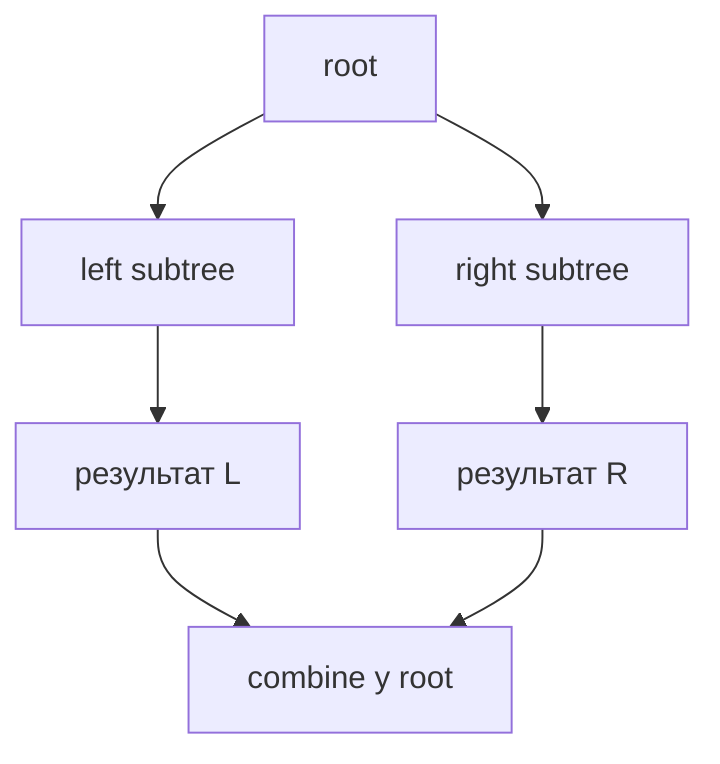
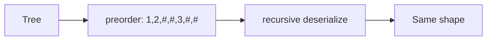

# 09. Дерева

[← Індекс](README.md) · Код: [`src/topic09_trees`](../../src/topic09_trees)

## Рекурсивний контракт

Дерево — рекурсивна структура, тому перед кодом завершіть речення: **«функція `dfs(node)` повертає…»**. Наприклад: висоту піддерева, чи воно збалансоване, найкращий downward path, серіалізацію або побудований вузол.

## Обходи

- Preorder `root,left,right`: копіювання/серіалізація, передача стану вниз.
- Inorder `left,root,right`: відсортований порядок BST.
- Postorder `left,right,root`: висота, діаметр, баланс, DP на дереві.
- Level order: queue, рівні, найкоротша глибина.

Ітеративний inorder: ідіть вліво, складаючи вузли у stack; pop → visit → перейти вправо. Час `O(n)`, пам’ять `O(h)`.

## Інформація вгору й вниз

Path Sum передає залишок **вниз**. Height повертається **вгору**. Diameter потребує обох: функція повертає висоту, а глобальна/обгорткова відповідь оновлюється `leftHeight+rightHeight`. Не плутайте те, що повертає один напрямок, з глобальним оптимумом.

Для Maximum Path Sum негативний downward contribution обрізається нулем. Шлях через вузол може взяти обидві гілки, але батькові можна повернути лише одну, інакше структура перестане бути шляхом.

## BST

Властивість BST глобальна. `node.left.val < node.val` недостатньо: передавайте допустимий інтервал `(low, high)` або перевіряйте строгий inorder. Використовуйте `long` межі, щоб `Integer.MIN_VALUE/MAX_VALUE` були валідними значеннями.

Kth Smallest — inorder з лічильником; LCA у BST використовує порядок: обидва ключі менші → вліво, більші → вправо, інакше поточний вузол є split point.

## Побудова й серіалізація

Preorder задає root, inorder ділить ліве/праве піддерево. Map `value→inorderIndex` прибирає повторний пошук і дає `O(n)`. Контракт зазвичай вимагає унікальні значення.

Серіалізація повинна зберігати `null`, інакше різні форми з однаковими значеннями зіллються. Preorder із маркером `#` відновлюється одним індексом токенів.

## Memoization породження дерев

All Possible Full Binary Trees: корінь споживає 1 вузол, непарні `leftCount` розподіляють решту. Memo `n→список коренів` уникає повторної генерації. Якщо клієнт змінюватиме дерева, слід клонувати спільні піддерева.

## Карта задач

| Контракт DFS | Задачі |
|---|---|
| Traversal/structure | Inorder, SameTree, SymmetricTree, Subtree, Invert, MergeTrees |
| Height/path | Diameter, BalancedTree, PathSum, BinaryTreeMaxPathSum |
| BST ordering | LCA BST, ValidateBST, KthSmallest |
| BFS | LevelOrderTraversal |
| Ancestors | LowestCommonAncestorBT |
| Build/encode | BuildTreeFromPreIn, SerializeDeserialize |
| Generate + memo | AllPossibleFBT |

## Пастки

- Не визначити, чи висота рахується у вузлах чи ребрах.
- Використовувати поле відповіді й не скидати його між викликами об’єкта.
- Загубити `null` у serialization.
- Перевіряти BST лише локально.
- Отримати `O(n²)` на перекошеному дереві через повторний підрахунок висоти.

