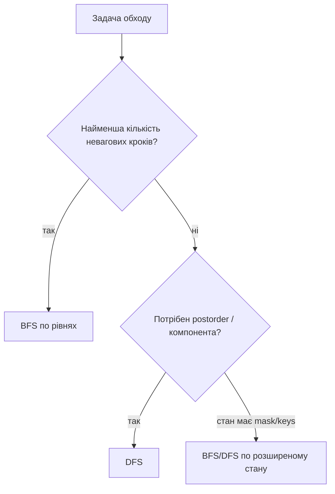

# 10. DFS і BFS

[← Індекс](README.md) · Код: [`src/topic10_dfs_bfs`](../../src/topic10_dfs_bfs)

## Вибір обходу

DFS і BFS відвідують ту саму множину досяжних вершин за `O(V+E)`, але порядок дає різні властивості.



## Grid як неявний граф

Клітинка — вершина, сусідство задається масивом напрямків. Завжди перевіряйте межі й visited. Позначайте visited **під час додавання** у queue/stack, не під час вилучення, інакше одна вершина потрапить у чергу багато разів.

```java
int[][] dirs = {{1,0},{-1,0},{0,1},{0,-1}};
Deque<int[]> q = new ArrayDeque<>();
q.offer(new int[]{sr, sc});
seen[sr][sc] = true;
while (!q.isEmpty()) {
    int[] cur = q.poll();
    for (int[] d : dirs) { /* bounds, condition, mark, offer */ }
}
```

## Multi-source BFS

Rotting Oranges: усі rotten клітинки входять до queue на рівні 0. Тоді BFS одночасно моделює фронт поширення і гарантує мінімальний час. Рахуйте fresh; відповідь існує, лише якщо після BFS `fresh==0`.

## State-space search

Shortest Path All Keys: координат недостатньо. Стан — `(row,col,keyMask)`, а visited має третій вимір. Та сама клітинка з іншими ключами — інша вершина. Розмір графа `rows·cols·2^k`.

Word Ladder: слова — вершини, ребро існує при зміні однієї літери. Щоб не будувати всі `O(n²)` ребер, генеруйте сусідів або індексуйте wildcard patterns. Bidirectional BFS часто різко зменшує фронт.

## DFS: компоненти, межі й postorder

- Flood fill / Surrounded Regions: дослідити компоненту або позначити safe клітинки від межі.
- Pacific Atlantic: замість пошуку шляху з кожної клітинки запустити з океанів у зворотному напрямку по неспадних висотах; відповідь — перетин visited.
- Longest Increasing Path: DFS + memo; DAG задається переходами до більшого значення.

## Cycle detection

Для directed graph використовуйте три кольори: `0=unvisited`, `1=visiting`, `2=done`. Ребро у visiting означає цикл. Course Schedule також розв’язується Kahn BFS: indegree 0 → queue; якщо оброблено менше `V`, цикл існує.

## Карта задач

| Модель | Задачі |
|---|---|
| Grid DFS/BFS | FloodFill, IslandPerimeter, RottingOranges, PacificAtlantic, SurroundedRegions |
| Tree/organization | EmployeeImportance, NaryDepth, Cousins, MinimumDepth, LeafSimilar, TreePaths, SumLeftLeaves |
| Graph reachability | FindIfPathExists, CloneGraph, CourseSchedule |
| Shortest path | WordLadder, ShortestPathAllKeys |
| DAG + memo | LongestIncreasingPath |

## Пастки

- Рекурсивний DFS може переповнити stack на великій grid/chain.
- Mutate grid без усвідомлення контракту.
- У BFS збільшувати distance на кожен вузол, а не на рівень.
- Вважати `visited[row][col]` достатнім для стану з ключами.
- Для clone graph мапити за значенням, хоча різні вузли можуть мати однакові labels.

