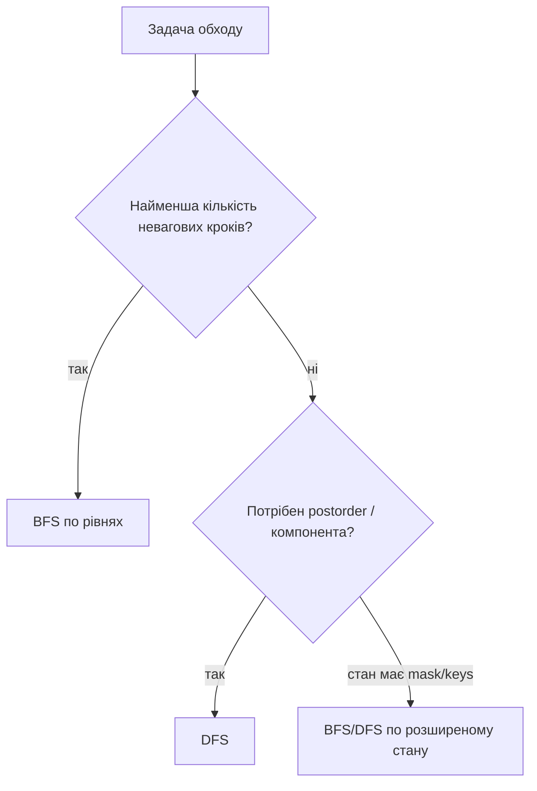

# 10. DFS і BFS

[← Індекс](README.md) · Код: [`src/topic10_dfs_bfs`](../../src/topic10_dfs_bfs)

## 1. Граф як універсальна модель

Граф — це вершини та зв’язки між ними. Дороги між містами, залежності курсів, переходи між словами, сусідні клітинки grid і навіть можливі стани гри можна описати однаково.

```text
A ─ B
│   │
C ─ D ─ E
```

- **undirected edge** `A-B` дозволяє рух обома напрямками;
- **directed edge** `A→B` — лише з A в B;
- **component** — група взаємно досяжних вершин;
- **path** — послідовність ребер;
- **cycle** — шлях, що повертається до старту.

Для adjacency list:

```java
List<List<Integer>> graph = new ArrayList<>();
// graph.get(v) містить сусідів v
```

Пам’ять `O(V+E)`. Adjacency matrix `boolean[V][V]` займає `O(V²)`, але швидко перевіряє конкретне ребро.

## 2. DFS і BFS: одна досяжність, різний порядок

DFS іде в одну гілку максимально глибоко, потім повертається. BFS досліджує всі вершини на відстані 1, потім 2 тощо.

```text
      A
    /   \
   B     C
  / \     \
 D   E     F

можливий DFS: A,B,D,E,C,F
BFS:          A,B,C,D,E,F
```

### DFS recursion

```java
void dfs(int v) {
    if (seen[v]) return;
    seen[v] = true;
    for (int nei : graph.get(v)) dfs(nei);
}
```

### BFS queue

```java
Deque<Integer> queue = new ArrayDeque<>();
seen[source] = true;
queue.offer(source);
while (!queue.isEmpty()) {
    int v = queue.poll();
    for (int nei : graph.get(v)) {
        if (!seen[nei]) {
            seen[nei] = true;
            queue.offer(nei);
        }
    }
}
```

Позначайте seen під час `offer`, а не `poll`. Інакше кілька батьків можуть додати одну вершину багато разів.

## 3. Коли обирати DFS

DFS природний, коли треба:

- повністю дослідити component;
- виконати дію після дітей (postorder);
- знайти цикл у directed graph через recursion stack;
- перебрати paths із backtracking;
- memoize результат стану в DAG;
- позначити region на grid.

Рекурсія коротка, але для дуже глибокого графа Java stack може переповнитися; тоді використовуйте явний `Deque`.

## 4. Коли обирати BFS

BFS гарантує найменшу кількість ребер у **неваговому** графі. Коли вершина вперше відкрита на рівні `d`, коротшого шляху бути не може: усі рівні `<d` уже повністю оброблені.

Використовуйте BFS для:

- minimum steps/moves;
- shortest transformation;
- поширення процесу за хвилинами;
- level order;
- одночасного руху від багатьох джерел.

Якщо ребра мають різні ваги, звичайна FIFO queue більше не впорядковує за реальною distance; потрібен Dijkstra або інший алгоритм.

## 5. Grid як граф без явних ребер

У grid кожна клітинка `(r,c)` є вершиною. Сусідів генеруємо напрямками:

```java
int[][] dirs = {{1,0},{-1,0},{0,1},{0,-1}};
for (int[] d : dirs) {
    int nr = r+d[0], nc = c+d[1];
    if (nr < 0 || nr >= rows || nc < 0 || nc >= cols) continue;
    // додаткові умови про стіну, колір, висоту, visited
}
```

Типова помилка — переплутати rows/columns або прочитати `grid[nr][nc]` до bounds check.

### Flood Fill

Стартова клітинка задає старий колір. DFS/BFS відвідує лише сусідів цього кольору й змінює їх. Якщо newColor дорівнює oldColor і visited позначається самим перефарбуванням, без раннього return можна зациклитися.

### Island Perimeter

Кожна land-клітинка додає 4 сторони, а кожна спільна сторона між двома land віднімає 2. Або DFS для кожного напряму додає 1, коли сусід поза grid або water. Це демонструє, що не кожна grid-задача обов’язково потребує обходу component; іноді локального scan достатньо.

## 6. Multi-source BFS на Rotting Oranges

Якщо запустити BFS окремо від кожного rotten orange, робота повторюється. Натомість усі rotten клітинки кладуться в queue на старті як рівень 0.

```text
minute 0: усі початкові rotten
minute 1: усі fresh на відстані 1
minute 2: усі fresh на відстані 2
```

Queue моделює одночасний фронт. Змінна `fresh` зменшується при зараженні. Наприкінці:

- `fresh>0` → частина недосяжна, відповідь -1;
- інакше minutes останнього реального зараження.

Не додавайте зайву хвилину після останнього рівня. Зручно або зберігати distance разом зі станом, або збільшувати minutes лише якщо наступний рівень справді заражає.

## 7. Clone Graph

Граф може мати цикли, тому рекурсивно копіювати сусідів без visited/map означає нескінченний процес.

Map `originalNode → clonedNode` виконує дві ролі:

1. visited — чи вузол уже копіювали;
2. доступ до його копії для ребер.

```java
Node clone(Node node) {
    if (node == null) return null;
    if (copies.containsKey(node)) return copies.get(node);
    Node copy = new Node(node.val);
    copies.put(node, copy); // ДО recursion сусідів
    for (Node nei : node.neighbors) copy.neighbors.add(clone(nei));
    return copy;
}
```

Копію треба записати в map до обходу сусідів, інакше цикл повернеться до ще «неіснуючої» копії.

## 8. Surrounded Regions: почати з того, що точно безпечне

Наївно досліджувати кожну O-region і потім вирішувати, чи торкається вона boundary. Простіше перевернути логіку:

1. усі `O` на border точно не будуть захоплені;
2. DFS/BFS від них позначає всі connected safe O;
3. непозначені O перетворюються на X;
4. тимчасові safe marks повертаються в O.

Це загальна стратегія **reverse reachability**: замість перевіряти кожен кандидат до виходу, почати з усіх виходів/цілей і йти у зворотному напрямку.

## 9. Pacific Atlantic Water Flow

Прямий погляд: з кожної клітинки перевіряти шлях униз до двох океанів — багато повторів.

Зворотний погляд: стартувати з берегів Pacific та рухатися до сусідів із висотою **не меншою** за поточну. Це рівно клітинки, з яких вода могла б стекти до океану в прямому напрямку. Те саме від Atlantic. Перетин двох visited sets — відповідь.

Спершу чітко змініть inequality: прямий рух води `nextHeight <= currentHeight`; reverse search `nextHeight >= currentHeight`.

## 10. Directed cycle і Course Schedule

У directed graph звичайний boolean visited не відрізняє:

- вершину, що зараз у поточному DFS path;
- вершину, яку повністю завершено раніше.

Три кольори:

```text
0 = unvisited
1 = visiting (у recursion stack)
2 = done
```

Ребро до color 1 є back edge і доводить цикл. Ребро до done безпечне.

Kahn BFS дивиться на indegree. Courses без prerequisites мають indegree 0. Після їх «проходження» зменшуємо indegree залежних. Якщо queue спорожніла, а оброблено менше V, решта замкнена в циклі.

## 11. Longest Increasing Path: DFS + memo

Переходити можна лише до строго більшого значення, тому цикл неможливий: значення вздовж path постійно зростають. Маємо неявний DAG.

`dfs(r,c)` повертає довжину найдовшого increasing path, що починається в клітинці. Без memo одні й ті самі хвости рахуються багато разів; з memo кожна клітинка обчислюється один раз, переглядаючи до 4 сусідів → `O(rows·cols)`.

Це межа між graph traversal і dynamic programming: DFS визначає залежності, memo зберігає результат підзадачі.

## 12. Word Ladder

Стан — слово. Ребро з’єднує слова, що відрізняються однією літерою. Потрібна найменша кількість transformations, тому BFS.

Не обов’язково будувати `O(n²)` pair comparisons. Для кожного слова можна:

- замінити кожну позицію на `a..z` і перевірити dictionary set;
- або індексувати wildcard patterns: `hot → *ot,h*t,ho*`.

Bidirectional BFS стартує одночасно з begin і end та завжди розширює менший frontier. Для branching factor `b` і distance `d` це приблизно два дерева глибини `d/2` замість одного глибини d.

## 13. State-space BFS: keys змінюють вершину

У Shortest Path All Keys координати не описують повний стан. У клітинці `(r,c)` без ключа A і з ключем A доступні різні наступні переходи.

```text
state = (row, col, keyMask)
visited[row][col][mask]
```

Ключ додається через bit OR. Door дозволений, якщо відповідний bit встановлений. Target mask має всі `k` bits. Простір до `rows·cols·2^k`, тому constraints на k критичні.

## 14. Дерево вибору

| Умова | Метод |
|---|---|
| просто існує path/component | DFS або BFS |
| minimum edges/steps/time | BFS |
| багато одночасних джерел | multi-source BFS |
| треба postorder/memo | DFS |
| directed dependencies/cycle | colors DFS або Kahn |
| grid із boundary escape | reverse search від boundary |
| state має inventory/mask | BFS/DFS по повному state |
| weighted path | не звичайний BFS; Dijkstra/інший |

У complexity пишіть `O(V+E)`, а для grid — `O(rows·cols)`. Якщо state розширений mask, включайте множник `2^k`.

## Вибір обходу

DFS і BFS відвідують ту саму множину досяжних вершин за `O(V+E)`, але порядок дає різні властивості.



## Grid як неявний граф

Клітинка — вершина, сусідство задається масивом напрямків. Завжди перевіряйте межі й visited. Позначайте visited **під час додавання** у queue/stack, не під час вилучення, інакше одна вершина потрапить у чергу багато разів.

```java
int[][] dirs = {{1,0},{-1,0},{0,1},{0,-1}};
Deque<int[]> q = new ArrayDeque<>();
q.offer(new int[]{sr, sc});
seen[sr][sc] = true;
while (!q.isEmpty()) {
    int[] cur = q.poll();
    for (int[] d : dirs) { /* bounds, condition, mark, offer */ }
}
```

## Multi-source BFS

Rotting Oranges: усі rotten клітинки входять до queue на рівні 0. Тоді BFS одночасно моделює фронт поширення і гарантує мінімальний час. Рахуйте fresh; відповідь існує, лише якщо після BFS `fresh==0`.

## State-space search

Shortest Path All Keys: координат недостатньо. Стан — `(row,col,keyMask)`, а visited має третій вимір. Та сама клітинка з іншими ключами — інша вершина. Розмір графа `rows·cols·2^k`.

Word Ladder: слова — вершини, ребро існує при зміні однієї літери. Щоб не будувати всі `O(n²)` ребер, генеруйте сусідів або індексуйте wildcard patterns. Bidirectional BFS часто різко зменшує фронт.

## DFS: компоненти, межі й postorder

- Flood fill / Surrounded Regions: дослідити компоненту або позначити safe клітинки від межі.
- Pacific Atlantic: замість пошуку шляху з кожної клітинки запустити з океанів у зворотному напрямку по неспадних висотах; відповідь — перетин visited.
- Longest Increasing Path: DFS + memo; DAG задається переходами до більшого значення.

## Cycle detection

Для directed graph використовуйте три кольори: `0=unvisited`, `1=visiting`, `2=done`. Ребро у visiting означає цикл. Course Schedule також розв’язується Kahn BFS: indegree 0 → queue; якщо оброблено менше `V`, цикл існує.

## Карта задач

| Модель | Задачі |
|---|---|
| Grid DFS/BFS | FloodFill, IslandPerimeter, RottingOranges, PacificAtlantic, SurroundedRegions |
| Tree/organization | EmployeeImportance, NaryDepth, Cousins, MinimumDepth, LeafSimilar, TreePaths, SumLeftLeaves |
| Graph reachability | FindIfPathExists, CloneGraph, CourseSchedule |
| Shortest path | WordLadder, ShortestPathAllKeys |
| DAG + memo | LongestIncreasingPath |

## Пастки

- Рекурсивний DFS може переповнити stack на великій grid/chain.
- Mutate grid без усвідомлення контракту.
- У BFS збільшувати distance на кожен вузол, а не на рівень.
- Вважати `visited[row][col]` достатнім для стану з ключами.
- Для clone graph мапити за значенням, хоча різні вузли можуть мати однакові labels.
