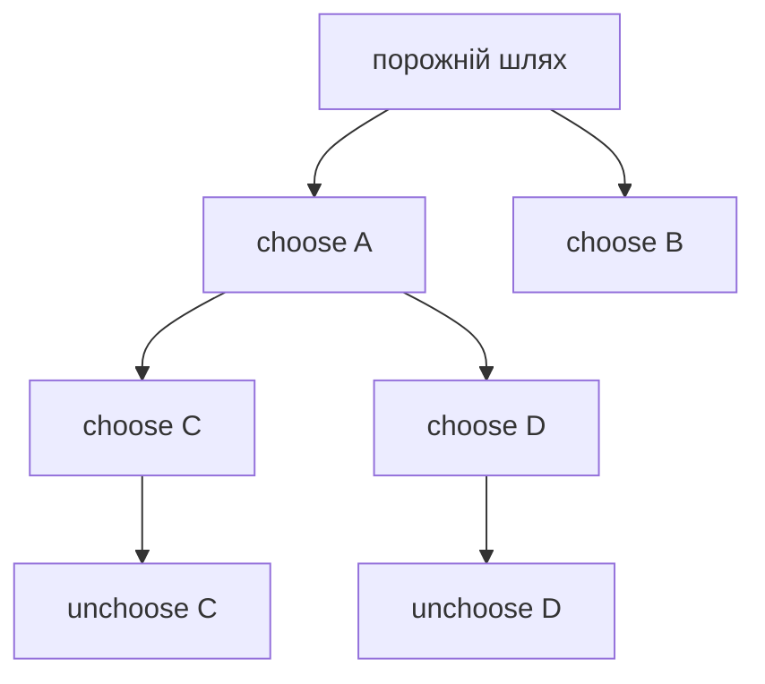

# 11. Рекурсія та backtracking

[← Індекс](README.md) · Код: [`src/topic11_recursion_backtracking`](../../src/topic11_recursion_backtracking)

## 1. Що робить рекурсивний виклик

Кожен виклик функції отримує власний stack frame: параметри, локальні змінні й адресу повернення. Наприклад `factorial(4)`:

```text
factorial(4) чекає 4 * factorial(3)
  factorial(3) чекає 3 * factorial(2)
    factorial(2) чекає 2 * factorial(1)
      factorial(1) повертає 1
    повертається 2
  повертається 6
повертається 24
```

Коректна recursion потребує:

- **base case**, який завершує;
- **progress**, кожен виклик наближає стан до base;
- чіткого контракту return value;
- усвідомлення максимальної depth.

Якщо хоча б одна гілка не наближається до base, можливий StackOverflowError.

## 2. Рекурсія не завжди ефективна

Наївний Fibonacci:

```text
fib(5)
├─ fib(4)
│  ├─ fib(3)
│  └─ fib(2)
└─ fib(3)   ← та сама підзадача повторюється
```

Розмір дерева експоненційний. Memo `n→fib(n)` обчислює кожне n один раз і дає `O(n)`. Ще простіший bottom-up використовує дві змінні.

Рекурсивний код сам по собі не є алгоритмом із хорошою складністю. Завжди рахуйте кількість **різних станів** і скільки разів кожен викликається.

## 3. Що додає backtracking

Backtracking досліджує дерево рішень. У кожному вузлі є часткове рішення `path`; для кожного дозволеного choice ми:

```text
choose → recurse → undo
```

Undo повертає mutable state у точний стан до choice, щоб наступна sibling-гілка стартувала чисто.

```java
path.add(choice);
backtrack(nextState, path);
path.remove(path.size()-1);
```

Якщо state immutable або кожен виклик створює копію, явний undo не потрібен, але виникає більше allocations.

## 4. Subsets: дерево include/exclude

Для `[1,2,3]` кожен елемент або входить, або ні, тому `2^3=8` subsets.

```text
[]
├─ [1]
│  ├─ [1,2]
│  │  └─ [1,2,3]
│  └─ [1,3]
├─ [2]
│  └─ [2,3]
└─ [3]
```

Loop-based шаблон додає current path до result **у кожному вузлі**, бо кожен префікс уже є валідною subset:

```java
void subsets(int start, List<Integer> path) {
    result.add(new ArrayList<>(path));
    for (int i=start; i<nums.length; i++) {
        path.add(nums[i]);
        subsets(i+1, path);
        path.remove(path.size()-1);
    }
}
```

`i+1` не дозволяє повторно взяти той самий індекс і зберігає порядок, тому `[2,1]` окремо не генерується. Копія path обов’язкова: result повинен зберегти snapshot, не посилання на список, який далі зміниться.

Output сам має `2^n` списків, тому експоненційний час тут неминучий.

## 5. Combination Sum

Від subsets відрізняється двома речами:

- є `remaining target`;
- той самий candidate можна брати повторно.

Після choice `c` рекурсія отримує `remaining-c` і `start=i`, не `i+1`. Base:

- remaining==0 → зберегти solution;
- remaining<0 → гілка неможлива.

Після сортування, якщо `c>remaining`, можна `break`: усі наступні ще більші. Це правильне pruning, доведене порядком.

Якщо candidate можна використати лише раз, next start буде `i+1`. Одна маленька зміна індексу змінює всю множину рішень.

## 6. Контроль дублікатів

Для input із однаковими values сортування ставить дублікати поруч. Правило:

```java
if (i > start && nums[i] == nums[i-1]) continue;
```

Воно пропускає однаковий choice лише між siblings одного рівня. `i>0` було б занадто сильним і могло б заборонити використання другої копії на глибшому рівні.

Важливо розрізняти:

- duplicate **values** у вхідних даних;
- повторне використання того самого **index**;
- однакові **output combinations**.

## 7. Letter Combinations of a Phone Number

Кожна цифра задає набір choices. Рівень recursion відповідає позиції цифри. Коли `index==digits.length()`, path має потрібну довжину й додається у result.

Для `"23"` дерево має 3·3=9 leaves: `ad,ae,af,bd,...,cf`. Тут start не потрібен, бо choice set визначається поточною позицією, а порядок позицій фіксований.

## 8. Palindrome Partitioning

State — індекс `start`, з якого ще треба розбити suffix. Choices — усі кінці `end>=start`, для яких `s[start..end]` palindrome.

```text
"aab"

start 0:
  "a" palindrome → start 1
      "a" → "b" => [a,a,b]
      "ab" not palindrome
  "aa" palindrome → start 2
      "b" => [aa,b]
  "aab" not palindrome
```

Base `start==s.length()` означає, що весь рядок покрито, й current partitions є solution.

Palindrome check може бути `O(n)` для кожного choice; DP precomputation `isPal[l][r]` зменшує повторну роботу до `O(1)` на перевірку, хоча output все одно може бути експоненційним.

## 9. Word Search на grid

State: `(row,col,indexInWord)`. Поточна клітинка має дорівнювати потрібному символу. Потім тимчасово позначаємо її visited, досліджуємо 4 сусіди для наступного символу й відновлюємо клітинку.

Чому restore потрібен? Клітинку не можна використати двічі **в одному path**, але інший path має право її використати.

```java
char saved = board[r][c];
board[r][c] = '#';
boolean found = dfs(... four neighbors ...);
board[r][c] = saved;
return found;
```

Перевірки bounds і character робляться до зміни. Якщо word знайдено, усе одно треба відновити board перед return, якщо контракт не дозволяє мутацію.

## 10. Word Search II і Trie pruning

Запускати окремий Word Search для кожного слова повторює спільні префікси. Trie об’єднує їх:

```text
words: oat, oath, oak

o → a → t (word)
        └→ h (word oath)
      └→ k (word oak)
```

Board DFS тримає поточний TrieNode. Якщо для символу немає child, жодне слово з цим prefix не існує — гілка завершується. У terminal node зберігають саме слово; після додавання можна очистити його, щоб не додавати дублікати.

## 11. N-Queens

Рівень recursion — row. Choice — column для queen у цьому row. Дві queens конфліктують, якщо мають:

- однакову column;
- однакову діагональ `row-col`;
- однакову антидіагональ `row+col`.

Три boolean arrays/sets дозволяють `O(1)` перевірку. Після placement усі три mark встановлюються, після recursion — знімаються.

```text
row 0: спробувати кожну col
row 1: лише cols без конфлікту
...
row n: усі queens розставлені → solution
```

Pruning тут величезний: замість усіх `n^n` розстановок ми відкидаємо конфлікт одразу після часткового prefix.

## 12. Sudoku Solver

Choice для порожньої клітинки — цифра 1..9, яка відсутня у row, column і 3×3 box. Після вибору mark/board оновлюються, при невдачі відновлюються.

Простий порядок «перша порожня» коректний, але повільний. MRV heuristic обирає клітинку з найменшою кількістю допустимих цифр. Це не змінює solutions, але раніше виявляє суперечності й різко зменшує дерево.

Bit masks можуть представляти зайняті digits; candidate mask обчислюється через OR трьох masks та complement.

## 13. Backtracking чи DP/memo?

Backtracking зазвичай перелічує solutions і path має значення. Memoization об’єднує однакові підзадачі, але два виклики з однаковим `index` можуть мати різний path/visited і не бути еквівалентними.

Поставте питання: «Якщо два рази прийти до цього state, чи множина можливих продовжень і потрібна відповідь точно однакова незалежно від історії?» Якщо так — state можна memoize. Якщо історія впливає, її треба включити в ключ, що може зробити state експоненційним.

## 14. Як розпізнати pattern

| Формулювання | Ймовірна модель |
|---|---|
| усі subsets/combinations/partitions | backtracking tree |
| розставити за constraints | backtracking + pruning |
| знайти path у grid без повтору клітинок | DFS choose/unchoose |
| багато слів зі спільними prefixes | Trie + backtracking |
| count/optimum із повторними immutable states | memo/DP |

Перед кодом випишіть: state, choices, base case, allowed predicate, apply, undo. Якщо один пункт нечіткий, реалізація майже напевно заплутається.

## Рекурсивний контракт і дерево рішень

Рекурсія розв’язує підзадачу того самого типу. Backtracking додає змінний шлях: **choose → explore → unchoose**. Кожен рівень дерева відповідає позиції/рішенню, кожен лист — кандидату на відповідь.



## Канонічний шаблон

```java
void backtrack(int start, List<Integer> path) {
    if (isSolution(path)) {
        result.add(new ArrayList<>(path));
        // return лише якщо рішення не можна продовжувати
    }
    for (int i = start; i < choices.length; i++) {
        if (!allowed(i, path)) continue;
        path.add(choices[i]);
        backtrack(nextStart(i), path);
        path.remove(path.size() - 1);
    }
}
```

Копіюйте `path` при збереженні; інакше всі відповіді посилатимуться на один mutable список.

## Контроль дублікатів

- Subsets без повторів: `nextStart=i+1`.
- Combination Sum з повторним вибором: `nextStart=i`.
- Після сортування пропускайте duplicate choice на **одному рівні**: `if (i>start && a[i]==a[i-1]) continue`.
- Permutation використовує `used[]`, а не start.

## Pruning

Відтинання має бути доведеним. Після сортування в Combination Sum, якщо `candidate > remaining`, можна `break`. N-Queens тримає sets/boolean arrays для колонок і діагоналей `row-col`, `row+col`. Sudoku обирає цифри, дозволені row/column/box; евристика MRV — наступною брати клітинку з найменшою кількістю кандидатів.

## Word search і Trie

Звичайний Word Search виконує DFS по клітинках зі visited/unmark. Для багатьох слів Trie об’єднує спільні префікси: якщо поточний префікс відсутній, гілка відтинається одразу. Знайдене слово можна очистити у вузлі, щоб не дублювати результат.

## Від рекурсії до memo/DP

Fibonacci без memo має експоненційне дерево повторів. Якщо результат залежить лише від невеликого immutable state, cache перетворює recursion на top-down DP. Якщо стан залежить від mutable visited/path, memoization може бути некоректною без включення цього стану в ключ.

## Карта задач

| Родина | Задачі |
|---|---|
| Базова recursion | Fibonacci, PowerOfTwo/Three, ReverseString, MergeLists, RangeSumBST, TreeTilt, Power |
| Include/exclude | SubsetXOR, Subsets |
| Choose with target | CombinationSum |
| Grid path | WordSearch, WordSearchII |
| Product choices | LetterCombinations |
| Partition | PalindromePartitioning |
| Constraint satisfaction | NQueens, SudokuSolver |

## Складність

Вказуйте розмір дерева рішень і ціну копіювання: subsets мають `2^n` відповідей і вже потребують `Ω(n·2^n)` для виводу; permutations — `n!`; grid DFS — до `O(mn·4^L)` до pruning. Експоненційність не завжди вада, якщо сам вихід експоненційний.

## Пастки

- Забути undo для board/used/path.
- Зробити `return` після додавання subset і втратити довші subsets.
- Неправильно дозволити повторний вибір через `i` проти `i+1`.
- Зберегти mutable path без копії.
- Назвати pruning евристикою, хоча він може видалити правильну відповідь.
