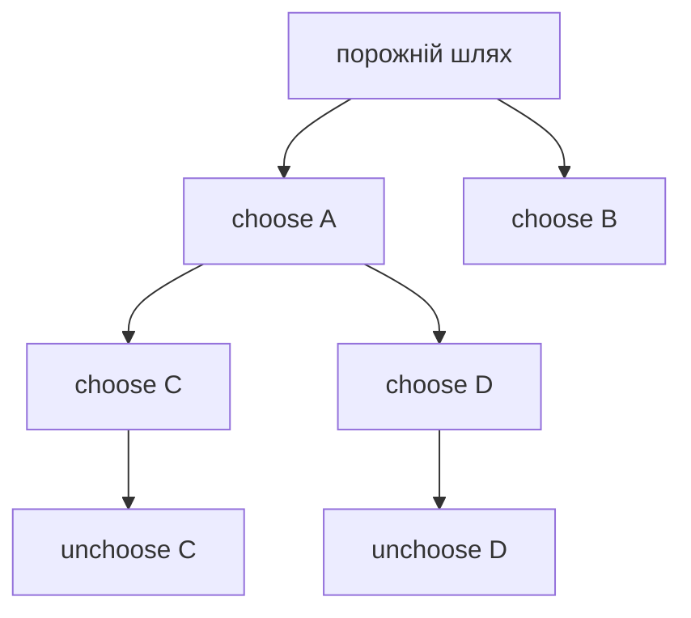

# 11. Рекурсія та backtracking

[← Індекс](README.md) · Код: [`src/topic11_recursion_backtracking`](../../src/topic11_recursion_backtracking)

## Рекурсивний контракт і дерево рішень

Рекурсія розв’язує підзадачу того самого типу. Backtracking додає змінний шлях: **choose → explore → unchoose**. Кожен рівень дерева відповідає позиції/рішенню, кожен лист — кандидату на відповідь.



## Канонічний шаблон

```java
void backtrack(int start, List<Integer> path) {
    if (isSolution(path)) {
        result.add(new ArrayList<>(path));
        // return лише якщо рішення не можна продовжувати
    }
    for (int i = start; i < choices.length; i++) {
        if (!allowed(i, path)) continue;
        path.add(choices[i]);
        backtrack(nextStart(i), path);
        path.remove(path.size() - 1);
    }
}
```

Копіюйте `path` при збереженні; інакше всі відповіді посилатимуться на один mutable список.

## Контроль дублікатів

- Subsets без повторів: `nextStart=i+1`.
- Combination Sum з повторним вибором: `nextStart=i`.
- Після сортування пропускайте duplicate choice на **одному рівні**: `if (i>start && a[i]==a[i-1]) continue`.
- Permutation використовує `used[]`, а не start.

## Pruning

Відтинання має бути доведеним. Після сортування в Combination Sum, якщо `candidate > remaining`, можна `break`. N-Queens тримає sets/boolean arrays для колонок і діагоналей `row-col`, `row+col`. Sudoku обирає цифри, дозволені row/column/box; евристика MRV — наступною брати клітинку з найменшою кількістю кандидатів.

## Word search і Trie

Звичайний Word Search виконує DFS по клітинках зі visited/unmark. Для багатьох слів Trie об’єднує спільні префікси: якщо поточний префікс відсутній, гілка відтинається одразу. Знайдене слово можна очистити у вузлі, щоб не дублювати результат.

## Від рекурсії до memo/DP

Fibonacci без memo має експоненційне дерево повторів. Якщо результат залежить лише від невеликого immutable state, cache перетворює recursion на top-down DP. Якщо стан залежить від mutable visited/path, memoization може бути некоректною без включення цього стану в ключ.

## Карта задач

| Родина | Задачі |
|---|---|
| Базова recursion | Fibonacci, PowerOfTwo/Three, ReverseString, MergeLists, RangeSumBST, TreeTilt, Power |
| Include/exclude | SubsetXOR, Subsets |
| Choose with target | CombinationSum |
| Grid path | WordSearch, WordSearchII |
| Product choices | LetterCombinations |
| Partition | PalindromePartitioning |
| Constraint satisfaction | NQueens, SudokuSolver |

## Складність

Вказуйте розмір дерева рішень і ціну копіювання: subsets мають `2^n` відповідей і вже потребують `Ω(n·2^n)` для виводу; permutations — `n!`; grid DFS — до `O(mn·4^L)` до pruning. Експоненційність не завжди вада, якщо сам вихід експоненційний.

## Пастки

- Забути undo для board/used/path.
- Зробити `return` після додавання subset і втратити довші subsets.
- Неправильно дозволити повторний вибір через `i` проти `i+1`.
- Зберегти mutable path без копії.
- Назвати pruning евристикою, хоча він може видалити правильну відповідь.

