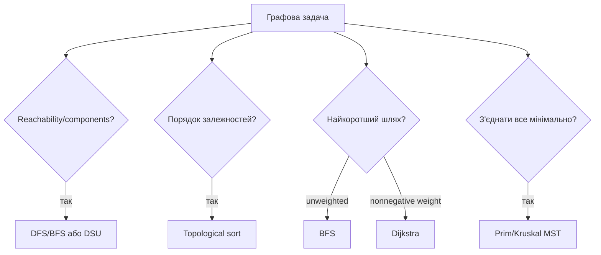

# 13. Просунуті графи

[← Індекс](README.md) · Код: [`src/topic13_advanced_graphs`](../../src/topic13_advanced_graphs)

## 1. Спочатку перекладіть історію на граф

В умові можуть не вживати слово «граф». Вершинами можуть бути міста, курси, символи, клітинки, користувачі або стани. Ребро означає доступний перехід чи відношення.

Перед вибором алгоритму випишіть:

- що є vertex;
- що є edge і чи воно directed;
- чи має edge weight і що вона означає;
- потрібен один path, усі reachable, порядок, компоненти чи з’єднання всіх;
- який масштаб `V` та `E`.

Одна й та сама історія може вимагати різних цілей:

```text
Чи можна доїхати?             → DFS/BFS
Найменше доріг?               → BFS, якщо всі рівні
Найменша сума часу?           → Dijkstra, якщо ваги ≥0
Чи є зайве ребро?             → DSU
Як з'єднати всі міста дешево? → MST
У якому порядку пройти курси? → topological sort
```

```algoviz
{
  "type": "graph",
  "title": "Dijkstra: minimum-distance frontier",
  "values": ["A", "B", "C", "D"],
  "edges": [[0,1],[0,2],[1,3],[2,3]],
  "positions": [[0.16,0.5],[0.46,0.18],[0.46,0.82],[0.82,0.5]],
  "steps": [
    {"label": "Distance(A)=0, усі інші distances нескінченні", "active": [0]},
    {"label": "Relax edges A→B і A→C та додаємо candidates у min-heap", "active": [1,2], "visited": [0], "prediction": {"prompt": "Яку вершину Dijkstra бере наступною?", "options": ["Будь-яку", "З найменшим tentative distance", "З найбільшим degree", "Останню додану"], "answer": 1}},
    {"label": "Найближча candidate стає finalized; stale heap entries пропускаються", "active": [1], "visited": [0]}
  ]
}
```

## 2. Degree та локальні властивості

Не всі graph tasks потребують складного обходу.

- Center of Star має degree `n-1`; навіть перші два edges уже мають спільний center.
- Town Judge має indegree `n-1` і outdegree 0. Можна вести один score: довіра до person `+1`, довіра від person `-1`.
- Destination City має outdegree 0 серед міст, що з’являються як destination.

Спочатку перевірте, чи відповідь визначається degree/локальним підрахунком. Це простіше, ніж будувати повну adjacency structure.

## 3. Bipartite graph

Граф bipartite, якщо vertices можна пофарбувати у два кольори так, щоб кожне edge з’єднувало різні кольори. BFS/DFS призначає сусіду протилежний колір; конфлікт означає odd cycle.

```text
0(red) ─ 1(blue)
 │          │
3(blue)─ 2(red)      bipartite
```

Треба запускати traversal з кожної uncolored vertex, бо граф може бути disconnected. Self-loop одразу створює конфлікт.

## 4. Dijkstra від інтуїції

У weighted graph BFS не працює: один edge вагою 100 гірший за десять edges вагою 1. Dijkstra завжди обирає unsettled vertex з найменшою відомою distance.

```text
A --4--> B
|        ^
1        | 1
v        |
C --1--> D

короткий A→C→D→B має вагу 3, а прямий A→B — 4
```

Старт `dist[A]=0`, інші infinity. Relaxation edge `(u,v,w)`:

```text
if dist[u] + w < dist[v], знайдено кращий шлях до v
```

Min-heap видає vertex з найменшим candidate distance. Після poll запис може бути застарілим, бо Java PriorityQueue не оновлює стару пару. Якщо polled distance не дорівнює current `dist[v]`, пропускаємо.

### Чому greedy коректний

Коли `u` має найменшу candidate distance, будь-який альтернативний шлях через ще не оброблену vertex уже має prefix не менший за `dist[u]`; невід’ємна наступна вага не зробить його коротшим. Тому distance u можна фіналізувати. З negative edge цей доказ руйнується.

Складність з adjacency list і binary heap: `O((V+E) log V)`, часто пишуть `O(E log V)` для connected sparse graph.

## 5. Варіації «відстані»

Dijkstra — це не лише сума, а загальна схема «витягти найкращий стан, релаксувати сусідів», якщо metric має правильну монотонність.

### Maximum Probability

Шляхова ймовірність — добуток edges. Початкова probability 1, max-heap. Relaxation `newProb=currentProb*edgeProb`, оновити якщо більше.

### Minimum Effort Path

Cost path — максимальна абсолютна різниця на будь-якому edge. Relaxation:

```text
newEffort = max(currentEffort, abs(height[u]-height[v]))
```

Мінімізується bottleneck, а не сума.

### Swim in Rising Water

Cost дістатися cell — максимальна висота на path. Та сама bottleneck relaxation. Альтернативно binary search water level + DFS feasibility або DSU activation за висотою.

Уміння сформулювати, як cost path комбінується з новим edge, є центральним.

## 6. Topological sort

Directed edge `A→B` означає, що A має бути раніше B. Topological order існує лише для DAG.

### Kahn BFS

1. Порахувати indegree кожної vertex.
2. У queue покласти всі indegree 0 — вони не мають невиконаних prerequisites.
3. Вилучити одну, додати в order, зменшити indegree її neighbors.
4. Нові нулі додати в queue.
5. Якщо order містить менше V, cycle заблокував решту.

Кілька правильних orders можливі. Якщо потрібен lexicographically smallest, замість FIFO queue використовуйте min-heap.

### DFS postorder

Vertex додається після всіх descendants, потім список розвертається. Три кольори одночасно знаходять cycle. Kahn зручніший для indegree/scheduling, DFS — для postorder reasoning.

## 7. Alien Dictionary

Sorted list слів задає порядок невідомого alphabet. Порівнюйте **сусідні** слова й беріть лише першу різну позицію:

```text
"wrt"
"wrf"  → t перед f
```

Пізніші символи вже не несуть ordering information, бо lexicographic decision зроблено першою різницею.

Усі символи треба додати як vertices, навіть без edges. Special invalid case: `"abc"` перед `"ab"`; довше слово не може стояти перед власним prefix. Після edges виконується topological sort; cycle означає суперечливий порядок.

## 8. Union-Find з нуля

DSU підтримує partition елементів на компоненти. Операції:

- `find(x)` повертає representative component;
- `union(a,b)` об’єднує компоненти;
- `connected(a,b)` перевіряє однаковий root.

Спочатку кожен є власним parent. Path compression під час find під’єднує вузли прямо до root. Union by size/rank приєднує менше дерево під більше.

```java
int find(int x) {
    if (parent[x] != x) parent[x] = find(parent[x]);
    return parent[x];
}
void union(int a, int b) {
    int ra=find(a), rb=find(b);
    if (ra==rb) return;
    if (size[ra] < size[rb]) { int t=ra; ra=rb; rb=t; }
    parent[rb]=ra;
    size[ra]+=size[rb];
}
```

Амортизована складність `α(n)` практично константна.

### Коли DSU кращий за DFS

DFS чудовий для статичного graph. DSU особливо зручний, коли edges надходять послідовно й після кожного треба знати connectivity, або коли будуємо компоненти об’єднаннями.

Redundant Connection: перед union перевірити roots. Якщо вже однакові, edge створює cycle. Number of Provinces: union усі connected pairs, наприкінці count roots/успішні merges.

## 9. Minimum Spanning Tree

MST з’єднує всі vertices `V-1` edges без cycle з мінімальною загальною вагою.

Це **не** набір shortest paths від root. Шлях між двома vertices у MST може бути довшим за shortest path, зате сумарна ціна всієї мережі мінімальна.

### Kruskal

Сортувати всі edges за вагою. Додавати edge, якщо DSU каже, що endpoints у різних компонентах. Cycle edges пропускати. Cut property пояснює greedy: найдешевше edge, що перетинає будь-який cut, безпечно для деякого MST.

Час `O(E log E)` через sort.

### Prim

Почати з однієї vertex. Min-heap містить edges, що виходять із уже підключеної множини. Додати найдешевше до нової vertex й її outgoing edges. Це схоже на Dijkstra за структурою, але key означає ціну підключення до tree, не distance від source.

Min Cost Connect Points має complete graph Manhattan distances. Явно створювати `O(n²)` edges можливо лише за відповідних constraints; простий Prim `O(n²)` без heap часто кращий за зберігання всіх edges.

## 10. Count Unreachable Pairs

Після DFS/DSU маємо sizes компонентів. Для component size `s` вона утворює `s*(remaining)` unreachable pairs з vertices поза нею. Поступово зменшуйте remaining, щоб кожну пару порахувати раз. Використовуйте `long`, бо кількість пар до `n(n-1)/2`.

## 11. Дерево вибору

| Ціль | Алгоритм | Ключова умова |
|---|---|---|
| components/reachability | DFS/BFS | статичні edges |
| dynamic connectivity/cycle edge | DSU | потрібні union/find |
| shortest path | BFS | unweighted/equal weights |
| shortest path | Dijkstra | weights nonnegative |
| dependency order | topological sort | directed DAG |
| cheapest network connecting all | MST | не shortest path |
| two-color constraints | bipartite BFS/DFS | перевірка odd cycle |

Ніколи не обирайте алгоритм лише за словом «граф». Спочатку сформулюйте математичну ціль.

## Спершу класифікуйте задачу



## Представлення

Adjacency list займає `O(V+E)` і є стандартом для sparse graph; matrix — `O(V²)`, але дає `O(1)` перевірку ребра. Directed/undirected та ваги мають бути явними. Для undirected додавайте обидва напрями, але ребро для Kruskal зберігайте один раз.

## Dijkstra

Для невід’ємних ваг `dist[source]=0`, решта infinity. Min-heap зберігає `(distance,node)`. Java `PriorityQueue` не має decrease-key, тому додавайте нову пару, а stale entry пропускайте, якщо `d != dist[node]`.

```java
while (!pq.isEmpty()) {
    State s = pq.poll();
    if (s.distance() != dist[s.node()]) continue;
    for (Edge e : graph[s.node()]) {
        long nd = s.distance() + e.weight();
        if (nd < dist[e.to()]) { dist[e.to()] = nd; pq.offer(new State(nd, e.to())); }
    }
}
```

Network Delay бере максимум distances; Path with Maximum Probability замінює `+` на множення і min на max. Minimum Effort Path мінімізує максимум ребра вздовж шляху: relaxation `max(currentEffort, edgeDiff)`.

## Topological sort

Kahn: indegree 0 у queue, видалення вершини зменшує indegree сусідів. Якщо оброблено не всі вершини — цикл. DFS-варіант використовує три кольори й додає вершину в postorder. Alien Dictionary спочатку створює всі символи, додає лише першу різну пару сусідніх слів і відхиляє invalid prefix: довше слово перед власним префіксом.

## Union-Find

DSU підтримує компоненти через `parent` і `rank/size`. Path compression + union by size дають амортизовано майже `O(1)` (`α(n)`). Redundant Connection — перше ребро, чиї кінці вже мають один root. Provinces — union усіх зв’язків і підрахунок roots.

## Minimum spanning tree

- Kruskal: сортувати ребра, додавати ті, що з’єднують різні DSU-компоненти — `O(E log E)`.
- Prim: вирощувати дерево від вершини через найменше crossing edge — `O(E log V)`.

MST мінімізує суму з’єднання всіх вершин, але не обов’язково шлях між конкретною парою.

## Swim in Rising Water

Три погляди: Dijkstra з cost `max`; binary search часу + reachability; сортування клітинок і DSU activation. Уміння побачити кілька моделей важливіше за заучування однієї.

## Карта задач

| Родина | Задачі |
|---|---|
| Degree/reachability | StarCenter, FindJudge, MinVertices, DestinationCity, Provinces, Bipartite, Ancestors, UnreachablePairs |
| Serialization stack | VerifyPreorderSerialization |
| Shortest/best path | MaxProbability, NetworkDelay, PathMinEffort, SwimInWater |
| Topological | CourseScheduleII, AlienDictionary |
| DSU | Provinces, RedundantConnection, UnreachablePairs |
| MST | MinCostConnectPoints |

## Пастки

- Запускати Dijkstra з від’ємними вагами.
- Позначати Dijkstra-вузол visited при додаванні, а не при фінальному poll.
- Забути isolated vertices у topo graph.
- Не перевірити invalid prefix в Alien Dictionary.
- Плутати shortest-path tree з MST.
