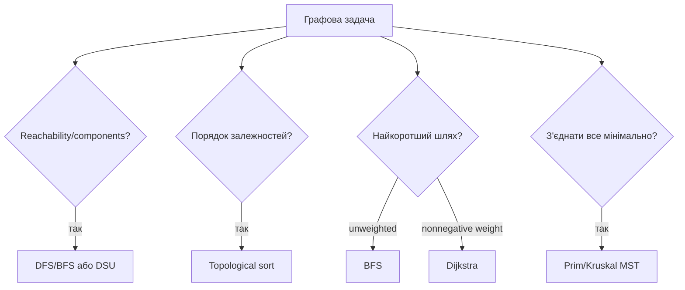

# 13. Просунуті графи

[← Індекс](README.md) · Код: [`src/topic13_advanced_graphs`](../../src/topic13_advanced_graphs)

## Спершу класифікуйте задачу



## Представлення

Adjacency list займає `O(V+E)` і є стандартом для sparse graph; matrix — `O(V²)`, але дає `O(1)` перевірку ребра. Directed/undirected та ваги мають бути явними. Для undirected додавайте обидва напрями, але ребро для Kruskal зберігайте один раз.

## Dijkstra

Для невід’ємних ваг `dist[source]=0`, решта infinity. Min-heap зберігає `(distance,node)`. Java `PriorityQueue` не має decrease-key, тому додавайте нову пару, а stale entry пропускайте, якщо `d != dist[node]`.

```java
while (!pq.isEmpty()) {
    State s = pq.poll();
    if (s.distance() != dist[s.node()]) continue;
    for (Edge e : graph[s.node()]) {
        long nd = s.distance() + e.weight();
        if (nd < dist[e.to()]) { dist[e.to()] = nd; pq.offer(new State(nd, e.to())); }
    }
}
```

Network Delay бере максимум distances; Path with Maximum Probability замінює `+` на множення і min на max. Minimum Effort Path мінімізує максимум ребра вздовж шляху: relaxation `max(currentEffort, edgeDiff)`.

## Topological sort

Kahn: indegree 0 у queue, видалення вершини зменшує indegree сусідів. Якщо оброблено не всі вершини — цикл. DFS-варіант використовує три кольори й додає вершину в postorder. Alien Dictionary спочатку створює всі символи, додає лише першу різну пару сусідніх слів і відхиляє invalid prefix: довше слово перед власним префіксом.

## Union-Find

DSU підтримує компоненти через `parent` і `rank/size`. Path compression + union by size дають амортизовано майже `O(1)` (`α(n)`). Redundant Connection — перше ребро, чиї кінці вже мають один root. Provinces — union усіх зв’язків і підрахунок roots.

## Minimum spanning tree

- Kruskal: сортувати ребра, додавати ті, що з’єднують різні DSU-компоненти — `O(E log E)`.
- Prim: вирощувати дерево від вершини через найменше crossing edge — `O(E log V)`.

MST мінімізує суму з’єднання всіх вершин, але не обов’язково шлях між конкретною парою.

## Swim in Rising Water

Три погляди: Dijkstra з cost `max`; binary search часу + reachability; сортування клітинок і DSU activation. Уміння побачити кілька моделей важливіше за заучування однієї.

## Карта задач

| Родина | Задачі |
|---|---|
| Degree/reachability | StarCenter, FindJudge, MinVertices, DestinationCity, Provinces, Bipartite, Ancestors, UnreachablePairs |
| Serialization stack | VerifyPreorderSerialization |
| Shortest/best path | MaxProbability, NetworkDelay, PathMinEffort, SwimInWater |
| Topological | CourseScheduleII, AlienDictionary |
| DSU | Provinces, RedundantConnection, UnreachablePairs |
| MST | MinCostConnectPoints |

## Пастки

- Запускати Dijkstra з від’ємними вагами.
- Позначати Dijkstra-вузол visited при додаванні, а не при фінальному poll.
- Забути isolated vertices у topo graph.
- Не перевірити invalid prefix в Alien Dictionary.
- Плутати shortest-path tree з MST.

