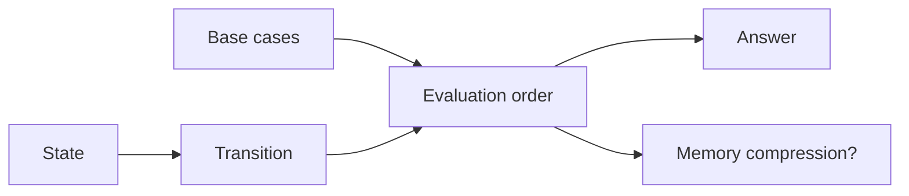

# 14. Динамічне програмування

[← Індекс](README.md) · Код: [`src/topic14_dynamic_programming`](../../src/topic14_dynamic_programming)

## 1. Що DP робить насправді

Dynamic programming не є окремою магічною формулою. Це спосіб не розв’язувати однакову підзадачу повторно.

Щоб DP було доречним:

- велика задача розкладається на менші того самого типу;
- однакові менші стани виникають з різних шляхів;
- відповідь великої задачі можна скласти з правильних відповідей менших.

Наївна recursion часто допомагає **відкрити** recurrence. Після цього memoization або table прибирає повтори.

## 2. П’ять речень перед таблицею

Для кожної задачі письмово завершіть:

1. `dp[...]` означає ...
2. Base cases такі, бо ...
3. Перехід розглядає варіанти ...
4. Стани обчислюються в порядку ..., щоб залежності були готові.
5. Відповідь лежить у ...

Якщо значення state не можна пояснити одним точним реченням, індекси таблиці майже напевно заплутаються.

```algoviz
{
  "type": "dp-table",
  "title": "Fibonacci: dp[i] = dp[i-1] + dp[i-2]",
  "values": [0, 1, "?", "?", "?", "?"],
  "columns": 6,
  "steps": [
    {"label": "Base cases dp[0]=0 і dp[1]=1 уже відомі", "active": [0,1], "prediction": {"prompt": "Чому дорівнює dp[2]?", "options": ["0", "1", "2", "Невідомо"], "answer": 1}},
    {"label": "dp[2]=dp[1]+dp[0]=1", "values": [0,1,1,"?","?","?"], "active": [2], "visited": [0,1]},
    {"label": "dp[3]=dp[2]+dp[1]=2", "values": [0,1,1,2,"?","?"], "active": [3], "visited": [0,1,2]},
    {"label": "Таблиця заповнюється зліва направо, коли залежності готові", "values": [0,1,1,2,3,5], "active": [5], "visited": [0,1,2,3,4]}
  ]
}
```

## 3. Climbing Stairs як перше DP

Щоб дійти до сходинки `i`, останній крок був:

- з `i-1` на 1;
- з `i-2` на 2.

Ці cases взаємно виключні й покривають усі способи:

```text
ways[i] = ways[i-1] + ways[i-2]
ways[0]=1  // один спосіб нічого не робити
ways[1]=1
```

Для n=4: `1,1,2,3,5`. Оскільки потрібні лише два попередні значення, array стискається до `prev2`, `prev1`.

Це не просто Fibonacci за назвою: recurrence треба вивести з останнього рішення.

## 4. Min Cost Climbing Stairs

Визначимо `dp[i]` як мінімальну вартість **дістатися позиції i**, де top має індекс n і не має власної cost.

```text
dp[i] = min(dp[i-1] + cost[i-1],
            dp[i-2] + cost[i-2])
```

Можна стартувати з 0 або 1, тому `dp[0]=dp[1]=0`. Інше визначення state («мінімальна ціна, починаючи з i») дає іншу, теж коректну recurrence. Не змішуйте base cases одного визначення з transition іншого.

## 5. House Robber: choice take/skip

Для префікса до будинку i оптимум робить одне з двох:

- skip i → оптимум до `i-1`;
- take i → money[i] + оптимум до `i-2`.

```text
dp[i] = max(dp[i-1], dp[i-2]+money[i])
```

Ми не знаємо, який локальний будинок кращий, тому greedy «брати кожен більший» може завадити майбутній комбінації. DP порівнює обидва завершальні cases.

Приклад `[2,7,9,3,1]`:

```text
best: 2, 7, 11, 11, 12
```

## 6. 0/1 Knapsack: Partition Equal Subset Sum

Потрібна subset із сумою `total/2`. `dp[s]` означає, чи можна набрати s уже розглянутими елементами.

Base `dp[0]=true`. Для кожного value:

```java
for (int s=target; s>=value; s--) {
    dp[s] = dp[s] || dp[s-value];
}
```

Чому справа наліво? Стан `dp[s-value]` має належати **попередньому набору items**. Якщо йти зліва направо, щойно створений стан може використати той самий value ще раз, перетворивши 0/1 knapsack на unbounded.

Якщо total odd, partition неможливий одразу.

## 7. Coin Change: unbounded choice

`dp[amount]` — мінімальна кількість coins для суми amount. `dp[0]=0`, інші infinity.

```text
dp[a] = min(dp[a], dp[a-coin]+1)
```

Оскільки coin можна брати повторно, суми можуть іти зліва направо. Перед `+1` перевіряйте, що попередній стан не infinity, інакше overflow.

Для `coins=[1,3,4], amount=6` greedy бере 4+1+1 (3 coins), але optimum 3+3 (2). Це класичний доказ, що локально найбільша coin не завжди веде до глобального optimum.

Порядок loops змінює сенс count-варіантів:

- coins зовні → combinations без порядку;
- amount зовні → ordered sequences/permutations.

## 8. Longest Increasing Subsequence

### O(n²) DP

`dp[i]` — довжина LIS, що **закінчується** саме в i.

```text
dp[i] = 1 + max(dp[j]) для j<i і nums[j]<nums[i]
```

Відповідь — max усіх dp[i], не обов’язково останній state.

Для `[10,9,2,5,3,7,101,18]`:

```text
dp = [1,1,1,2,2,3,4,4]
```

### O(n log n) tails

`tails[len-1]` — найменший можливий хвіст increasing subsequence довжини len. Для кожного x lower bound першого tail `>=x` і замінити його; якщо такого немає — append.

`tails` не обов’язково є реальною subsequence, але його length дорівнює LIS. Менший хвіст залишає більше шансів продовжити. Для відновлення самої sequence потрібні parent/index arrays.

## 9. 2D sequence DP: LCS

`dp[i][j]` — LCS перших i символів text1 і перших j text2.

- якщо останні символи рівні, вони можуть продовжити LCS: `1+dp[i-1][j-1]`;
- інакше хоча б один із них не входить у оптимальну пару: `max(dp[i-1][j],dp[i][j-1])`.

Нульовий row/column представляє порожній prefix. Таблиця заповнюється зверху вниз і зліва направо.

Substring вимагав би contiguous match і при різних символах скидав би поточну довжину, тому не плутайте ці задачі.

## 10. Edit Distance

`dp[i][j]` — мінімальні операції перетворити перші i chars word1 на перші j chars word2.

Base:

- `dp[i][0]=i` deletions;
- `dp[0][j]=j` insertions.

Якщо chars рівні → diagonal без нової операції. Інакше 1 + minimum:

- `dp[i-1][j]` delete;
- `dp[i][j-1]` insert;
- `dp[i-1][j-1]` replace.

Щоб не плутати сусідів, завжди описуйте, яка операція перевела **попередній state** у поточний.

## 11. Distinct Subsequences

`dp[i][j]` — кількість способів утворити перші j chars target із перших i chars source.

- target empty → один спосіб: нічого не брати;
- source empty, target nonempty → 0;
- якщо chars рівні, можна використати source char або пропустити:
  `dp[i-1][j-1]+dp[i-1][j]`;
- якщо різні, лише пропустити source char.

Це count DP, значення можуть швидко рости; перевіряйте constraints/type.

## 12. Counting Bits і DP на представленнях

Не всі DP схожі на optimization. Для числа i:

```text
bits[i] = bits[i >> 1] + (i & 1)
```

`i>>1` менше за i й уже пораховане. State space — числа 0..n, transition використовує binary representation.

## 13. Super Egg Drop: змінити питання

Класичний state `dp[eggs][floors]` із перебором поверху дорогий. Корисніше запитати: скільки поверхів можна гарантовано перевірити за `moves` і `eggs`?

Після одного drop:

- egg розбився → нижче можна покрити `reachable[m-1][e-1]`;
- не розбився → вище `reachable[m-1][e]`;
- плюс поточний floor.

```text
reachable[m][e] = 1 + reachable[m-1][e-1] + reachable[m-1][e]
```

Збільшуємо moves, доки covered floors ≥ n. Це важливий meta-skill: якщо очевидний DP надто дорогий, змініть значення state або поміняйте місцями «ресурс» і «результат».

## 14. Top-down чи bottom-up

| Top-down memo | Bottom-up table |
|---|---|
| пишеться близько до recurrence | явний порядок ітерацій |
| рахує лише reachable states | зазвичай рахує всю таблицю |
| має recursion overhead/stack risk | легко стискати memory |
| зручний для sparse/graph-like state | швидкий для регулярної grid |

Починайте з того, де легше довести state. Потім, якщо треба, конвертуйте для memory/performance.

## 15. Як розпізнати DP

Сигнали: «кількість способів», «мінімальна/максимальна вартість», «чи можливо», вибір послідовності з constraints. Але цього недостатньо. Спробуйте написати recursion і подивіться, чи однакові параметри повторюються.

Якщо рішення треба лише перелічити всі унікальні комбінації, backtracking може бути природнішим. Якщо кожен state обчислюється один раз без overlapping, простий DFS/greedy може бути достатнім.

## DP — це DAG станів

DP застосовується, коли є повторні підзадачі та optimal substructure. Не починайте з таблиці; спочатку визначте:

1. **State:** що мінімально описує підзадачу?
2. **Transition:** з яких менших станів вона утворюється?
3. **Base cases.**
4. **Order:** коли залежності вже обчислені?
5. **Answer:** який стан або агрегат повернути?



## Top-down і bottom-up

Memoized DFS природний для sparse reachable states і складних переходів; tabulation уникає stack overflow і часто швидша. Обидва реалізують той самий DAG. Memo повинен відрізняти «не обчислено» від валідного `0`/`false`.

## 1D recurrence

Climbing Stairs/Fibonacci: `dp[i]=dp[i-1]+dp[i-2]`, тому таблицю можна стиснути до двох змінних. House Robber: `dp[i]=max(dp[i-1], dp[i-2]+money[i])`; інваріант — оптимум на префіксі.

Kadane/Best Time Stock також є DP-агрегаціями: найкращий стан, що закінчується тут, і глобальний найкращий.

## Knapsack

Partition Equal Subset Sum — 0/1 knapsack: `dp[s]` чи можна набрати суму. Ітеруйте `s` **справа наліво**, щоб один item не використався кілька разів. Coin Change — unbounded; порядок циклів визначає, чи рахуємо комбінації, permutations або minimum coins.

## Sequence DP

- LIS `O(n²)`: `dp[i]` — довжина LIS, що закінчується в `i`; оптимізована tails + binary search — `O(n log n)`.
- LCS: `dp[i][j]` для префіксів; рівні символи → diagonal+1, інакше max top/left.
- Edit Distance: insert/delete/replace — min трьох сусідів +1.
- Distinct Subsequences: кількість способів утворити target prefix; потрібен тип, що витримує межі.

## Interval/decision DP

Super Egg Drop з класичного `dp[eggs][floors]` можна переосмислити: `reachable[moves][eggs] = 1 + reachable[m-1][eggs-1] + reachable[m-1][eggs]`. Це кількість поверхів, які можна розрізнити за дану кількість ходів; збільшуйте moves до покриття `n`.

## Карта задач

| Форма state | Задачі |
|---|---|
| Constant-memory 1D | Fibonacci, ClimbingStairs, MinCostStairs, Tribonacci, Stock, HouseRobber |
| Simple table | DivisorGame, CountingBits, PascalTriangle, IsSubsequence |
| Sequence 1D/2D | LIS, LCS, EditDistance, DistinctSubsequences |
| Knapsack | PartitionEqualSubsetSum, CoinChange |
| Reformulated state | SuperEggDrop |

## Доказ DP

Для кожного переходу доведіть: варіанти повні (кожне рішення належить одному case), взаємно коректні та використовують оптимальні менші стани. Індукція за evaluation order тоді доводить таблицю.

## Пастки

- Додати зайвий вимір state, різко збільшивши складність.
- Компресувати пам’ять у неправильному напрямку й читати вже оновлений поточний рядок.
- Плутати substring із subsequence.
- Використовувати greedy без exchange proof.
- Не врахувати неможливий стан (`INF`) перед `+1`, отримавши overflow.
