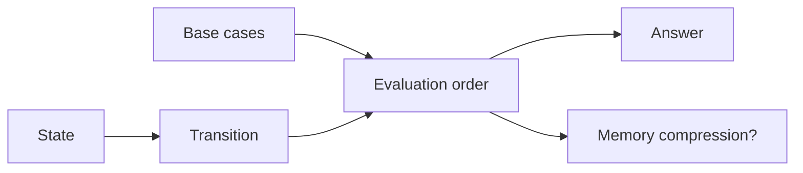

# 14. Динамічне програмування

[← Індекс](README.md) · Код: [`src/topic14_dynamic_programming`](../../src/topic14_dynamic_programming)

## DP — це DAG станів

DP застосовується, коли є повторні підзадачі та optimal substructure. Не починайте з таблиці; спочатку визначте:

1. **State:** що мінімально описує підзадачу?
2. **Transition:** з яких менших станів вона утворюється?
3. **Base cases.**
4. **Order:** коли залежності вже обчислені?
5. **Answer:** який стан або агрегат повернути?

## Top-down і bottom-up

Memoized DFS природний для sparse reachable states і складних переходів; tabulation уникає stack overflow і часто швидша. Обидва реалізують той самий DAG. Memo повинен відрізняти «не обчислено» від валідного `0`/`false`.

## 1D recurrence

Climbing Stairs/Fibonacci: `dp[i]=dp[i-1]+dp[i-2]`, тому таблицю можна стиснути до двох змінних. House Robber: `dp[i]=max(dp[i-1], dp[i-2]+money[i])`; інваріант — оптимум на префіксі.

Kadane/Best Time Stock також є DP-агрегаціями: найкращий стан, що закінчується тут, і глобальний найкращий.

## Knapsack

Partition Equal Subset Sum — 0/1 knapsack: `dp[s]` чи можна набрати суму. Ітеруйте `s` **справа наліво**, щоб один item не використався кілька разів. Coin Change — unbounded; порядок циклів визначає, чи рахуємо комбінації, permutations або minimum coins.

## Sequence DP

- LIS `O(n²)`: `dp[i]` — довжина LIS, що закінчується в `i`; оптимізована tails + binary search — `O(n log n)`.
- LCS: `dp[i][j]` для префіксів; рівні символи → diagonal+1, інакше max top/left.
- Edit Distance: insert/delete/replace — min трьох сусідів +1.
- Distinct Subsequences: кількість способів утворити target prefix; потрібен тип, що витримує межі.

## Interval/decision DP

Super Egg Drop з класичного `dp[eggs][floors]` можна переосмислити: `reachable[moves][eggs] = 1 + reachable[m-1][eggs-1] + reachable[m-1][eggs]`. Це кількість поверхів, які можна розрізнити за дану кількість ходів; збільшуйте moves до покриття `n`.

## Карта задач

| Форма state | Задачі |
|---|---|
| Constant-memory 1D | Fibonacci, ClimbingStairs, MinCostStairs, Tribonacci, Stock, HouseRobber |
| Simple table | DivisorGame, CountingBits, PascalTriangle, IsSubsequence |
| Sequence 1D/2D | LIS, LCS, EditDistance, DistinctSubsequences |
| Knapsack | PartitionEqualSubsetSum, CoinChange |
| Reformulated state | SuperEggDrop |

## Доказ DP

Для кожного переходу доведіть: варіанти повні (кожне рішення належить одному case), взаємно коректні та використовують оптимальні менші стани. Індукція за evaluation order тоді доводить таблицю.

## Пастки

- Додати зайвий вимір state, різко збільшивши складність.
- Компресувати пам’ять у неправильному напрямку й читати вже оновлений поточний рядок.
- Плутати substring із subsequence.
- Використовувати greedy без exchange proof.
- Не врахувати неможливий стан (`INF`) перед `+1`, отримавши overflow.

