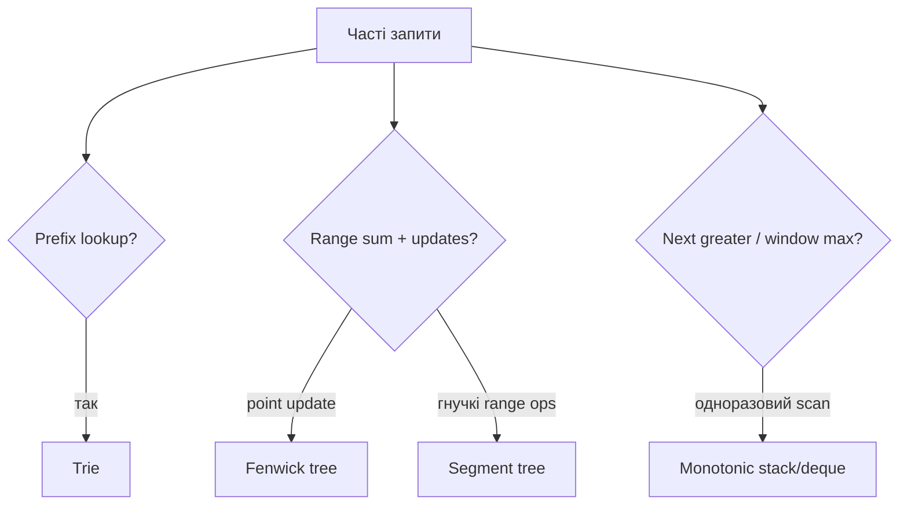

# 15. Просунуті структури даних

[← Індекс](README.md) · Код: [`src/topic15_advanced_data_structures`](../../src/topic15_advanced_data_structures)

## Вибір структури за операціями



## Trie

Кожне ребро — символ, шлях від root — prefix, прапорець `isWord` відрізняє повне слово. Insert/search/prefix коштують `O(L)`. Для малого фіксованого алфавіту `Node[26]` швидкий; `Map<Character,Node>` економить пам’ять на sparse Unicode-наборах.

Wildcard search `.` запускає DFS по всіх дітях лише на цій позиції. Word Search II поєднує board DFS із Trie pruning; видаляйте знайдені слова/порожні гілки для прискорення.

## Fenwick tree (BIT)

Fenwick зберігає суми блоків, визначених молодшим установленим бітом. Індексація 1-based:

```java
void add(int i, int delta) {
    for (i++; i < bit.length; i += i & -i) bit[i] += delta;
}
long prefix(int i) {
    long sum = 0;
    for (i++; i > 0; i -= i & -i) sum += bit[i];
    return sum;
}
```

Point update і prefix/range query — `O(log n)`, пам’ять `O(n)`. Для assignment зберігайте поточні values і додавайте `new-old`.

## Segment tree

Вузол відповідає інтервалу і зберігає агрегат двох дітей. Point update/query — `O(log n)`, build — `O(n)`, пам’ять близько `4n`. На 2D структура значно дорожча; обирайте її лише за відповідними constraints. Lazy propagation потрібна для range updates, але не для простого point update.

## Монотонні структури

Stack відповідає next greater/warmer; deque — min/max рухомого вікна; Stock Spanner стискає попередні ціни в пари `(price,span)`, поглинаючи не більші. Кожен запис push/pop один раз → амортизовано `O(1)`.

## Карта задач

| Структура | Задачі |
|---|---|
| Immutable prefix | RangeSumQuery |
| Trie | CountPrefixes, LongestCommonPrefix, ImplementTrie, AddSearchWords, WordSearchII |
| Fenwick/segment tree | RangeSumMutableEasy, RangeSumQueryMutable, RangeSumQuery2DMutable |
| Monotonic stack | FinalPrices, NextGreater, DailyTemperatures, OnlineStockSpan |
| Monotonic deque | MonotonicQueueIntro, MaxSlidingWindow |
| Базова властивість | MonotonicArray |

## Пастки

- Off-by-one між зовнішнім 0-based і Fenwick 1-based.
- Забути `isWord` і приймати будь-який prefix як слово.
- Виділяти 26 дітей для довільного Unicode без узгодження контракту.
- Використати segment tree там, де простий prefix достатній і оновлень немає.
- Плутати строгий і нестрогий порядок у monotonic pop.

