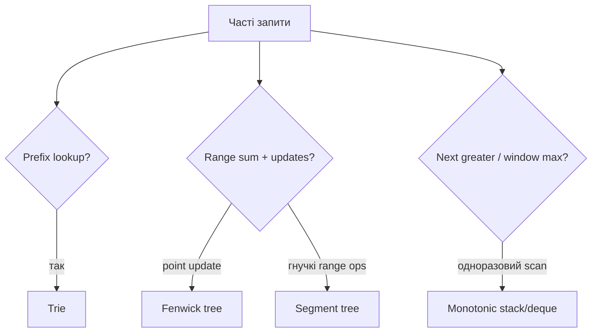

# 15. Просунуті структури даних

[← Індекс](README.md) · Код: [`src/topic15_advanced_data_structures`](../../src/topic15_advanced_data_structures)

## Навіщо «просунута» структура

Структура даних корисна не сама по собі, а через набір операцій. Масив чудовий для random access, але не для частих range sum після updates. HashMap чудова для exact key, але не для prefix words. Перед вибором випишіть частоти операцій:

```text
build один раз?
скільки insert/update?
скільки query?
який тип query: exact, prefix, range, min/max?
```

Іноді складніша структура лише переносить роботу: більше часу/пам’яті на update або build, зате дешевші queries.

## 1. Trie від звичайного set

HashSet може сказати, чи є повне слово `apple`, але неефективно відповідає «чи існує хоч одне слово з prefix `app`?» без перегляду ключів. Trie зберігає спільні prefixes один раз.

```text
words: app, apple, apt

root
 └ a
    └ p
       ├ p* ─ l ─ e*
       └ t*

* = terminal word
```

Кожен TrieNode має children і `isWord`. `app` є одночасно повним словом і prefix для apple, тому terminal flag обов’язковий.

### Insert

Для кожного char перейти/створити child. Після останнього поставити `isWord=true`. Час `O(L)`.

### Search

Пройти всі chars. Якщо edge немає — false. Після останнього повернути `isWord`, а не просто true.

### startsWith

Такий самий traversal, але після останнього char достатньо існування node.

### Array чи Map children

- `Node[26]`: швидко й передбачувано для lowercase English, але 26 refs у кожному node;
- `Map<Character,Node>`: менше для sparse alphabet, більше overhead;
- Unicode code points складніші за Java `char`, якщо контракт виходить за BMP.

## 2. Wildcard search

У Design Add and Search Words символ `.` означає будь-яку одну літеру. На звичайному char ідемо однією child. На `.` пробуємо DFS кожної існуючої child для наступного index.

Worst case може бути експоненційним за кількістю wildcards, але Trie відтинає неіснуючі prefixes. Не будуйте substring на кожній recursion; передавайте index.

## 3. Trie + board DFS

Word Search II поєднує дві структури:

- Trie каже, чи current letters є prefix хоча б одного слова;
- backtracking на board генерує paths без повтору клітинок.

У TrieNode зручно зберігати `String word`, не лише boolean. Коли node.word non-null, додати його й очистити, щоб не дублювати. Після DFS можна видалити child, якщо вона більше не має children/word — це pruning для наступних стартів.

## 4. Immutable prefix vs mutable range query

Якщо array не змінюється, prefix sum дає query `O(1)`. Якщо значення оновлюються, після одного update довелося б перерахувати весь suffix prefix array — `O(n)`.

Fenwick і segment tree балансують:

```text
point update: O(log n)
range query:  O(log n)
```

## 5. Fenwick Tree інтуїтивно

Fenwick array зберігає суми блоків різного розміру. Розмір блоку для індексу `i` (1-based) — `lowbit=i&-i`.

```text
i binary  lowbit  bit[i] покриває
1 0001      1     [1..1]
2 0010      2     [1..2]
3 0011      1     [3..3]
4 0100      4     [1..4]
6 0110      2     [5..6]
8 1000      8     [1..8]
```

Prefix query додає `bit[i]` і прибирає lowbit, переходячи до попереднього блоку. Update додає lowbit, переходячи до всіх більших блоків, що містять позицію.

Зовнішній індекс 0-based переводиться у внутрішній через `i++`.

### Assignment update

Fenwick природно підтримує «додати delta». Якщо API каже `update(index,newValue)`, зберігайте original values:

```text
delta = newValue - values[index]
values[index] = newValue
fenwick.add(index, delta)
```

Range sum `[l,r] = prefix(r)-prefix(l-1)`.

## 6. Segment Tree інтуїтивно

Корінь зберігає aggregate всього array, діти — лівої та правої половин.

```text
                 sum[0..7]
              /             \
         sum[0..3]       sum[4..7]
         /      \         /      \
     [0..1]   [2..3]   [4..5]   [6..7]
```

Point update змінює leaf і всіх ancestors — `O(log n)`. Range query:

- interval node повністю всередині query → взяти aggregate;
- не перетинається → neutral element (0 для sum, +∞ для min);
- частково → запитати обох дітей і combine.

Segment tree гнучкіший за Fenwick: min/max/gcd/custom aggregate, range operations із lazy propagation. Але код і constants більші.

### Коли Fenwick, коли Segment Tree

| Потреба | Вибір |
|---|---|
| point add/assign + prefix/range sum | Fenwick простіший |
| range min/max або custom associative combine | Segment tree |
| range updates + range queries | Segment tree + lazy або спеціальні Fenwick tricks |
| immutable data | звичайний prefix sum |

## 7. 2D mutable range sums

2D Fenwick робить update/query по двох lowbit loops, `O(log rows·log cols)`. 2D segment tree значно складніший і пам’яттєво дорогий. Для малих constraints просте оновлення row prefix або навіть scan може бути кращим.

Завжди порівнюйте реальні constraints: теоретично «просунуте» рішення може бути зайвим і більш помилковим.

## 8. Monotonic stack як стиснення кандидатів

Для next greater stack тримає unresolved indices. Коли приходить більший x, він завершує відповідь для всіх менших вершин. Елементи, які pop-нули, більше ніколи не повертаються.

Daily Temperatures і Final Prices відрізняються inequality та тим, що зберігається в answer, але skeleton однаковий:

```java
for (int i=0; i<n; i++) {
    while (!stack.isEmpty() && resolves(stack.peek(), i)) {
        int j=stack.pop();
        answer[j]=...;
    }
    stack.push(i);
}
```

## 9. Online Stock Span

Для нової price потрібна кількість послідовних попередніх days із price ≤ current. Замість зберігати кожен день окремо, stack містить пари `(price,span)`.

```text
price 100 → push (100,1), answer 1
price 80  → push (80,1), answer 1
price 60  → push (60,1), answer 1
price 70  → pop (60,1), span=2, push (70,2)
price 75  → pop (70,2), span=3, push (75,3)
price 85  → pop (75,3), pop (80,1), span=5
```

Одна пара представляє цілий блок уже поглинутих days. Кожна push/pop один раз → amortized `O(1)` на `next`.

## 10. Monotonic deque

Для window maximum deque містить indices у спадному порядку values. Від stack відрізняється тим, що старі candidates видаляються з **голови** за віком, а доміновані — з **хвоста** за значенням.

Ця структура потрібна, коли одночасно важливі priority і expiration.

## 11. Як зрозуміти, що складна структура виправдана

1. Напишіть простий baseline і його complexity.
2. Визначте, яка операція повторюється дорого.
3. Перевірте кількість operations у constraints.
4. Оберіть structure, що прискорює саме цю операцію.
5. Врахуйте build, memory і implementation risk.

Наприклад, один range query не виправдовує segment tree. Сто тисяч updates і queries — уже виправдовують.

## Вибір структури за операціями



## Trie

Кожне ребро — символ, шлях від root — prefix, прапорець `isWord` відрізняє повне слово. Insert/search/prefix коштують `O(L)`. Для малого фіксованого алфавіту `Node[26]` швидкий; `Map<Character,Node>` економить пам’ять на sparse Unicode-наборах.

Wildcard search `.` запускає DFS по всіх дітях лише на цій позиції. Word Search II поєднує board DFS із Trie pruning; видаляйте знайдені слова/порожні гілки для прискорення.

## Fenwick tree (BIT)

Fenwick зберігає суми блоків, визначених молодшим установленим бітом. Індексація 1-based:

```java
void add(int i, int delta) {
    for (i++; i < bit.length; i += i & -i) bit[i] += delta;
}
long prefix(int i) {
    long sum = 0;
    for (i++; i > 0; i -= i & -i) sum += bit[i];
    return sum;
}
```

Point update і prefix/range query — `O(log n)`, пам’ять `O(n)`. Для assignment зберігайте поточні values і додавайте `new-old`.

## Segment tree

Вузол відповідає інтервалу і зберігає агрегат двох дітей. Point update/query — `O(log n)`, build — `O(n)`, пам’ять близько `4n`. На 2D структура значно дорожча; обирайте її лише за відповідними constraints. Lazy propagation потрібна для range updates, але не для простого point update.

## Монотонні структури

Stack відповідає next greater/warmer; deque — min/max рухомого вікна; Stock Spanner стискає попередні ціни в пари `(price,span)`, поглинаючи не більші. Кожен запис push/pop один раз → амортизовано `O(1)`.

## Карта задач

| Структура | Задачі |
|---|---|
| Immutable prefix | RangeSumQuery |
| Trie | CountPrefixes, LongestCommonPrefix, ImplementTrie, AddSearchWords, WordSearchII |
| Fenwick/segment tree | RangeSumMutableEasy, RangeSumQueryMutable, RangeSumQuery2DMutable |
| Monotonic stack | FinalPrices, NextGreater, DailyTemperatures, OnlineStockSpan |
| Monotonic deque | MonotonicQueueIntro, MaxSlidingWindow |
| Базова властивість | MonotonicArray |

## Пастки

- Off-by-one між зовнішнім 0-based і Fenwick 1-based.
- Забути `isWord` і приймати будь-який prefix як слово.
- Виділяти 26 дітей для довільного Unicode без узгодження контракту.
- Використати segment tree там, де простий prefix достатній і оновлень немає.
- Плутати строгий і нестрогий порядок у monotonic pop.
