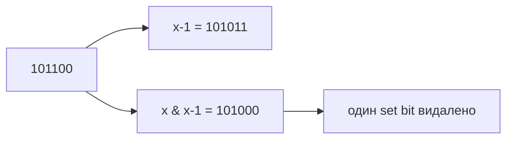

# 16. Бітові операції та математика

[← Індекс](README.md) · Код: [`src/topic16_bit_manipulation_math`](../../src/topic16_bit_manipulation_math)

## Бітові тотожності

| Операція | Значення |
|---|---|
| `x & 1` | молодший біт / парність |
| `x & (x-1)` | прибрати наймолодший встановлений біт |
| `x & -x` | виділити наймолодший встановлений біт |
| `x ^ x = 0` | пара однакових значень зникає |
| `x ^ 0 = x` | нуль нейтральний для XOR |
| `(mask >> i) & 1` | прочитати біт `i` |
| `mask | (1 << i)` | встановити біт `i` |

## Count/reverse bits

Brian Kernighan loop повторює `x &= x-1` рівно стільки разів, скільки одиниць. Для signed `int` у Java логічний зсув — `>>>`, арифметичний `>>` поширює знак. Reverse bits виконує рівно 32 кроки, щоб зберегти leading zeros у представленні.

Counting Bits DP: `bits[i]=bits[i>>1]+(i&1)` або `bits[i]=bits[i&(i-1)]+1`.

## XOR-родина

Single Number: XOR усіх. Missing Number: XOR індексів `0..n` і значень. Single Number II потребує підрахунку кожної бітової позиції modulo 3 або state machine `ones/twos`; важливо працювати з усіма 32 бітами, включно зі знаком.

## Bitmask enumeration

Кожна підмножина відповідає mask від `0` до `(1<<n)-1`. Це `O(n·2^n)` із явною побудовою. Для `n>=31` потрібен `1L<<n`, але сам перебір тоді зазвичай уже неприйнятний.

## Sieve і прості числа

Sieve of Eratosthenes позначає кратні кожного prime, починаючи з `p*p`, бо менші вже оброблені. Цикл до `p*p<n`, але множення виконуйте без overflow або як `long`. Час `O(n log log n)`, пам’ять `O(n)`.

## Fast power

Exponentiation by squaring: парний exponent ділиться навпіл; непарний додатково множить base. Для `Integer.MIN_VALUE` заперечення в `int` переповнюється, тому exponent спершу перетворюйте на `long`.

## Без `+` і множення

Додавання: `xor` дає суму без carry, `(a&b)<<1` — carry; повторювати до нульового carry. Max product word lengths: маска літер; слова не мають спільних літер, якщо `(maskA & maskB)==0`.

## Digit DP / positional counting

Number of Digit One рахує внесок кожної десяткової позиції через `high`, `current`, `low`. Це не звичайний bit DP, але той самий принцип декомпозиції представлення числа. Integer to English Words розбиває число на блоки по 1000 і окремо називає блок 0..999.

## Карта задач

| Ідея | Задачі |
|---|---|
| Bit count/position | NumberOfOneBits, CountingBits, ReverseBits, HammingDistance, PowerOfTwo |
| XOR | SingleNumber, MissingNumber, SingleNumberII |
| Представлення | AddBinary, Base7, IntegerToEnglishWords |
| Number theory | Sieve, CountPrimes, PowXN, NumberOfDigitOne |
| Masks | SubsetsBitmask, MaxProductWordLengths |
| Boolean addition | SumOfTwoIntegers |

## Пастки

- Використати `>>` замість `>>>` для negative bit pattern.
- Зсувати `1 << 31` і дивуватися від’ємному значенню.
- Переповнення `p*p`, `-Integer.MIN_VALUE`, проміжного добутку.
- Вважати floating-point `Math.pow` точною цілою арифметикою.
- Оптимізувати бітами код, який простіше й безпечніше читається арифметично без виграшу складності.

