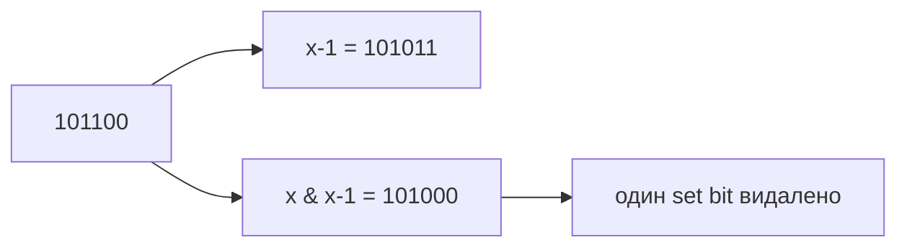

# 16. Бітові операції та математика

[← Індекс](README.md) · Код: [`src/topic16_bit_manipulation_math`](../../src/topic16_bit_manipulation_math)

## 1. Як Java зберігає цілі числа

`int` має 32 bits і використовує two's complement. Старший bit є знаком, але bit operations працюють із усім pattern.

```text
 5 = 00000000 ... 00000101
-1 = 11111111 ... 11111111
```

Зсуви:

- `>>` arithmetic: заповнює старші bits знаком;
- `>>>` logical: заповнює нулями;
- `<<` зсуває вліво, молодші bits стають нулями.

У Java для int реально використовується лише 5 молодших bits величини shift, тому дивні великі shifts краще не використовувати без розуміння правила.

## 2. AND, OR, XOR

Для одного біта:

| a | b | `a&b` | `a|b` | `a^b` |
|---:|---:|---:|---:|---:|
| 0 | 0 | 0 | 0 | 0 |
| 0 | 1 | 0 | 1 | 1 |
| 1 | 0 | 0 | 1 | 1 |
| 1 | 1 | 1 | 1 | 0 |

- AND перевіряє спільно встановлені flags;
- OR встановлює/об’єднує flags;
- XOR показує відмінність і скасовує пари;
- NOT `~` інвертує всі 32 bits.

Практичні операції:

```java
boolean set = (mask & (1 << bit)) != 0;
mask |= 1 << bit;      // set
mask &= ~(1 << bit);   // clear
mask ^= 1 << bit;      // toggle
```

## 3. Count set bits

### Перевіряти 32 позиції

```java
int count=0;
for (int i=0; i<32; i++) {
    count += (n >>> i) & 1;
}
```

### Brian Kernighan

`n-1` змінює найправішу 1 на 0 і всі bits правіше на 1. `n & (n-1)` прибирає саме цю найправішу 1.

```text
n       = 10110000
n-1     = 10101111
n&(n-1) = 10100000
```

Цикл виконується `popcount(n)` разів. Для negative int теж завершиться, бо pattern має скінченні 32 set bits.

## 4. Power of Two

Додатне число є степенем двійки, якщо має рівно один set bit:

```java
n > 0 && (n & (n-1)) == 0
```

Перевірка `n>0` потрібна: zero теж дає `0 & -1 == 0`, але не є степенем двійки.

Power of Three не має такого простого універсального bit-test; можна ділити на 3 або використати найбільший степінь 3 у int і divisibility з правильним контрактом.

## 5. XOR і парність появ

XOR associative/commutative, `x^x=0`, `x^0=x`. Якщо всі значення, крім одного, з’являються рівно двічі:

```text
4 ^ 1 ^ 2 ^ 1 ^ 2 = 4 ^ (1^1) ^ (2^2) = 4
```

Порядок не важливий, пам’ять `O(1)`.

### Missing Number

Маємо values із `0..n`, одне відсутнє. XOR усіх indices `0..n` і values: усі наявні пари зникнуть, залишиться missing.

Інший спосіб — expected sum minus actual, але sum може overflow без long.

### Hamming Distance

Bits, що відрізняються, стають 1 у `x^y`; відповідь — popcount XOR.

## 6. Single Number II

Кожне bit position у числах, що повторюються тричі, дає count, кратний 3. Додатковий single залишає remainder.

Проста версія:

1. для кожного з 32 bits порахувати, скільки numbers мають його;
2. якщо count%3 !=0, встановити bit відповіді.

Це `O(32n)=O(n)`, memory `O(1)` і коректно відновлює sign bit.

Оптимізована state machine `ones/twos` тримає bits, бачені один або два рази modulo 3, але її варто вчити лише після count-by-bit proof.

## 7. Reverse Bits

Треба виконати рівно 32 кроки, бо leading zeros теж змінюють позицію:

```java
int result=0;
for (int i=0; i<32; i++) {
    result = (result << 1) | (n & 1);
    n >>>= 1;
}
```

`>>>` важливий: arithmetic `>>` для negative n постійно додавав би одиниці зліва.

## 8. Counting Bits як DP

Для кожного `i`:

```text
bits[i] = bits[i >> 1] + (i & 1)
```

Правий shift видаляє останній bit, `(i&1)` додає його значення. Або `bits[i&(i-1)]+1`: прибрати одну одиницю та використати вже готовий менший state.

## 9. Bitmask subsets

Для n елементів mask має n bits. Bit i відповідає, чи входить `nums[i]`.

```text
nums=[a,b,c]
mask 000 → []
mask 001 → [a]
mask 010 → [b]
mask 011 → [a,b]
...
mask 111 → [a,b,c]
```

Перебираємо `0 .. (1<<n)-1`; для кожної mask перевіряємо n bits. Час `O(n·2^n)`, що відповідає розміру output.

Для n≥31 `1<<n` переповнює/має special shift behavior; `1L<<n` розширює межу, але практично 2^n усе одно швидко стає неможливим.

## 10. Add Binary

Це звичайне додавання справа наліво з carry. На кожній позиції:

```text
sum = carry + digitA + digitB
output bit = sum % 2
carry = sum / 2
```

StringBuilder накопичує bits у зворотному порядку й наприкінці reverse. Цей arithmetic підхід читабельніший за надмірні bit tricks над рядками.

## 11. Sum of Two Integers без `+`

Для bits:

- `a^b` — сума без переносів;
- `(a&b)<<1` — позиції переносів.

Повторюємо, доки carry 0:

```java
while (b != 0) {
    int carry = (a & b) << 1;
    a = a ^ b;
    b = carry;
}
return a;
```

Two's complement означає, що той самий алгоритм працює з negative values і природним int overflow semantics.

## 12. Fast Power

Замість множити x n разів:

```text
x^10 = (x^5)^2
x^5  = x*(x^2)^2
```

Кожен крок ділить exponent навпіл → `O(log |n|)`.

Ітеративно, якщо молодший bit exponent встановлений, домножити result на base; потім `base*=base`, exponent >>=1.

Negative exponent: `x^-n = 1/x^n`. Спершу конвертуйте n у long, бо `-Integer.MIN_VALUE` не поміщається в int.

## 13. Sieve of Eratosthenes

Для всіх primes `<n`:

1. boolean composite[n];
2. для `p` від 2 до `p*p<n`, якщо не composite;
3. позначити `p*p, p*p+p, ...`.

Чому старт `p*p`? Менші кратні `2p,3p,...` вже позначили менші primes. Час `O(n log log n)`, memory `O(n)`.

`p*p` може overflow для загального великого range, тому умову можна писати `p <= (n-1)/p` або використовувати long.

## 14. Max Product of Word Lengths

Для lowercase letters кожне слово стискається до 26-bit mask. Якщо `(maskA & maskB)==0`, спільних літер немає. Для однакової mask достатньо зберігати максимальну довжину слова, скорочуючи кількість пар.

Це типовий use case bitmask: множину з малого фіксованого universe представляємо одним integer і отримуємо union/intersection за одну операцію.

## 15. Digit decomposition

Base 7: повторно брати `n%7`, додавати digit і ділити `n/=7`, потім reverse. Окремо обробити 0 і знак; для `Integer.MIN_VALUE` magnitude потрібен long.

Integer to English Words розбиває число на groups по 1000:

```text
1,234,567 → 1 Million + 234 Thousand + 567
```

Окрема функція називає число 1..999 через hundreds, tens, under-twenty. Пропускайте нульові groups і акуратно керуйте spaces.

## 16. Number of Digit One

Для кожної десяткової позиції `factor=1,10,100...` число ділиться на:

```text
high    = n / (factor*10)
current = (n/factor) % 10
low     = n % factor
```

Повні cycles high дають `high*factor` одиниць. Якщо current=0 — лише вони; current=1 — плюс `low+1`; current>1 — плюс повний factor. Цю формулу краще вивести на позиції десятків для 0..n, а не заучувати без розуміння.

## 17. Коли bit trick доречний

Сигнали: small set of flags, парні повтори, powers of two, Hamming distance, subsets до ~20 elements, операції забороняють arithmetic. Але bit solution має бути пояснюваним. Якщо звичайний arithmetic/string код такий самий за complexity й набагато ясніший, він часто кращий.

## Бітові тотожності

| Операція | Значення |
|---|---|
| `x & 1` | молодший біт / парність |
| `x & (x-1)` | прибрати наймолодший встановлений біт |
| `x & -x` | виділити наймолодший встановлений біт |
| `x ^ x = 0` | пара однакових значень зникає |
| `x ^ 0 = x` | нуль нейтральний для XOR |
| `(mask >> i) & 1` | прочитати біт `i` |
| `mask | (1 << i)` | встановити біт `i` |



## Count/reverse bits

Brian Kernighan loop повторює `x &= x-1` рівно стільки разів, скільки одиниць. Для signed `int` у Java логічний зсув — `>>>`, арифметичний `>>` поширює знак. Reverse bits виконує рівно 32 кроки, щоб зберегти leading zeros у представленні.

Counting Bits DP: `bits[i]=bits[i>>1]+(i&1)` або `bits[i]=bits[i&(i-1)]+1`.

## XOR-родина

Single Number: XOR усіх. Missing Number: XOR індексів `0..n` і значень. Single Number II потребує підрахунку кожної бітової позиції modulo 3 або state machine `ones/twos`; важливо працювати з усіма 32 бітами, включно зі знаком.

## Bitmask enumeration

Кожна підмножина відповідає mask від `0` до `(1<<n)-1`. Це `O(n·2^n)` із явною побудовою. Для `n>=31` потрібен `1L<<n`, але сам перебір тоді зазвичай уже неприйнятний.

## Sieve і прості числа

Sieve of Eratosthenes позначає кратні кожного prime, починаючи з `p*p`, бо менші вже оброблені. Цикл до `p*p<n`, але множення виконуйте без overflow або як `long`. Час `O(n log log n)`, пам’ять `O(n)`.

## Fast power

Exponentiation by squaring: парний exponent ділиться навпіл; непарний додатково множить base. Для `Integer.MIN_VALUE` заперечення в `int` переповнюється, тому exponent спершу перетворюйте на `long`.

## Без `+` і множення

Додавання: `xor` дає суму без carry, `(a&b)<<1` — carry; повторювати до нульового carry. Max product word lengths: маска літер; слова не мають спільних літер, якщо `(maskA & maskB)==0`.

## Digit DP / positional counting

Number of Digit One рахує внесок кожної десяткової позиції через `high`, `current`, `low`. Це не звичайний bit DP, але той самий принцип декомпозиції представлення числа. Integer to English Words розбиває число на блоки по 1000 і окремо називає блок 0..999.

## Карта задач

| Ідея | Задачі |
|---|---|
| Bit count/position | NumberOfOneBits, CountingBits, ReverseBits, HammingDistance, PowerOfTwo |
| XOR | SingleNumber, MissingNumber, SingleNumberII |
| Представлення | AddBinary, Base7, IntegerToEnglishWords |
| Number theory | Sieve, CountPrimes, PowXN, NumberOfDigitOne |
| Masks | SubsetsBitmask, MaxProductWordLengths |
| Boolean addition | SumOfTwoIntegers |

## Пастки

- Використати `>>` замість `>>>` для negative bit pattern.
- Зсувати `1 << 31` і дивуватися від’ємному значенню.
- Переповнення `p*p`, `-Integer.MIN_VALUE`, проміжного добутку.
- Вважати floating-point `Math.pow` точною цілою арифметикою.
- Оптимізувати бітами код, який простіше й безпечніше читається арифметично без виграшу складності.
