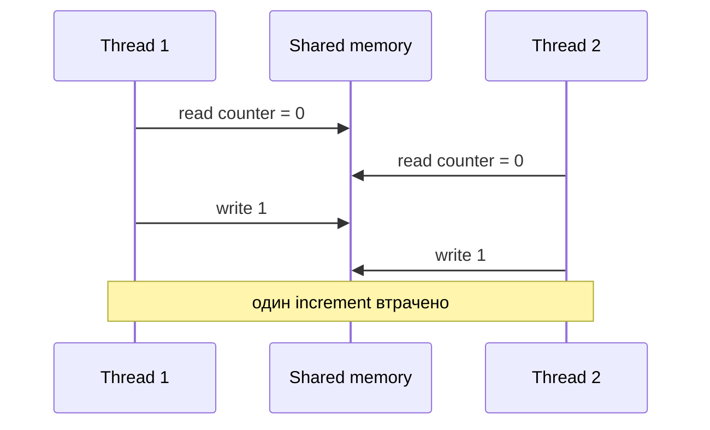

# 17. Основи багатопотоковості та thread safety

[← Індекс](README.md) · Код: [`src/topic17_multithreading_basics`](../../src/topic17_multithreading_basics)

## Correctness раніше за parallelism

Кілька потоків спільно бачать heap, але мають окремі stacks. Проблема виникає, коли щонайменше два потоки звертаються до однієї mutable змінної, один записує, а доступи не впорядковані synchronization — це data race.



`counter++` — read + add + write, а не атомарна операція.

## Три властивості JMM

- **Atomicity:** операція не спостерігається частково.
- **Visibility:** запис одного потоку стає видимим іншому.
- **Ordering:** компілятор/CPU не переставив операції всупереч дозволеним правилам.

Java Memory Model дає гарантії через **happens-before**: unlock → наступний lock того самого монітора; volatile write → наступний volatile read; `Thread.start()`; завершення потоку → успішний `join()`; правила транзитивні.

## `synchronized`, `volatile`, atomic

| Засіб | Дає | Не дає |
|---|---|---|
| `synchronized` | mutual exclusion + visibility + reentrancy | паралельність усередині одного monitor |
| `volatile` | visibility і порядок для одного поля | атомарність складених `x++`/check-then-act |
| `AtomicInteger` | атомарні RMW/CAS операції | атомарний інваріант кількох полів |
| immutable object | безпечне читання після safe publication | оновлення стану |

Вибирайте lock навколо **інваріанта**, а не навколо випадкової змінної. Якщо `balance` і `history` мають змінюватися разом, один AtomicInteger недостатній.

## Safe publication

Об’єкт має не лише бути створеним, а й коректно опублікованим: через final fields + коректне конструювання, volatile reference, lock, concurrent collection, static initialization або task handoff. Не дозволяйте `this` втекти з конструктора.

Lazy initialization: найпростіша коректна версія — initialization-on-demand holder. Double-checked locking потребує `volatile` instance.

```java
class Holder {
    private static class Lazy { static final Service INSTANCE = new Service(); }
    static Service get() { return Lazy.INSTANCE; }
}
```

## Interrupt і життєвий цикл

Interruption — cooperative cancellation request. Blocking method часто кидає `InterruptedException` і очищає прапорець. Якщо метод не може прокинути exception, відновіть статус `Thread.currentThread().interrupt()` і завершіть роботу. `join()` встановлює порядок завершення й visibility результатів.

## Карта задач

| Задача | Центральна ідея |
|---|---|
| PrintInOrder | happens-before між фазами |
| ThreadSafeCounter | atomic increment або lock |
| ThreadJoin | lifecycle + visibility після join |
| LazyInitializer | safe publication |
| ImmutableState | final fields, defensive copy, відсутність витоку mutable state |

## Пастки

- `volatile int count; count++` усе ще race.
- Синхронізувати записи, але читати без того самого протоколу.
- Lock на змінному або публічно доступному об’єкті.
- Ковтати `InterruptedException`.
- Повертати mutable внутрішню колекцію з «immutable» класу.

