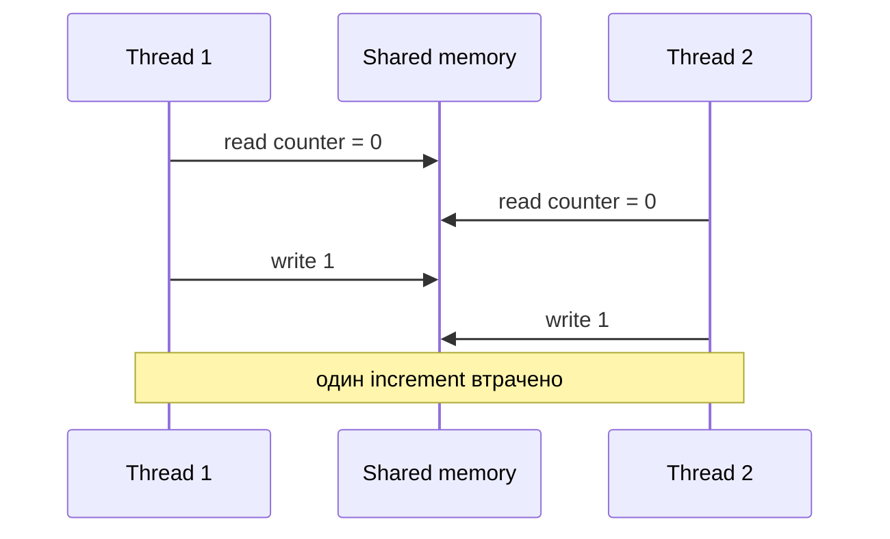

# 17. Основи багатопотоковості та thread safety

[← Індекс](README.md) · Код: [`src/topic17_multithreading_basics`](../../src/topic17_multithreading_basics)

## 1. Process, thread, concurrency і parallelism

Process має власний address space та ресурси. Threads одного process спільно використовують heap і відкриті ресурси, але кожен має власний call stack та поточну instruction.

```text
Process JVM
├─ Heap: shared objects
├─ Thread A stack: local variables, calls
├─ Thread B stack: local variables, calls
└─ Thread C stack: local variables, calls
```

**Concurrency** означає, що кілька tasks перебувають у progress в одному проміжку часу; CPU може швидко перемикатися між ними. **Parallelism** — фактичне одночасне виконання на різних cores. Програма може бути concurrent на одному core без parallel execution.

Багатопотоковість використовують для:

- responsiveness UI/service;
- overlap очікування I/O;
- parallel CPU work на кількох cores;
- моделювання незалежних tasks.

Вона не «автоматично пришвидшує» код: synchronization, scheduling і contention мають ціну.

## 2. Thread lifecycle

```java
Thread worker = new Thread(() -> doWork());
worker.start(); // створює новий шлях виконання
worker.join();  // поточний thread чекає завершення worker
```

Не викликайте `run()` напряму, якщо потрібен новий thread: це звичайний method call у поточному thread. Один об’єкт Thread можна start лише один раз.

Типові states: NEW, RUNNABLE, BLOCKED (чекає monitor), WAITING/TIMED_WAITING, TERMINATED. RUNNABLE у Java може означати як реально running, так і готовий до CPU.

`join()` не лише чекає: усі дії worker до завершення happens-before успішне повернення join, тому його результати стають видимими joining thread.

## 3. Race condition покроково

Нехай `count=0`, два threads виконують `count++`. Це три логічні операції:

```text
read count
add 1
write count
```

Можливе interleaving:

| Час | Thread A | Thread B | Shared count |
|---:|---|---|---:|
| 1 | read 0 | | 0 |
| 2 | | read 0 | 0 |
| 3 | calculate 1 | | 0 |
| 4 | | calculate 1 | 0 |
| 5 | write 1 | | 1 |
| 6 | | write 1 | 1 |

Очікували 2, отримали 1. Це lost update.

Data race формально виникає, коли два conflicting accesses до однієї memory location, принаймні один write, не впорядковані happens-before. Результат може бути не лише «старе значення», а поведінка, яку складно відтворити через compiler/CPU reorderings.

## 4. Atomicity, visibility, ordering

Ці проблеми треба розрізняти.

### Atomicity

Операція відбувається як неподільна щодо інших threads. Читання/запис окремого int atomic, але `count++` — compound read-modify-write і не atomic.

### Visibility

Thread A може записати `stop=true`, але B без synchronization не зобов’язаний вчасно побачити зміну й може продовжувати loop.

### Ordering

Compiler і CPU можуть переставляти незалежні instructions, якщо single-thread semantics не змінюється. Інший thread без happens-before може спостерігати несподіваний порядок publication.

Synchronization primitives дають не інтуїтивну «запис у RAM», а формальні Java Memory Model guarantees.

## 5. Happens-before як мова доказу

Найважливіші правила:

- program order усередині одного thread;
- unlock monitor happens-before наступний lock того самого monitor;
- write volatile happens-before наступний read цього volatile;
- виклик `start()` happens-before дії нового thread;
- усі дії thread happens-before успішний `join()` іншого;
- static initialization і final-field rules дають спеціальні publication guarantees;
- відношення транзитивне.

Якщо A записав data, потім volatile flag, а B прочитав true з цього flag, попередні data writes A видимі B через transitivity.

## 6. `synchronized` і monitor

Кожен Java object має intrinsic monitor. `synchronized(lock) { ... }` дозволяє лише одному thread одночасно виконувати block для того самого lock.

```java
private final Object lock = new Object();
private int count;

void increment() {
    synchronized (lock) {
        count++;
    }
}

int get() {
    synchronized (lock) {
        return count;
    }
}
```

І читання, і запис використовують той самий protocol. Якщо get не synchronized/volatile, mutual exclusion writer не гарантує reader visibility.

Monitor reentrant: thread, що вже володіє ним, може ввійти знову через інший synchronized method того самого object.

### Вибір lock object

Lock має бути `private final`. Не lock-айте string literals, boxed values або externally accessible object: чужий код може використати той самий monitor й створити неочікуваний contention/deadlock.

Lock повинен захищати invariant. Якщо `balance` і `transactions` мають оновлюватися разом, один block охоплює обидві зміни.

## 7. `volatile`

```java
private volatile boolean stopped;
```

Підходить для independent state flag, який один/кілька threads записують і інші читають. Volatile write/read дає visibility і ordering.

Не підходить для compound invariant:

```java
volatile int count;
count++; // усе ще read-modify-write race
```

Також `if (!initialized) initialized=true` не стає атомарним check-then-act лише через volatile.

## 8. Atomic variables

`AtomicInteger.incrementAndGet()` виконує atomic read-modify-write через CAS loop. Методи `compareAndSet(expected,update)`, `getAndUpdate`, `accumulateAndGet` дозволяють lock-free updates одного state.

```java
AtomicInteger counter = new AtomicInteger();
int newValue = counter.incrementAndGet();
```

Але два atomics не утворюють спільної transaction. Якщо треба одночасно оновити x і y за invariant, використовуйте lock або один immutable aggregate в AtomicReference з CAS.

Для дуже contention-heavy statistics `LongAdder` масштабує increments через кілька internal cells, але `sum()` не є atomic snapshot щодо concurrent updates; для sequence/id він не підходить.

## 9. Immutability

Immutable object після конструювання не змінює observable state. Правила:

- class final або контроль subclassing;
- fields private final;
- не повертати mutable internals;
- defensive copies на input/output;
- referenced objects теж immutable або копіюються;
- не дозволяти `this` escape під час constructor.

```java
final class Snapshot {
    private final List<String> values;
    Snapshot(List<String> input) { values = List.copyOf(input); }
    List<String> values() { return values; }
}
```

Final fields мають спеціальні JMM guarantees за коректного конструювання, але reference на object усе одно треба передати іншому thread нормальним способом.

## 10. Safe publication і lazy initialization

Небезпечно:

```java
if (instance == null) instance = new Service();
```

Два threads можуть створити два objects; без safe publication інший може спостерігати некоректно опублікований state.

Найпростіші варіанти:

- eager `static final` initialization;
- synchronized accessor;
- initialization-on-demand holder;
- enum singleton.

Double-checked locking коректний лише з `volatile`:

```java
private static volatile Service instance;
static Service get() {
    Service local=instance;
    if (local==null) {
        synchronized (Owner.class) {
            local=instance;
            if (local==null) instance=local=new Service();
        }
    }
    return local;
}
```

Для навчання holder простіший і менш помилковий.

## 11. Interruption

Interrupt — прохання скасувати/прокинутися, а не примусове вбивство. Методи `sleep`, `wait`, `join`, blocking queues можуть кинути `InterruptedException`.

Якщо ваш method може — прокиньте exception. Якщо не може:

```java
catch (InterruptedException e) {
    Thread.currentThread().interrupt();
    return;
}
```

Відновлення flag дозволяє caller побачити cancellation. Long CPU loop повинен періодично перевіряти `isInterrupted()`.

## 12. Як підійти до задач теми

- PrintInOrder: визначити three phases і happens-before між ними; не покладатися на стартовий порядок threads.
- ThreadSafeCounter: спочатку показати lost update, потім synchronized/AtomicInteger.
- ThreadJoin: не читати result до join.
- LazyInitializer: safe publication і один instance.
- ImmutableState: defensive copy та відсутність setters/витоку.

Перед рішенням назвіть shared mutable state і всі місця доступу. Якщо такого state немає, synchronization може бути непотрібною.

## Correctness раніше за parallelism

Кілька потоків спільно бачать heap, але мають окремі stacks. Проблема виникає, коли щонайменше два потоки звертаються до однієї mutable змінної, один записує, а доступи не впорядковані synchronization — це data race.



`counter++` — read + add + write, а не атомарна операція.

## Три властивості JMM

- **Atomicity:** операція не спостерігається частково.
- **Visibility:** запис одного потоку стає видимим іншому.
- **Ordering:** компілятор/CPU не переставив операції всупереч дозволеним правилам.

Java Memory Model дає гарантії через **happens-before**: unlock → наступний lock того самого монітора; volatile write → наступний volatile read; `Thread.start()`; завершення потоку → успішний `join()`; правила транзитивні.

## `synchronized`, `volatile`, atomic

| Засіб | Дає | Не дає |
|---|---|---|
| `synchronized` | mutual exclusion + visibility + reentrancy | паралельність усередині одного monitor |
| `volatile` | visibility і порядок для одного поля | атомарність складених `x++`/check-then-act |
| `AtomicInteger` | атомарні RMW/CAS операції | атомарний інваріант кількох полів |
| immutable object | безпечне читання після safe publication | оновлення стану |

Вибирайте lock навколо **інваріанта**, а не навколо випадкової змінної. Якщо `balance` і `history` мають змінюватися разом, один AtomicInteger недостатній.

## Safe publication

Об’єкт має не лише бути створеним, а й коректно опублікованим: через final fields + коректне конструювання, volatile reference, lock, concurrent collection, static initialization або task handoff. Не дозволяйте `this` втекти з конструктора.

Lazy initialization: найпростіша коректна версія — initialization-on-demand holder. Double-checked locking потребує `volatile` instance.

```java
class Holder {
    private static class Lazy { static final Service INSTANCE = new Service(); }
    static Service get() { return Lazy.INSTANCE; }
}
```

## Interrupt і життєвий цикл

Interruption — cooperative cancellation request. Blocking method часто кидає `InterruptedException` і очищає прапорець. Якщо метод не може прокинути exception, відновіть статус `Thread.currentThread().interrupt()` і завершіть роботу. `join()` встановлює порядок завершення й visibility результатів.

## Карта задач

| Задача | Центральна ідея |
|---|---|
| PrintInOrder | happens-before між фазами |
| ThreadSafeCounter | atomic increment або lock |
| ThreadJoin | lifecycle + visibility після join |
| LazyInitializer | safe publication |
| ImmutableState | final fields, defensive copy, відсутність витоку mutable state |

## Пастки

- `volatile int count; count++` усе ще race.
- Синхронізувати записи, але читати без того самого протоколу.
- Lock на змінному або публічно доступному об’єкті.
- Ковтати `InterruptedException`.
- Повертати mutable внутрішню колекцію з «immutable» класу.
