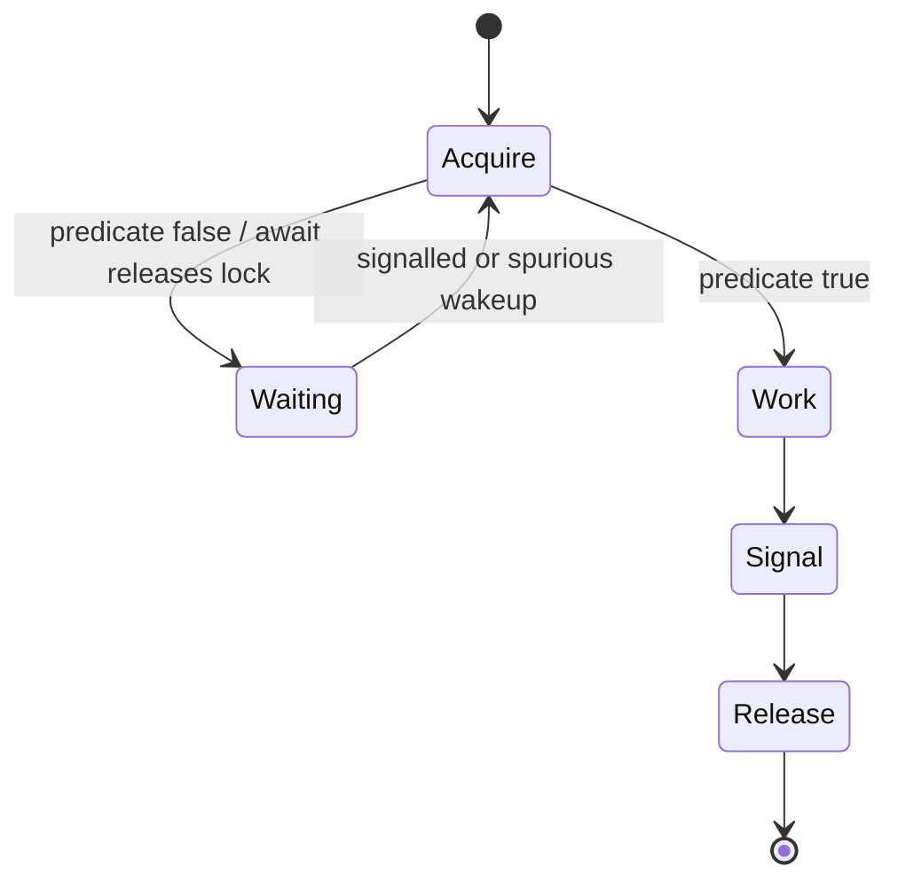
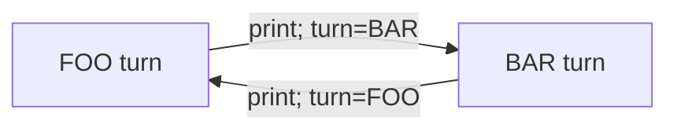

# 18. Координація потоків

[← Індекс](README.md) · Код: [`src/topic18_concurrency_coordination`](../../src/topic18_concurrency_coordination)

## Координація — це predicate, lock і signal

Потік має чекати не «сигналу взагалі», а умови над спільним станом. Правильний протокол:

```java
lock.lock();
try {
    while (!conditionIsTrue()) condition.await();
    changeState();
    otherCondition.signalAll();
} finally {
    lock.unlock();
}
```

`while`, не `if`: можливі spurious wakeups, умову може забрати інший потік, а сигнал не резервує право виконання.



## Low-level і high-level засоби

- `wait/notifyAll`: викликаються лише під intrinsic monitor; `wait` атомарно відпускає monitor.
- `ReentrantLock/Condition`: кілька wait sets, interruptible/timed acquisition, explicit unlock у `finally`.
- `CountDownLatch`: одноразові ворота `N→0`.
- `CyclicBarrier`: повторна зустріч фіксованої групи.
- `Semaphore`: permits обмежують одночасний доступ, але не є ownership lock.
- `BlockingQueue`: готовий producer-consumer protocol із backpressure.

## Alternation як state machine

FooBar, ZeroEvenOdd, FizzBuzz мають явний `turn`/`nextNumber`. Кожен worker чекає свого predicate, виконує рівно одну дію, змінює state, сигналізує. Логіку «хто наступний» тримайте в одному місці.



## Bounded blocking queue

Стан: deque і capacity. Producer чекає `notFull`, додає, сигналить `notEmpty`. Consumer чекає `notEmpty`, забирає, сигналить `notFull`. Усі перевірки та зміни size виконуються під одним lock. Це backpressure: швидкий producer не може безмежно накопичувати пам’ять.

## H2O як grouping barrier

На одну молекулу дозволено 2 hydrogen і 1 oxygen; наступна група не повинна змішатися до завершення поточної. Semaphore контролює квоти, barrier відділяє покоління. Самі permits без бар’єра можуть забезпечити пропорцію глобально, але не коректні трійки в output.

## Dining Philosophers

Deadlock потребує mutual exclusion, hold-and-wait, no preemption, circular wait. Зламайте хоча б одну умову: semaphore `N-1`, глобальний порядок fork locks або асиметричне захоплення. `tryLock` з timeout може дати відновлення, але треба уникнути livelock/starvation.

## Карта задач

| Задача | Засіб/модель |
|---|---|
| SimpleSignal | condition predicate |
| OneTimeLatch | CountDownLatch |
| SemaphorePermit | обмеження concurrency |
| FooBar, ZeroEvenOdd, FizzBuzz | state machine + conditions |
| BoundedBlockingQueue | notEmpty/notFull + backpressure |
| DiningPhilosophers | deadlock prevention |
| BuildingH2O | permits + generation barrier |

## Пастки

- Signal поза lock або зміна стану після signal.
- Один `Condition` і `signal()` будять worker, predicate якого false; `signalAll` безпечніший, окремі conditions ефективніші.
- Не повертати permit у `finally`.
- Тримати lock під час callback/повільного I/O без необхідності.
- Тести залежать від `sleep`, а не від детермінованих latch/barrier.

