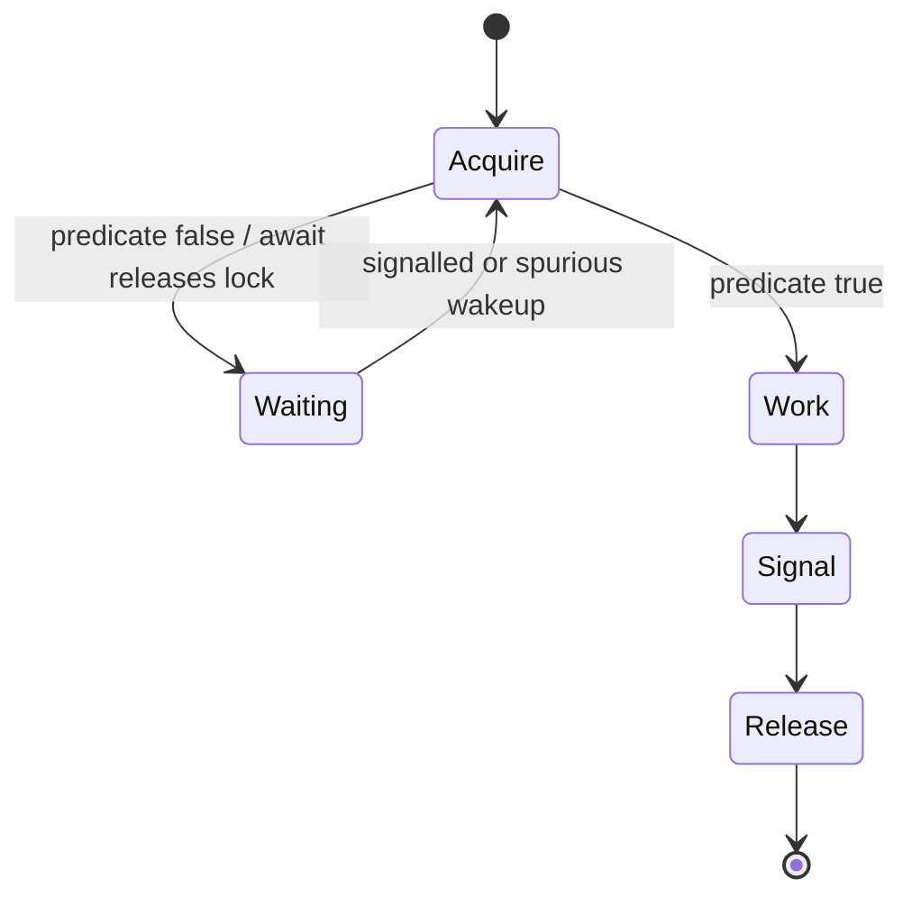
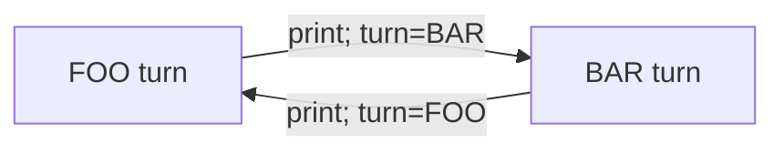

# 18. Координація потоків

[← Індекс](README.md) · Код: [`src/topic18_concurrency_coordination`](../../src/topic18_concurrency_coordination)

## 1. Mutual exclusion не дорівнює coordination

Lock відповідає «хто зараз може змінювати state». Coordination відповідає «коли конкретний thread має право продовжити».

Наприклад, consumer не просто хоче lock на queue — він може працювати лише коли queue не порожня. Producer може працювати лише коли queue не повна. Це **predicates над shared state**.

Поганий підхід — busy waiting:

```java
while (!ready) { } // витрачає CPU, visibility теж не гарантована
```

Координаційні primitives паркують thread і будять, коли state може змінитися.

## 2. `wait`, `notify`, `notifyAll`

Вони належать `Object` і використовуються тільки всередині synchronized на тому самому object:

```java
synchronized (lock) {
    while (!ready) {
        lock.wait(); // атомарно releases monitor і засинає
    }
    consumeState();
}
```

Інший thread:

```java
synchronized (lock) {
    updateState();
    lock.notifyAll();
}
```

`wait()` release-ить monitor, щоб producer міг змінити state. Після wake thread мусить знову acquire monitor і повторно перевірити predicate.

### Чому `while`, а не `if`

- spurious wakeup можливий без signal;
- notify не передає lock негайно; інший thread може змінити state раніше;
- notifyAll будить threads із різними predicates;
- умова могла бути true на signal, але false на реальному acquire.

Signal означає «state змінився, перевір ще раз», а не «тобі гарантовано можна працювати».

### notify чи notifyAll

`notify` будить довільного waiter. Якщо waiters мають різні conditions, може прокинутися не той і система застрягне. `notifyAll` безпечніший, хоча створює зайві wakeups. `Condition` дозволяє окремі wait sets і точніший signaling.

## 3. ReentrantLock і Condition

```java
private final ReentrantLock lock = new ReentrantLock();
private final Condition notEmpty = lock.newCondition();
private final Condition notFull = lock.newCondition();
```

`await` відповідає wait, `signal/signalAll` — notify. Переваги:

- кілька conditions на lock;
- `tryLock`, timeout, interruptible acquire;
- optional fairness;
- diagnostics.

Завжди unlock у finally. Не викликайте await/signal без володіння lock.

## 4. CountDownLatch

Latch має count N. Workers викликають `countDown`, waiter — `await`. Після нуля ворота відкриті назавжди; latch не reset-иться.

Use cases:

- чекати завершення N initialization tasks;
- одночасно стартувати workers через start latch;
- зробити deterministic concurrency test.

```java
CountDownLatch done = new CountDownLatch(n);
try {
    doWork();
} finally {
    done.countDown();
}
```

CountDown у finally важливий: failure worker не повинен назавжди заблокувати waiter.

## 5. Semaphore

Semaphore тримає permits. `acquire` забирає permit або чекає, `release` повертає.

```java
semaphore.acquire();
try {
    useLimitedResource();
} finally {
    semaphore.release();
}
```

Він контролює **кількість** concurrent users: 10 database connections, 3 API calls тощо. На відміну від lock, permit не має ownership і теоретично може бути released іншим thread; код має дотримувати protocol.

Binary semaphore схожий на lock, але не reentrant і має інші semantics.

## 6. CyclicBarrier і Phaser

CyclicBarrier чекає фіксовану кількість parties у точці rendezvous. Коли всі викликали await, generation відкривається й barrier можна використати знову.

На відміну від CountDownLatch:

- самі workers є parties;
- reusable;
- barrier action може виконатися після збору групи.

Якщо один waiter interrupted/timed out, barrier може стати broken, і решта отримають exception. Це треба обробити.

Phaser гнучкіший: parties можуть register/deregister, є багато phases.

## 7. FooBar alternation

Shared state `fooTurn`.

Foo thread:

1. lock;
2. while !fooTurn await fooCondition;
3. print foo;
4. fooTurn=false;
5. signal bar;
6. unlock.

Bar — симетрично. Loop повторює n разів.

Не тримайте lock довше, ніж потрібно. У навчальній задачі callback print зазвичай виконується під lock для строгого order, але якщо callback довільно повільний/зовнішній, у production треба продумати ownership і можливість reentrancy/deadlock.

## 8. ZeroEvenOdd як state machine

Три threads мають різні predicates:

- zero друкує 0 перед кожним числом;
- odd друкує непарне current;
- even — парне.

State можна описати `turn = ZERO/ODD/EVEN` і `nextNumber`. Після ZERO turn визначається parity nextNumber. Після number `nextNumber++`, turn знову ZERO.

Окремі Conditions зменшують зайві wakeups. Простота exact state machine важливіша за спробу координувати через випадкові sleeps.

## 9. FizzBuzz Multithreaded

Є чотири predicates для current n:

```text
divisible by 15 → fizzbuzz
divisible by 3  → fizz
divisible by 5  → buzz
otherwise       → number
```

Кожен worker чекає свого predicate. Після друку increment current і signalAll. Перевірка termination `current>n` має бути і в wait loop, і після wake, щоб threads могли завершитися, навіть коли їхня категорія більше не настане.

## 10. Bounded Blocking Queue повністю

State: deque і capacity.

### enqueue

```text
lock
while size==capacity: await notFull
addLast
signal notEmpty
unlock
```

### dequeue

```text
lock
while size==0: await notEmpty
removeFirst
signal notFull
unlock
```

Size read теж має бути під lock або мати чітку weaker semantics. `ArrayBlockingQueue` вже реалізує цей protocol і в real code краща за власну реалізацію; задача потрібна для розуміння.

## 11. Building H2O

Потрібно групувати рівно 2 H і 1 O. Semaphores можуть обмежити кількість H/O, але самі по собі не гарантують, що наступна molecule не почнеться до завершення callbacks поточної.

Один дизайн:

- H semaphore 2 permits;
- O semaphore 1 permit;
- CyclicBarrier на 3 parties;
- після того, як трійка пройшла barrier, permits generation повертаються узгоджено.

Інший дизайн може використовувати lock/counts/conditions. Треба довести дві властивості: safety (ніколи неправильна група) і liveness (правильна кількість threads зрештою проходить).

## 12. Dining Philosophers і deadlock

Якщо кожен philosopher бере left fork і чекає right, утворюється cycle wait.

Чотири Coffman conditions deadlock:

1. mutual exclusion;
2. hold and wait;
3. no preemption;
4. circular wait.

Стратегії:

- глобальний порядок forks: завжди брати менший id, потім більший → немає circular wait;
- semaphore `N-1`: хоча б один philosopher може отримати обидві;
- один philosopher бере у зворотному порядку;
- tryLock з release/retry — обережно з livelock.

Deadlock freedom не гарантує starvation freedom. Fair locks/queueing можуть покращити fairness ціною throughput.

## 13. Як вибрати primitive

| Потреба | Засіб |
|---|---|
| чекати зміни predicate | Condition / wait-notify |
| чекати N завершень один раз | CountDownLatch |
| обмежити concurrent access числом | Semaphore |
| усім зустрітися на phase | CyclicBarrier/Phaser |
| producer-consumer | BlockingQueue |
| mutual exclusion без waiting predicate | synchronized/Lock |

Найкращий production код часто використовує готову high-level structure, але задачі теми вчать protocol, який вона реалізує.

## Координація — це predicate, lock і signal

Потік має чекати не «сигналу взагалі», а умови над спільним станом. Правильний протокол:

```java
lock.lock();
try {
    while (!conditionIsTrue()) condition.await();
    changeState();
    otherCondition.signalAll();
} finally {
    lock.unlock();
}
```

`while`, не `if`: можливі spurious wakeups, умову може забрати інший потік, а сигнал не резервує право виконання.



## Low-level і high-level засоби

- `wait/notifyAll`: викликаються лише під intrinsic monitor; `wait` атомарно відпускає monitor.
- `ReentrantLock/Condition`: кілька wait sets, interruptible/timed acquisition, explicit unlock у `finally`.
- `CountDownLatch`: одноразові ворота `N→0`.
- `CyclicBarrier`: повторна зустріч фіксованої групи.
- `Semaphore`: permits обмежують одночасний доступ, але не є ownership lock.
- `BlockingQueue`: готовий producer-consumer protocol із backpressure.

## Alternation як state machine

FooBar, ZeroEvenOdd, FizzBuzz мають явний `turn`/`nextNumber`. Кожен worker чекає свого predicate, виконує рівно одну дію, змінює state, сигналізує. Логіку «хто наступний» тримайте в одному місці.



## Bounded blocking queue

Стан: deque і capacity. Producer чекає `notFull`, додає, сигналить `notEmpty`. Consumer чекає `notEmpty`, забирає, сигналить `notFull`. Усі перевірки та зміни size виконуються під одним lock. Це backpressure: швидкий producer не може безмежно накопичувати пам’ять.

## H2O як grouping barrier

На одну молекулу дозволено 2 hydrogen і 1 oxygen; наступна група не повинна змішатися до завершення поточної. Semaphore контролює квоти, barrier відділяє покоління. Самі permits без бар’єра можуть забезпечити пропорцію глобально, але не коректні трійки в output.

## Dining Philosophers

Deadlock потребує mutual exclusion, hold-and-wait, no preemption, circular wait. Зламайте хоча б одну умову: semaphore `N-1`, глобальний порядок fork locks або асиметричне захоплення. `tryLock` з timeout може дати відновлення, але треба уникнути livelock/starvation.

## Карта задач

| Задача | Засіб/модель |
|---|---|
| SimpleSignal | condition predicate |
| OneTimeLatch | CountDownLatch |
| SemaphorePermit | обмеження concurrency |
| FooBar, ZeroEvenOdd, FizzBuzz | state machine + conditions |
| BoundedBlockingQueue | notEmpty/notFull + backpressure |
| DiningPhilosophers | deadlock prevention |
| BuildingH2O | permits + generation barrier |

## Пастки

- Signal поза lock або зміна стану після signal.
- Один `Condition` і `signal()` будять worker, predicate якого false; `signalAll` безпечніший, окремі conditions ефективніші.
- Не повертати permit у `finally`.
- Тримати lock під час callback/повільного I/O без необхідності.
- Тести залежать від `sleep`, а не від детермінованих latch/barrier.
