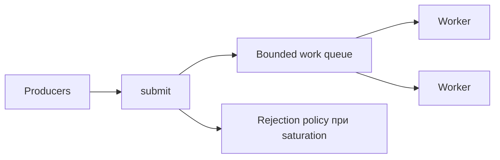
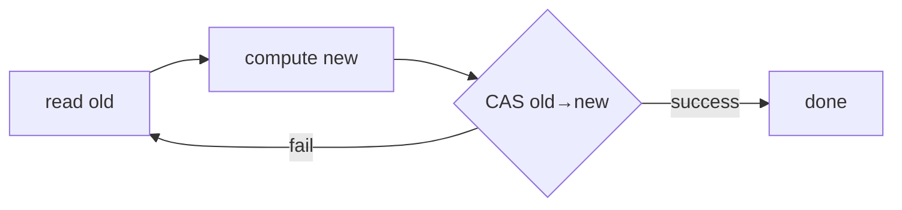

# 19. Concurrent collections, executors і CAS

[← Індекс](README.md) · Код: [`src/topic19_concurrent_collections_executors`](../../src/topic19_concurrent_collections_executors)

## 1. Чому `new Thread` не масштабується як архітектура

Якщо business method сам створює thread, він одночасно визначає роботу, scheduling, resource limits і lifecycle. Executor розділяє відповідальності:

```text
Runnable/Callable = що зробити
Executor          = де й коли виконати
Future            = handle результату/завершення
```

Це дозволяє централізовано контролювати кількість platform threads, queue, shutdown, naming, metrics і rejection.

## 2. execute, submit і Future

`execute(Runnable)` не повертає result. Uncaught exception іде до worker/handler.

`submit(Runnable/Callable)` повертає Future. Exception з task зберігається й буде загорнутий в `ExecutionException` при `get()`. Якщо Future ніколи не прочитати, failure легко не помітити.

```java
Future<Integer> f = executor.submit(() -> compute());
try {
    int value = f.get();
} catch (ExecutionException e) {
    Throwable cause = e.getCause();
}
```

`get()` блокує; overload із timeout захищає caller від безмежного очікування. `cancel(true)` просить interrupt running task, але task має реагувати на interruption.

## 3. ThreadPoolExecutor: порядок прийняття task

Спрощено:

1. якщо workers < corePoolSize → створити worker;
2. інакше спробувати покласти у workQueue;
3. якщо queue full і workers < maximumPoolSize → створити додатковий worker;
4. інакше reject.

Це означає: з unbounded queue pool зазвичай ніколи не росте понад core size, і maximumPoolSize майже не впливає.

### Queue trade-offs

- unbounded queue: згладжує bursts, але latency і memory можуть рости без контролю;
- bounded queue: явний overload/backpressure, треба вибрати capacity/rejection;
- SynchronousQueue: немає storage, task передається вільному/new worker безпосередньо.

### Rejection policies

- AbortPolicy кидає exception;
- CallerRuns виконує task у submitting thread і природно сповільнює producer;
- Discard/DiscardOldest втрачають роботу й допустимі лише за явного product contract.

## 4. Розмір platform thread pool

CPU-bound tasks: близько кількості cores, бо більше одночасної CPU роботи не стане. I/O-bound tasks багато чекають, тому pool може бути більшим; оцінка залежить від wait/compute ratio та зовнішніх limits.

Одна global formula не замінює measurement. Важливі queue wait time, active count, utilization, task latency, rejection. Virtual threads змінюють модель для blocking I/O, але database/API capacity все одно потребує semaphore/pool limits.

## 5. Lifecycle

ExecutorService володіє threads і має бути закритий owner-компонентом.

```java
executor.shutdown(); // нові tasks відхиляються, старі завершуються
if (!executor.awaitTermination(timeout, unit)) {
    List<Runnable> neverStarted = executor.shutdownNow();
    // running tasks отримують interrupt request
}
```

Не створюйте pool на кожен request. Не залишайте non-daemon workers після завершення application/test. Визначте, що робити з tasks, які не стартували.

## 6. ConcurrentHashMap і compound operations

Окремі `get` та `put` thread-safe, але їх комбінація не обов’язково атомарна:

```java
if (!map.containsKey(k)) map.put(k, create()); // race
```

Використовуйте `putIfAbsent`, `computeIfAbsent`, `compute`, `merge`.

Але mapping function у `computeIfAbsent` має бути короткою, не рекурсивно оновлювати той самий map/key і не робити uncontrolled blocking. Вона може мати строгі concurrency semantics; side effects треба продумати.

Для cache stampede atomic compute гарантує per-key координацію в межах map operation, але failure/expiry/slow loading потребують окремого дизайну.

## 7. Concurrent collections за workload

### CopyOnWriteArrayList

Кожен write копіює backing array. Iterator читає stable snapshot без lock і не бачить наступні writes.

Добре: listener list, configuration snapshots, дуже багато reads і дуже мало writes, невеликий size.

Погано: часті writes або великі lists — `O(n)` copy і garbage на кожну зміну.

### BlockingQueue

Producer-consumer handoff, bounded capacity, blocking/timed methods. Часто queue є кращою абстракцією, ніж вручну shared list + conditions.

### ConcurrentLinkedQueue

Non-blocking unbounded queue. Немає backpressure і blocking wait, тому lifecycle/notification треба вирішувати окремо.

### synchronized wrappers

`Collections.synchronizedList` захищає окремі methods, але iteration compound:

```java
synchronized (list) {
    for (var x : list) ...
}
```

## 8. ReadWriteLock

Кілька readers можуть тримати read lock одночасно, writer — exclusive.

Корисно, якщо:

- reads значно частіші;
- read section не мікроскопічний;
- state має compound invariant;
- contention реально виміряний.

Для простого map ConcurrentHashMap часто кращий. Read→write upgrade може deadlock: відпустіть read, acquire write і повторно перевірте condition. Downgrade write→read можливий у визначеному порядку.

`StampedLock` має optimistic reads, але не reentrant і значно складніший; потрібна validate та fallback. Не використовуйте його без потреби.

## 9. CAS від апаратної операції до Java

Compare-and-set:

```text
якщо current == expected:
    current = update
    success
інакше:
    нічого не змінити
    fail
```

Atomic update функція зазвичай loop:

```java
while (true) {
    State old = ref.get();
    State next = transform(old);
    if (ref.compareAndSet(old, next)) return;
}
```

Transform може виконатися кілька разів через CAS failures, тому не повинен мати side effects.

Lock-free означає, що система загалом робить progress; окремий thread може постійно програвати CAS і starve. Wait-free — сильніша гарантія bounded steps для кожного operation.

## 10. Lock-free stack

Push:

1. прочитати oldHead;
2. `newNode.next=oldHead`;
3. CAS head old→new;
4. при failure повторити з новим head.

Pop:

1. old=head; якщо null — empty;
2. next=old.next;
3. CAS head old→next;
4. при success повернути old.value.

Safe publication node fields відбувається через atomic reference semantics, але fields краще final/не змінювати після publication.

### ABA

Head був A, змінився A→B→A. Thread, який давно прочитав A, CAS-ить успішно, не помітивши проміжних змін. У garbage-collected simple stack object identity зменшує деякі memory reclamation проблеми, але ABA можливе при повторному використанні nodes/state. Version stamp (`AtomicStampedReference`) відрізняє A(version1) від A(version3).

## 11. Custom Thread Pool як система

Мінімальні частини:

- bounded BlockingQueue<Runnable>;
- fixed workers, які `take` tasks;
- state RUNNING/SHUTDOWN/STOP/TERMINATED;
- submit policy;
- worker exception isolation;
- interruption/shutdown protocol.

Worker loop не повинен померти назавжди через RuntimeException однієї task. Але InterruptedException може означати shutdown або transient interrupt — рішення залежить від state. Race між submit і shutdown має чітко гарантувати: task або прийнята й буде виконана, або відхилена/повернена caller.

Ця задача складна не через queue, а через lifecycle races.

## 12. ForkJoinPool

Fork/join розбиває CPU work:

```text
sum[0..n]
├─ sum[0..mid]
└─ sum[mid..n]
```

Workers використовують work stealing: thread із порожньою deque краде tasks в іншого. RecursiveTask повертає result, RecursiveAction — ні.

```java
if (size <= threshold) return sequentialSum();
left.fork();
long rightResult = right.compute();
long leftResult = left.join();
return leftResult + rightResult;
```

Threshold балансує parallelism і overhead. Надто маленький створює мільйони tasks; надто великий недовикористовує cores. Blocking I/O в common ForkJoinPool може блокувати limited workers.

## 13. Практична матриця вибору

| Потреба | Інструмент |
|---|---|
| bounded platform CPU workers | fixed ThreadPoolExecutor |
| blocking producer/consumer | BlockingQueue |
| per-key concurrent state | ConcurrentHashMap atomic methods |
| read-mostly immutable snapshots | CopyOnWriteArrayList |
| simple counter | AtomicInteger/LongAdder залежно semantics |
| compound multi-field invariant | lock / immutable state CAS |
| recursive CPU divide-and-conquer | ForkJoinPool |
| massive blocking I/O | virtual-thread-per-task + resource limits |

Спочатку визначте semantics і ownership, потім API. Thread-safe collection не робить автоматично thread-safe цілий workflow.

## Executor відділяє task від thread

Task описує роботу; executor визначає, де, коли й з якою політикою вона виконується. Пул має чотири взаємодіючі частини: workers, work queue, lifecycle, rejection/backpressure.



## Розмір пулу й черги

CPU-bound: близько кількості cores; надлишок додає context switching. Blocking I/O потребує більше concurrency або virtual-thread-per-task. Unbounded queue приховує overload до OOM; bounded queue + явна rejection policy створюють контрольований backpressure. `CallerRunsPolicy` сповільнює submitter, але змінює latency/контекст виконання.

`execute` приймає Runnable; `submit` повертає Future і захоплює exception усередині нього. Завжди визначайте ownership: хто викликає `shutdown`, скільки чекає `awaitTermination`, коли можливий `shutdownNow`.

## Concurrent collections

- `ConcurrentHashMap`: atomic per-key operations `compute`, `merge`, `putIfAbsent`; послідовність `get`→`put` не атомарна.
- `CopyOnWriteArrayList`: дуже дешеві стабільні snapshots для читання, дорогий `O(n)` copy на кожен write.
- `BlockingQueue`: атомарний handoff/backpressure через `put/take` або timed `offer/poll`.
- `Collections.synchronizedList`: compound iteration вимагає зовнішньої синхронізації на wrapper.

Concurrent iterators часто weakly consistent: не кидають `ConcurrentModificationException`, але не гарантують один глобальний snapshot.

## ReadWriteLock

Корисний для read-heavy registry, якщо операції читання достатньо довгі й contention виправдовує складність. Перехід read→write небезпечний; зазвичай release read, acquire write, повторно перевірити predicate. Завжди unlock у `finally`.

## CAS і ABA

CAS атомарно змінює значення лише якщо воно дорівнює expected. Типовий цикл: прочитати old → створити new → `compareAndSet`; при невдачі повторити. Lock-free означає прогрес системи, але не гарантує, що конкретний потік не голодує.



Lock-free stack: head є `AtomicReference<Node>`, push ставить `new.next=old`, CAS head. Pop CAS-ить `old→old.next`. ABA: значення A змінилося A→B→A, CAS не бачить історії; `AtomicStampedReference` додає версію.

## ForkJoinPool

Підходить для recursive divide-and-conquer CPU tasks. Розбивайте до threshold, одну гілку fork, іншу compute, потім join. Надто дрібні задачі програють overhead; blocking I/O може виснажити workers.

## Карта задач

| Задача | Центральна ідея |
|---|---|
| SimpleSubmit | submit/Future/lifecycle |
| SafeListWrite | правильна concurrent collection |
| AtomicIncrement | atomic RMW |
| ThreadPoolWebRegistry | пул + thread-safe aggregation |
| ConcurrentCache | `computeIfAbsent` і caveats |
| ReadWriteSafeRegistry | read/write locking |
| ParallelArraySumPool | ForkJoin decomposition |
| CustomThreadPool | bounded queue, workers, shutdown, rejection |
| LockFreeStack | CAS loop, safe publication, ABA awareness |

## Пастки

- Забути прочитати `Future.get()` і не помітити task exception.
- Створити pool усередині кожного виклику.
- `containsKey` + `put` замість atomic map operation.
- Паралелізувати занадто малу CPU-задачу.
- Завершити worker на першому task exception.
- Не визначити поведінку submit після shutdown.
