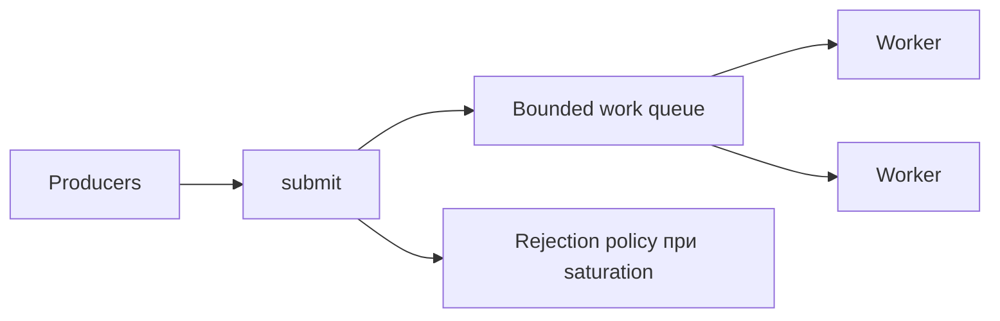
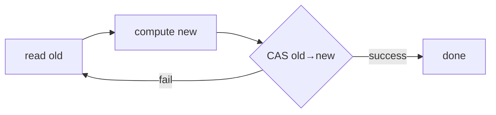

# 19. Concurrent collections, executors і CAS

[← Індекс](README.md) · Код: [`src/topic19_concurrent_collections_executors`](../../src/topic19_concurrent_collections_executors)

## Executor відділяє task від thread

Task описує роботу; executor визначає, де, коли й з якою політикою вона виконується. Пул має чотири взаємодіючі частини: workers, work queue, lifecycle, rejection/backpressure.

## Розмір пулу й черги

CPU-bound: близько кількості cores; надлишок додає context switching. Blocking I/O потребує більше concurrency або virtual-thread-per-task. Unbounded queue приховує overload до OOM; bounded queue + явна rejection policy створюють контрольований backpressure. `CallerRunsPolicy` сповільнює submitter, але змінює latency/контекст виконання.

`execute` приймає Runnable; `submit` повертає Future і захоплює exception усередині нього. Завжди визначайте ownership: хто викликає `shutdown`, скільки чекає `awaitTermination`, коли можливий `shutdownNow`.

## Concurrent collections

- `ConcurrentHashMap`: atomic per-key operations `compute`, `merge`, `putIfAbsent`; послідовність `get`→`put` не атомарна.
- `CopyOnWriteArrayList`: дуже дешеві стабільні snapshots для читання, дорогий `O(n)` copy на кожен write.
- `BlockingQueue`: атомарний handoff/backpressure через `put/take` або timed `offer/poll`.
- `Collections.synchronizedList`: compound iteration вимагає зовнішньої синхронізації на wrapper.

Concurrent iterators часто weakly consistent: не кидають `ConcurrentModificationException`, але не гарантують один глобальний snapshot.

## ReadWriteLock

Корисний для read-heavy registry, якщо операції читання достатньо довгі й contention виправдовує складність. Перехід read→write небезпечний; зазвичай release read, acquire write, повторно перевірити predicate. Завжди unlock у `finally`.

## CAS і ABA

CAS атомарно змінює значення лише якщо воно дорівнює expected. Типовий цикл: прочитати old → створити new → `compareAndSet`; при невдачі повторити. Lock-free означає прогрес системи, але не гарантує, що конкретний потік не голодує.

Lock-free stack: head є `AtomicReference<Node>`, push ставить `new.next=old`, CAS head. Pop CAS-ить `old→old.next`. ABA: значення A змінилося A→B→A, CAS не бачить історії; `AtomicStampedReference` додає версію.

## ForkJoinPool

Підходить для recursive divide-and-conquer CPU tasks. Розбивайте до threshold, одну гілку fork, іншу compute, потім join. Надто дрібні задачі програють overhead; blocking I/O може виснажити workers.

## Карта задач

| Задача | Центральна ідея |
|---|---|
| SimpleSubmit | submit/Future/lifecycle |
| SafeListWrite | правильна concurrent collection |
| AtomicIncrement | atomic RMW |
| ThreadPoolWebRegistry | пул + thread-safe aggregation |
| ConcurrentCache | `computeIfAbsent` і caveats |
| ReadWriteSafeRegistry | read/write locking |
| ParallelArraySumPool | ForkJoin decomposition |
| CustomThreadPool | bounded queue, workers, shutdown, rejection |
| LockFreeStack | CAS loop, safe publication, ABA awareness |

## Пастки

- Забути прочитати `Future.get()` і не помітити task exception.
- Створити pool усередині кожного виклику.
- `containsKey` + `put` замість atomic map operation.
- Паралелізувати занадто малу CPU-задачу.
- Завершити worker на першому task exception.
- Не визначити поведінку submit після shutdown.

