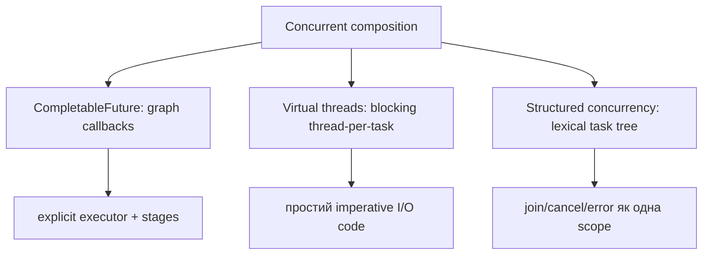
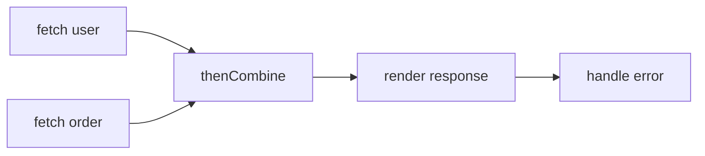
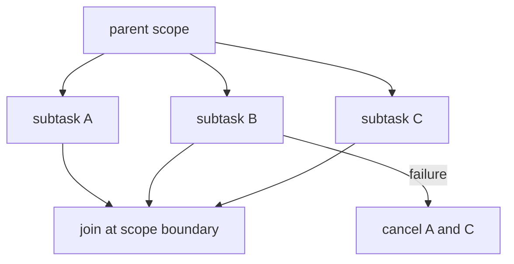

# 20. Сучасна конкурентність Java

[← Індекс](README.md) · Код: [`src/topic20_modern_java_concurrency`](../../src/topic20_modern_java_concurrency)

> Проєкт використовує JDK 21. Virtual Threads у JDK 21 — фінальна можливість; `StructuredTaskScope` і `ScopedValue` у цій версії — preview API та потребують `--enable-preview`. Поточний `build.gradle` preview не вмикає, тому канонічні вправи можуть моделювати ці семантики через стабільні API або вимагати окремої зміни build-конфігурації.

## Три різні моделі



Не змішуйте терміни: asynchronous API не гарантує non-blocking implementation; virtual thread не робить CPU роботу швидшою; structured concurrency — насамперед керування lifetime, cancellation та errors.

## CompletableFuture

### Composition

- `thenApply`: `T→U`, синхронне продовження у потоці завершення попередньої stage.
- `thenApplyAsync`: continuation через executor.
- `thenCompose`: `T→CompletionStage<U>` і flatten, аналог `flatMap`.
- `thenCombine`: незалежні futures, об’єднати обидва результати.
- `allOf`: бар’єр завершення; результати треба зібрати з оригінальних futures.



Завжди вказуйте executor для blocking I/O замість неявного common pool. `join` обгортає failure у unchecked `CompletionException`; `get` — checked exceptions. `exceptionally` відновлює значення, `whenComplete` спостерігає, `handle` перетворює success/failure. Timeout не обов’язково зупиняє underlying task — cancellation має бути спроєктоване окремо.

## Virtual threads у JDK 21

```java
try (var executor = Executors.newVirtualThreadPerTaskExecutor()) {
    Future<String> f = executor.submit(this::blockingIoCall);
    return f.get();
}
```

Створюйте virtual thread **на task**, не pool virtual threads. Вони дають throughput для великої кількості blocking I/O, бо під час підтримуваного blocking JVM може unmount virtual thread з carrier. Для CPU-bound throughput усе одно обмежений cores; обмежуйте зовнішні ресурси semaphore/connection pool, а не кількість virtual threads як заміну capacity control.

### Pinning у контексті JDK 21

У JDK 21 blocking усередині `synchronized` або native/foreign frame може утримувати carrier. Не тримайте monitor навколо довгого I/O; звузьте critical section або, коли справді потрібен lock через blocking region, використайте `ReentrantLock`, parking якого дружній до virtual threads. Це не означає механічно замінити кожен короткий `synchronized`.

## Structured concurrency

Принцип: якщо parent породив subtasks, вони завершуються в lexical scope parent. Типовий цикл: open scope → fork → join → centrally propagate errors/compose results → close. Shutdown-on-failure скасовує siblings при failure; shutdown-on-success реалізує «перший успішний». Subtasks повинні реагувати на interruption.



## Scoped values

Scoped value — immutable binding контексту на час виконання lexical operation. На відміну від mutable `ThreadLocal`, callee не може довільно перепризначити binding; lifetime обмежений scope, а structured child tasks можуть успадковувати контекст. Це підходить для request/user/trace context, але не замінює звичайні параметри там, де залежність краще зробити явною.

## Web crawler

Потрібні: нормалізація URL, thread-safe visited check (`add` має бути атомарним), обмеження domain/depth, fan-out, aggregation, error policy, executor ownership і termination. Не викликайте blocking `join` усередині того самого малого bounded pool для рекурсивних children — можливе thread starvation deadlock. Virtual-thread-per-task або неблокувальна composition спрощують модель, але visited і resource limits залишаються.

## Карта задач

| Задача | Фокус |
|---|---|
| SimpleCompletableFuture | створення й transformation stage |
| SpawnVirtualThread | lifecycle одного virtual thread |
| VirtualThreadExecutorSimple | thread-per-task executor |
| AsyncFetchData | combine, executor, errors |
| VirtualThreadsIO | масштабування blocking I/O |
| ThreadPinningFix | не блокувати carrier під monitor |
| StructuredScatterGather | all-or-fail / first-success semantics |
| ScopedValuesContext | lexical immutable context |
| WebCrawlerCompletableFuture | recursive fan-out, dedup, termination |

## Пастки

- Використовувати common pool для blocking calls.
- Писати `thenApply(x -> future)` замість `thenCompose` і отримати nested future.
- Вважати timeout рівнозначним cancellation underlying operation.
- Пулити virtual threads або використовувати їх для прискорення чистого CPU.
- Вийти з owner method, залишивши «сирітські» subtasks.
- Зберігати mutable security context у ThreadLocal і забувати `remove()` у pooled thread.

## Офіційні матеріали для версії проєкту

- [JEP 444: Virtual Threads (JDK 21)](https://openjdk.org/jeps/444)
- [JEP 453: Structured Concurrency — Preview у JDK 21](https://openjdk.org/jeps/453)
- [JEP 446: Scoped Values — Preview у JDK 21](https://openjdk.org/jeps/446)

