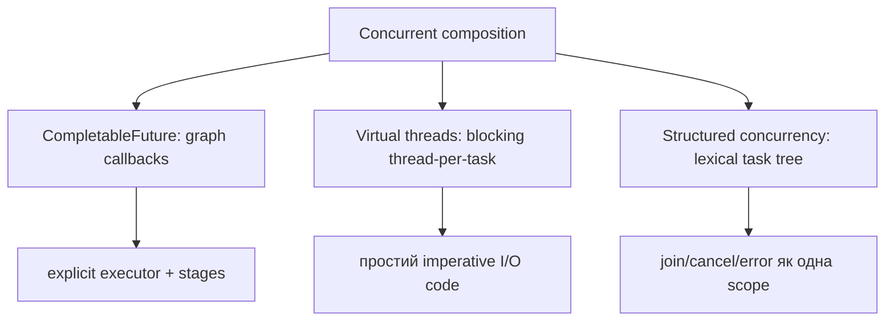
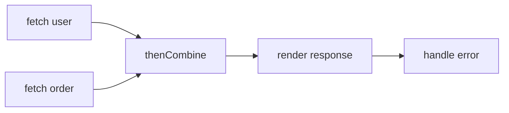
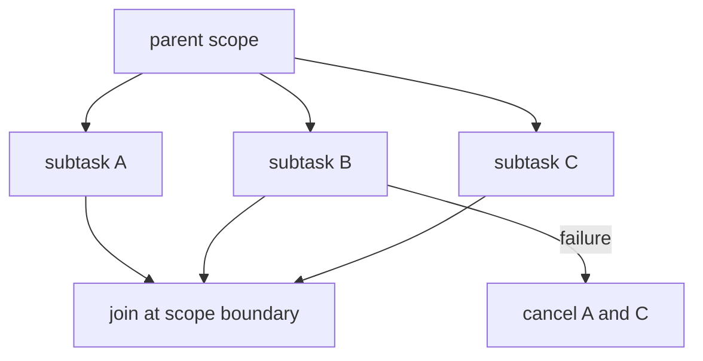

# 20. Сучасна конкурентність Java

[← Індекс](README.md) · Код: [`src/topic20_modern_java_concurrency`](../../src/topic20_modern_java_concurrency)

> Проєкт використовує JDK 21. Virtual Threads у JDK 21 — фінальна можливість; `StructuredTaskScope` і `ScopedValue` у цій версії — preview API та потребують `--enable-preview`. Поточний `build.gradle` preview не вмикає, тому канонічні вправи можуть моделювати ці семантики через стабільні API або вимагати окремої зміни build-конфігурації.

## 1. Спочатку розділіть три запитання

Modern Java пропонує кілька API, але вони вирішують різні проблеми:

1. **Як представити task?** Runnable/Callable/stage.
2. **На чому виконати?** platform pool, virtual thread, explicit executor.
3. **Як пов’язати lifetime, results, errors і cancellation?** Future graph або structured scope.

`CompletableFuture` зручний для callback/dataflow composition. Virtual threads дозволяють писати звичайний blocking code із великою concurrency. Structured concurrency робить parent-child lifetime явним. Один інструмент не автоматично замінює інші.

## 2. Future проти CompletableFuture

Звичайний Future — handle одного task:

```text
submit → Future → blocking get / cancel / done?
```

Він не має зручного способу сказати «коли завершиться A, перетвори результат, паралельно дочекайся B, а помилку оброби тут» без ручного blocking.

CompletableFuture є і result promise, і stage graph. Stage може завершитися success value або exceptional completion.

## 3. Створення stage і executor

```java
CompletableFuture<String> f =
    CompletableFuture.supplyAsync(() -> fetch(), ioExecutor);
```

Без explicit executor async methods зазвичай використовують ForkJoin common pool. Це небезпечно для довгого blocking I/O: limited common workers можуть усі заблокуватися й вплинути на parallel streams/інші unrelated tasks.

`completedFuture(value)` корисний для вже готового result. `runAsync` для void task, `supplyAsync` для value.

Синхронний suffix (`thenApply`) не означає, що все виконується caller thread: continuation зазвичай виконає thread, який завершив попередню stage, або caller, якщо вона вже завершена. Async suffix планує continuation через executor.

## 4. `thenApply` і `thenCompose`

`thenApply` використовують, коли function повертає звичайний value:

```java
future.thenApply(String::length); // CF<String> → CF<Integer>
```

Якщо function сама запускає async operation:

```java
future.thenApply(id -> fetchUserAsync(id))
// CompletableFuture<CompletableFuture<User>> — вкладеність
```

`thenCompose` flatten-ить:

```java
future.thenCompose(id -> fetchUserAsync(id))
// CompletableFuture<User>
```

Мнемоніка: apply = map, compose = flatMap/dependent async step.

## 5. Незалежні tasks: thenCombine

Якщо user і order не залежать один від одного, запускати їх послідовно збільшує latency:

```text
sequential: user 300ms + order 400ms ≈ 700ms
parallel:   max(300,400) + combine ≈ 400ms
```

```java
var user = supplyAsync(this::fetchUser, executor);
var order = supplyAsync(this::fetchOrder, executor);
return user.thenCombine(order, Response::new);
```

Parallelism корисний, якщо tasks справді незалежні й external resource дозволяє одночасність.

## 6. allOf і збір результатів

`CompletableFuture.allOf(futures...)` повертає `CompletableFuture<Void>` — це barrier, а не list results. Після успішного allOf оригінальні futures завершені, і їх можна join-ити без очікування.

```java
CompletableFuture<Void> all = CompletableFuture.allOf(array);
return all.thenApply(v -> futures.stream()
    .map(CompletableFuture::join)
    .toList());
```

Якщо одна future exceptional, allOf теж exceptional, але це не означає автоматичного interruption/cancellation siblings. Політику fail-fast треба реалізувати або використати structured concurrency.

`anyOf` повертає перший завершений result як Object і теж не завжди має бажану semantics «перший успішний» — першим може бути failure.

## 7. Error handling

Stage graph має дві доріжки: success і failure.

- `exceptionally(ex -> fallback)` перетворює failure у value;
- `handle((value,ex) -> ...)` завжди виконується й повертає новий value;
- `whenComplete((value,ex) -> ...)` спостерігає/log-ує, не задуманий для зміни outcome;
- `exceptionallyCompose` запускає async fallback.

Не ставте fallback занадто рано, інакше важлива failure перетвориться на «успішний null/default» і caller не дізнається.

`join()` кидає unchecked CompletionException, `get()` — checked InterruptedException/ExecutionException. При unpacking зберігайте root cause і interruption semantics.

## 8. Timeout і cancellation

`orTimeout` завершує future exceptional після часу; `completeOnTimeout` дає fallback value. Але exceptional completion wrapper не гарантує, що underlying blocking call перестав використовувати socket/thread/resource.

Потрібні timeout на рівні HTTP/JDBC API, interruption-aware task та явна cancellation policy. `cancel(true)` для CompletableFuture не має універсальної сили примусово зупинити arbitrary computation.

Deadline краще за каскад незалежних timeout: усі subtasks отримують один абсолютний budget, інакше послідовні етапи можуть кожен витратити повний timeout.

## 9. Virtual thread: що саме стало дешевим

Virtual thread — Java Thread, scheduled JVM на carrier platform threads. Він має звичайний blocking programming model, ThreadLocal/interruption APIs та stack trace, але не займає OS thread протягом усього lifetime.

Коли підтримувана blocking I/O operation чекає, JVM може unmount virtual thread; carrier виконує іншу. Після готовності virtual thread знову schedule-иться.

```text
Virtual A: compute ─ block I/O ........ resume
Carrier 1: A compute → Virtual B → Virtual C → A resume
```

Тому тисячі I/O-bound request tasks можуть мати окремий virtual thread без тисяч OS threads.

## 10. Як створювати

```java
Thread t = Thread.startVirtualThread(() -> work());
t.join();
```

Або executor per task:

```java
try (var executor = Executors.newVirtualThreadPerTaskExecutor()) {
    Future<Result> f = executor.submit(this::blockingOperation);
    return f.get();
}
```

Не робіть fixed pool virtual threads. Їхня перевага саме в дешевому thread-per-task. Якщо треба обмежити одночасні database operations до 20, обмежуйте resource semaphore/connection pool, а не повторно використовуйте 20 virtual threads як workers.

## 11. Де virtual threads не допоможуть

- CPU-bound computation уже обмежене cores;
- synchronized shared bottleneck серіалізує tasks;
- external service/DB має власний capacity limit;
- memory/state кожної task все одно може бути великим;
- native/blocking operation може не бути loom-friendly;
- надмірний ThreadLocal state множиться на дуже багато threads.

Virtual threads покращують scalability/throughput waiting workloads, не скорочують latency одного повільного network call.

## 12. Pinning у JDK 21

Virtual thread pinned, коли не може unmount від carrier під час blocking. Для контексту JDK 21 важливий випадок — blocking усередині `synchronized`/native frame.

Погано:

```java
synchronized (lock) {
    blockingNetworkCall();
}
```

Спочатку запитайте, чи I/O взагалі мусить бути під lock. Часто можна під lock скопіювати/оновити короткий shared state, відпустити, а I/O виконати зовні. Якщо lock справді має охопити blocking section, `ReentrantLock` parking дружніший до virtual threads у JDK 21.

Короткий uncontended synchronized без blocking не треба механічно переписувати. Проблема — carrier captivity під час тривалого очікування.

## 13. Structured concurrency від проблеми orphan tasks

Unstructured method може submit кілька futures, впасти/timeout-нути й залишити siblings працювати. Їх lifetime більше не видно зі структури code.

Structured principle:

```text
parent scope відкрився
├─ fork A
├─ fork B
└─ join / policy / compose
scope закрився → жоден child не пережив boundary
```

ShutdownOnFailure: перша failure просить скасувати unfinished siblings; після join centrally propagate error. ShutdownOnSuccess: перший successful result завершує race, siblings скасовуються; якщо всі failed — failure.

`join` є одним synchronization point. Results читаються після join, тому не блокують окремо. Children повинні реагувати на interruption, і close гарантує cleanup boundary.

У JDK 21 API preview і потребує compile/run `--enable-preview`; проєкт зараз цього не налаштовує.

## 14. Scoped Values

ThreadLocal дозволяє mutable per-thread variable й вимагає дисципліни `remove`, особливо в pools. Scoped value прив’язує immutable value до lexical execution:

```text
bind USER="alice" for operation
└─ service call
   └─ repository/logging читає USER
після operation binding автоматично недоступний
```

Переваги: bounded lifetime, callee не може set binding, structured children можуть успадковувати контекст, модель підходить для великої кількості virtual threads.

Це ambient context, тому не зловживайте: ordinary business dependency часто ясніше передати параметром. Добрі кандидати — trace/request/security context, що conceptually належить цілому call tree.

## 15. Scatter-gather design

Scatter: одночасно запустити кілька independent calls. Gather: зібрати results за policy.

Перед кодом визначте semantics:

- all results або fail;
- partial results;
- first success;
- quorum;
- deadline;
- чи cancellation siblings обов’язкова;
- порядок результатів submission чи completion.

CompletableFuture може реалізувати кожну, але потребує явної логіки. Structured scopes надають natural lifetime/error policies.

## 16. Async web crawler як комплексна задача

Модель:

```text
frontier URLs → fetch → parse links → normalize/filter → atomic visited add → schedule
```

Потрібні окремі рішення:

### Deduplication

`if (!visited.contains(url)) { visited.add(url); schedule(); }` має race. Використовуйте атомарний `if (visited.add(url)) schedule` на concurrent set.

### URL identity

Нормалізувати relative URLs, fragments, scheme/host case, default ports згідно contract. Інакше той самий resource має кілька keys.

### Termination

Недостатньо, щоб queue тимчасово була empty: active tasks можуть пізніше додати links. Потрібен count in-flight tasks, structured scope або completion tracking.

### Resource limits

Обмеження total pages, depth, domain, per-host concurrency, response size, redirects. Virtual threads не скасовують politeness/backpressure.

### Deadlock risk

Якщо task у маленькому fixed pool запускає child tasks у той самий pool і blocking join-ить їх, усі workers можуть чекати children, яким нема де запуститися. Рішення: nonblocking composition, інша ownership model, достатній executor або virtual/structured tasks.

### Failure policy

Одна сторінка failed: зупинити весь crawl, пропустити, retry з backoff? Це product decision, а не деталь exception handler.

## 17. Дерево вибору modern API

| Сценарій | Початковий вибір |
|---|---|
| кілька dependent async stages у library/API | CompletableFuture |
| простий blocking request code, дуже багато I/O tasks | virtual threads |
| parent породжує bounded subtasks і потрібен fail/cancel together | structured concurrency |
| immutable request context через call tree | ScopedValue |
| CPU parallel decomposition | bounded pool/ForkJoin, не unlimited virtual threads |

Оцінюйте не лише happy path. Для кожного дизайну намалюйте, що відбудеться при failure, timeout, caller interruption і shutdown.

## Три різні моделі



Не змішуйте терміни: asynchronous API не гарантує non-blocking implementation; virtual thread не робить CPU роботу швидшою; structured concurrency — насамперед керування lifetime, cancellation та errors.

## CompletableFuture

### Composition

- `thenApply`: `T→U`, синхронне продовження у потоці завершення попередньої stage.
- `thenApplyAsync`: continuation через executor.
- `thenCompose`: `T→CompletionStage<U>` і flatten, аналог `flatMap`.
- `thenCombine`: незалежні futures, об’єднати обидва результати.
- `allOf`: бар’єр завершення; результати треба зібрати з оригінальних futures.



Завжди вказуйте executor для blocking I/O замість неявного common pool. `join` обгортає failure у unchecked `CompletionException`; `get` — checked exceptions. `exceptionally` відновлює значення, `whenComplete` спостерігає, `handle` перетворює success/failure. Timeout не обов’язково зупиняє underlying task — cancellation має бути спроєктоване окремо.

## Virtual threads у JDK 21

```java
try (var executor = Executors.newVirtualThreadPerTaskExecutor()) {
    Future<String> f = executor.submit(this::blockingIoCall);
    return f.get();
}
```

Створюйте virtual thread **на task**, не pool virtual threads. Вони дають throughput для великої кількості blocking I/O, бо під час підтримуваного blocking JVM може unmount virtual thread з carrier. Для CPU-bound throughput усе одно обмежений cores; обмежуйте зовнішні ресурси semaphore/connection pool, а не кількість virtual threads як заміну capacity control.

### Pinning у контексті JDK 21

У JDK 21 blocking усередині `synchronized` або native/foreign frame може утримувати carrier. Не тримайте monitor навколо довгого I/O; звузьте critical section або, коли справді потрібен lock через blocking region, використайте `ReentrantLock`, parking якого дружній до virtual threads. Це не означає механічно замінити кожен короткий `synchronized`.

## Structured concurrency

Принцип: якщо parent породив subtasks, вони завершуються в lexical scope parent. Типовий цикл: open scope → fork → join → centrally propagate errors/compose results → close. Shutdown-on-failure скасовує siblings при failure; shutdown-on-success реалізує «перший успішний». Subtasks повинні реагувати на interruption.



## Scoped values

Scoped value — immutable binding контексту на час виконання lexical operation. На відміну від mutable `ThreadLocal`, callee не може довільно перепризначити binding; lifetime обмежений scope, а structured child tasks можуть успадковувати контекст. Це підходить для request/user/trace context, але не замінює звичайні параметри там, де залежність краще зробити явною.

## Web crawler

Потрібні: нормалізація URL, thread-safe visited check (`add` має бути атомарним), обмеження domain/depth, fan-out, aggregation, error policy, executor ownership і termination. Не викликайте blocking `join` усередині того самого малого bounded pool для рекурсивних children — можливе thread starvation deadlock. Virtual-thread-per-task або неблокувальна composition спрощують модель, але visited і resource limits залишаються.

## Карта задач

| Задача | Фокус |
|---|---|
| SimpleCompletableFuture | створення й transformation stage |
| SpawnVirtualThread | lifecycle одного virtual thread |
| VirtualThreadExecutorSimple | thread-per-task executor |
| AsyncFetchData | combine, executor, errors |
| VirtualThreadsIO | масштабування blocking I/O |
| ThreadPinningFix | не блокувати carrier під monitor |
| StructuredScatterGather | all-or-fail / first-success semantics |
| ScopedValuesContext | lexical immutable context |
| WebCrawlerCompletableFuture | recursive fan-out, dedup, termination |

## Пастки

- Використовувати common pool для blocking calls.
- Писати `thenApply(x -> future)` замість `thenCompose` і отримати nested future.
- Вважати timeout рівнозначним cancellation underlying operation.
- Пулити virtual threads або використовувати їх для прискорення чистого CPU.
- Вийти з owner method, залишивши «сирітські» subtasks.
- Зберігати mutable security context у ThreadLocal і забувати `remove()` у pooled thread.

## Офіційні матеріали для версії проєкту

- [JEP 444: Virtual Threads (JDK 21)](https://openjdk.org/jeps/444)
- [JEP 453: Structured Concurrency — Preview у JDK 21](https://openjdk.org/jeps/453)
- [JEP 446: Scoped Values — Preview у JDK 21](https://openjdk.org/jeps/446)
