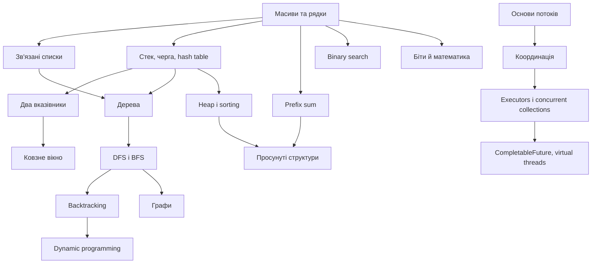
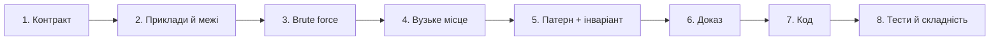

# Повний навчальний путівник з алгоритмів і Java

Цей путівник перетворює 20 каталогів проєкту на послідовну програму підготовки. Тематичні сторінки пояснюють не одну задачу, а **родину задач**: як упізнати патерн, який інваріант підтримувати, як довести коректність, оцінити складність і перенести розв’язок на Java.

> Практичний цикл: прочитайте сторінку теми → самостійно запишіть шаблон → розв’яжіть канонічний файл без підглядання → перевірте тестом → порівняйте з відповідним `*_Doc.md` → виконайте п’ять drills.

## Як працювати з одним уроком протягом 1–2 годин

Тематичні сторінки тепер написані як перше знайомство, а не як коротка довідка. Рекомендований прохід:

| Час | Що робити | Результат |
|---:|---|---|
| 0–15 хв | Прочитати інтуїцію, терміни й перший простий приклад | Можете своїми словами пояснити структуру |
| 15–35 хв | Вручну повторити таблиці станів і намалювати інваріант | Розумієте, що змінюється на кожному кроці |
| 35–55 хв | Переписати один базовий Java-шаблон без копіювання | Маєте робочий «скелет» патерну |
| 55–75 хв | Прочитати складніші варіації та дерево вибору | Відрізняєте схожі методи |
| 75–105 хв | Розв’язати одну Easy і почати одну Medium | Переносите ідею на нову умову |
| 105–120 хв | Записати помилки, складність і власний checklist | Закріплюєте спосіб мислення |

Не намагайтеся вивчити код напам’ять. Ціль — уміти відновити алгоритм із трьох речей: **ознаки умови → інваріант → правило руху/переходу**.

## Як розпізнавати тип задачі за текстом

Назва структури в умові майже ніколи не є достатньою підказкою. Наприклад, задача «про масив» може насправді бути binary search, window, prefix sum, heap або DP. Розпізнавайте не контейнер входу, а операцію та обмеження.

### Крок 1. Визначте форму відповіді

- Одне число min/max/count?
- Конкретна пара або range?
- Усі combinations/paths?
- Порядок виконання?
- Mutable structure з багатьма operations?

### Крок 2. Знайдіть слово, що задає геометрію

- **subarray / substring** — неперервний range;
- **subsequence** — порядок збережено, але можна пропускати;
- **subset** — порядок неважливий;
- **path** — сусідні вершини/вузли;
- **prefix/suffix** — усе до/після межі;
- **top K** — частковий порядок;
- **first/last/minimum feasible** — межа predicate.

### Крок 3. Подивіться на constraints

При `n≤20` експоненційний backtracking/bitmask може бути нормальним. При `n=100 000` зазвичай потрібні `O(n)` або `O(n log n)`. Матриця `200×200` має 40 000 states, а state з 10-bit mask — до 40 мільйонів комбінацій. Constraints — частина алгоритму, а не технічна примітка.

### Крок 4. Назвіть повторювану дорогу операцію brute force

| Brute force повторює… | Чим стискати повторення |
|---|---|
| пошук «чи бачили» | HashSet/HashMap |
| суму одного range | prefix sum |
| min/max серед кандидатів | heap / monotonic structure |
| однакову рекурсивну підзадачу | memoization/DP |
| перевірку кожної можливої відповіді | binary search on answer |
| scan неперервного range після зсуву | sliding window |
| обхід тієї самої component | visited DFS/BFS |

### Крок 5. Перевірте доказ, а не лише схожість

Слова в умові дають кандидата, але алгоритм обирає доказ:

- Two pointers працює, якщо після порівняння край можна безпечно відкинути.
- Sliding window працює, якщо invalid state можна виправити лише рухом left і стан дешево видалити.
- Greedy працює, якщо локальний вибір можна обміняти з будь-яким optimum без погіршення.
- Binary search працює, якщо predicate монотонний.
- DP працює, якщо state повністю описує майбутню підзадачу.

## Приклади класифікації умов

### «Знайти найдовший підрядок, що містить не більше двох різних символів»

Підрядок означає неперервність, «найдовший» — maximum valid range, умова підтримується frequency map. Кандидат: variable sliding window. Інваріант після shrink: у вікні не більше двох keys.

### «Знайти кількість підмасивів із сумою K; числа можуть бути від’ємними»

Звичайне sum-window не монотонне через від’ємні числа. Рівність range sum перетворюється на різницю префіксів. Кандидат: prefix sum + map `prefix→count`.

### «Знайти найменшу швидкість, за якої всі роботи завершаться за H годин»

Відповідь — число, перевірка конкретної швидкості проста, більша швидкість не погіршує можливість. Кандидат: binary search for first feasible speed.

### «Для кожного дня знайти перший наступний день із більшою температурою»

Кожен день очікує майбутнього першого більшого елемента. Кандидат: monotonic decreasing stack індексів.

### «Повернути K найчастіших елементів»

Спочатку frequency map, потім потрібен не весь sorted order, а top K. Кандидат: min-heap size K або buckets, якщо частоти обмежені n.

### «Знайти мінімальну кількість перетворень слова, змінюючи по одній літері»

Слова — states, допустима зміна — unweighted edge, потрібна найменша кількість edges. Кандидат: BFS.

### «Побудувати всі розбиття рядка на паліндроми»

Потрібні всі варіанти, кожен крок обирає наступний palindrome prefix. Кандидат: backtracking; palindrome table може прискорити перевірки.

### «Є оновлення елемента масиву й багато запитів суми діапазону»

Immutable prefix після кожного update дорогий. Потрібен баланс `O(log n)` update/query. Кандидат: Fenwick або segment tree.

### «Курси мають prerequisites; повернути допустимий порядок»

Directed dependencies і порядок, а cycle робить відповідь неможливою. Кандидат: topological sort.

### «Кілька потоків повинні друкувати по черзі»

Це не просто mutual exclusion. Потрібен shared turn predicate, очікування й signal після зміни state. Кандидат: Lock/Condition або інший synchronization protocol.

## Карта курсу



| № | Тема | Ключове питання |
|---:|---|---|
| 01 | [Масиви та рядки](01-arrays-strings.md) | Як використати індекс як адресу, стан або відображення? |
| 02 | [Зв’язані списки](02-linked-lists.md) | Як безпечно змінити посилання, не втративши хвіст? |
| 03 | [Стеки та черги](03-stacks-queues.md) | Який порядок обробки потрібен: LIFO чи FIFO? |
| 04 | [Хеш-таблиці](04-hash-tables.md) | Яку інформацію треба пам’ятати для відповіді за O(1)? |
| 05 | [Два вказівники](05-two-pointers.md) | Чому один із країв можна відкинути назавжди? |
| 06 | [Ковзне вікно](06-sliding-window.md) | Як підтримувати стан неперервного діапазону? |
| 07 | [Префіксні суми](07-prefix-sums.md) | Як перетворити діапазон на різницю двох станів? |
| 08 | [Бінарний пошук](08-binary-search.md) | Який монотонний предикат ділить простір відповідей? |
| 09 | [Дерева](09-trees.md) | Яку інформацію піддерево повертає батькові? |
| 10 | [DFS і BFS](10-dfs-bfs.md) | Потрібна повна компонента чи найкоротша кількість кроків? |
| 11 | [Рекурсія та backtracking](11-recursion-backtracking.md) | Яке дерево рішень ми будуємо і де відтинаємо гілку? |
| 12 | [Купи та сортування](12-heaps-sorting.md) | Чи потрібен увесь порядок, чи лише найкращі k елементів? |
| 13 | [Просунуті графи](13-advanced-graphs.md) | Чи задача про шлях, порядок, компоненти або MST? |
| 14 | [Динамічне програмування](14-dynamic-programming.md) | Який мінімальний стан однозначно описує підзадачу? |
| 15 | [Просунуті структури](15-advanced-data-structures.md) | Які запити треба прискорити ціною попередньої структури? |
| 16 | [Біти та математика](16-bit-manipulation-math.md) | Яку алгебраїчну властивість можна використати замість перебору? |
| 17 | [Основи багатопотоковості](17-multithreading-basics.md) | Де виникає data race і який happens-before потрібен? |
| 18 | [Координація потоків](18-concurrency-coordination.md) | Яка умова дозволяє кожному потоку продовжити? |
| 19 | [Concurrent collections та executors](19-concurrent-collections-executors.md) | Хто володіє чергою робіт і життєвим циклом виконавців? |
| 20 | [Сучасна конкурентність Java](20-modern-java-concurrency.md) | Як структурувати асинхронні підзадачі, помилки й скасування? |

## Універсальний алгоритм розв’язання



### 1. Зафіксуйте контракт

- Що є входом і виходом? Чи можливі `null`, порожня колекція, дублікати, від’ємні числа?
- Чи можна змінювати вхід? Чи потрібен стабільний порядок?
- Які межі `n`? Саме вони відсіюють `O(n²)` або дозволяють його.
- Для конкурентної задачі: хто запускає, хто завершує, що робити при interruption або винятку?

### 2. Побудуйте brute force

Наївний розв’язок — контрольна модель, а не марна робота. Назвіть повторювану операцію: повторний пошук → hash map; повторна сума діапазону → prefix sum; повторне дослідження стану → memoization; вибір min/max → heap; перевірка відповіді → binary search on answer.

### 3. Сформулюйте інваріант

Інваріант — твердження, істинне до і після кожної ітерації. Приклади:

- `[0, left)` уже оброблено;
- стек містить індекси у спадному порядку значень;
- вікно `[left, right]` задовольняє обмеження;
- `dist[v]` — найкраща відома відстань;
- `dp[i]` — оптимум для перших `i` елементів;
- усі записи до `volatile`-публікації видимі читачеві після неї.

### 4. Доведіть коректність трьома частинами

1. **Ініціалізація:** інваріант істинний до першого кроку.
2. **Збереження:** кожна гілка циклу залишає його істинним.
3. **Завершення:** разом з умовою виходу інваріант дає потрібну відповідь.

### 5. Рахуйте складність правильно

Вкладені цикли не завжди означають `O(n²)`: якщо кожен елемент входить і виходить зі стеку/вікна один раз, загалом це `O(n)`. Для рекурсії рахуйте також висоту стека. Для hash table вказуйте очікуване `O(1)`, для heap — `O(log k)`, для графа — `O(V + E)`. У конкурентному коді окремо оцінюйте CPU work, blocking time, кількість задач і пам’ять.

## Матриця вибору патерну

| Ознака умови | Перший кандидат | Перевірка |
|---|---|---|
| Неперервний підмасив/підрядок | window або prefix sum | Чи стан можна вилучити зліва? |
| Відсортований масив | two pointers / binary search | Потрібна пара чи одна межа? |
| Найменше можливе значення, для якого «можна» | binary search on answer | Чи `feasible(x)` монотонний? |
| Наступний більший/менший | monotonic stack | Чи кожен елемент має чекати майбутній? |
| Top K / поточний min або max | heap | Чи непотрібне повне сортування? |
| Усі комбінації | backtracking | Чи можна відтинати префікси? |
| Оптимум із повторними підзадачами | DP | Який стан і перехід? |
| Найкоротший шлях без ваг | BFS | Чи всі ребра мають однакову ціну? |
| Найкоротший шлях з невід’ємними вагами | Dijkstra | Чи немає від’ємних ребер? |
| Залежності/передумови | topological sort | Чи треба також знайти цикл? |
| Динамічна зв’язність | Union-Find | Чи операції переважно `union/find`? |
| Багато range query | prefix/Fenwick/segment tree | Чи є оновлення і які саме? |

## Як запускати практику

```powershell
# одна канонічна задача
.\gradlew.bat test --tests "topic08_binary_search.practice.Medium_04_KokoEatingBananasTest"

# одна тема
.\gradlew.bat test --tests "topic08_binary_search.practice.*"
```

У кожній темі спершу реалізуйте канонічний файл без числового суфікса, потім варіанти `_01`…`_05`. Детальний розбір конкретної задачі лежить поруч у `*_Doc.md`.

## Контрольний список перед завершенням задачі

- Контракт і крайові випадки проговорені.
- Є конкретний інваріант, а не лише назва патерну.
- Цикл гарантовано просувається; рекурсія має базу.
- Індекси, `long` проти `int`, компаратори й `null` перевірені.
- Вхід не змінюється випадково.
- Складність пояснена, а не вгадана.
- Є тести для мінімального, типового, граничного та «підступного» випадків.
