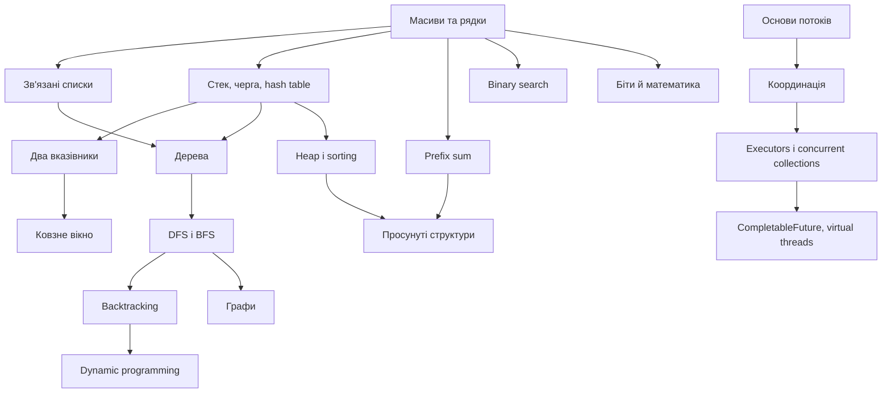

# Повний навчальний путівник з алгоритмів і Java

Цей путівник перетворює 20 каталогів проєкту на послідовну програму підготовки. Тематичні сторінки пояснюють не одну задачу, а **родину задач**: як упізнати патерн, який інваріант підтримувати, як довести коректність, оцінити складність і перенести розв’язок на Java.

> Практичний цикл: прочитайте сторінку теми → самостійно запишіть шаблон → розв’яжіть канонічний файл без підглядання → перевірте тестом → порівняйте з відповідним `*_Doc.md` → виконайте п’ять drills.

## Карта курсу



| № | Тема | Ключове питання |
|---:|---|---|
| 01 | [Масиви та рядки](01-arrays-strings.md) | Як використати індекс як адресу, стан або відображення? |
| 02 | [Зв’язані списки](02-linked-lists.md) | Як безпечно змінити посилання, не втративши хвіст? |
| 03 | [Стеки та черги](03-stacks-queues.md) | Який порядок обробки потрібен: LIFO чи FIFO? |
| 04 | [Хеш-таблиці](04-hash-tables.md) | Яку інформацію треба пам’ятати для відповіді за O(1)? |
| 05 | [Два вказівники](05-two-pointers.md) | Чому один із країв можна відкинути назавжди? |
| 06 | [Ковзне вікно](06-sliding-window.md) | Як підтримувати стан неперервного діапазону? |
| 07 | [Префіксні суми](07-prefix-sums.md) | Як перетворити діапазон на різницю двох станів? |
| 08 | [Бінарний пошук](08-binary-search.md) | Який монотонний предикат ділить простір відповідей? |
| 09 | [Дерева](09-trees.md) | Яку інформацію піддерево повертає батькові? |
| 10 | [DFS і BFS](10-dfs-bfs.md) | Потрібна повна компонента чи найкоротша кількість кроків? |
| 11 | [Рекурсія та backtracking](11-recursion-backtracking.md) | Яке дерево рішень ми будуємо і де відтинаємо гілку? |
| 12 | [Купи та сортування](12-heaps-sorting.md) | Чи потрібен увесь порядок, чи лише найкращі k елементів? |
| 13 | [Просунуті графи](13-advanced-graphs.md) | Чи задача про шлях, порядок, компоненти або MST? |
| 14 | [Динамічне програмування](14-dynamic-programming.md) | Який мінімальний стан однозначно описує підзадачу? |
| 15 | [Просунуті структури](15-advanced-data-structures.md) | Які запити треба прискорити ціною попередньої структури? |
| 16 | [Біти та математика](16-bit-manipulation-math.md) | Яку алгебраїчну властивість можна використати замість перебору? |
| 17 | [Основи багатопотоковості](17-multithreading-basics.md) | Де виникає data race і який happens-before потрібен? |
| 18 | [Координація потоків](18-concurrency-coordination.md) | Яка умова дозволяє кожному потоку продовжити? |
| 19 | [Concurrent collections та executors](19-concurrent-collections-executors.md) | Хто володіє чергою робіт і життєвим циклом виконавців? |
| 20 | [Сучасна конкурентність Java](20-modern-java-concurrency.md) | Як структурувати асинхронні підзадачі, помилки й скасування? |

## Універсальний алгоритм розв’язання


### 1. Зафіксуйте контракт

- Що є входом і виходом? Чи можливі `null`, порожня колекція, дублікати, від’ємні числа?
- Чи можна змінювати вхід? Чи потрібен стабільний порядок?
- Які межі `n`? Саме вони відсіюють `O(n²)` або дозволяють його.
- Для конкурентної задачі: хто запускає, хто завершує, що робити при interruption або винятку?

### 2. Побудуйте brute force

Наївний розв’язок — контрольна модель, а не марна робота. Назвіть повторювану операцію: повторний пошук → hash map; повторна сума діапазону → prefix sum; повторне дослідження стану → memoization; вибір min/max → heap; перевірка відповіді → binary search on answer.

### 3. Сформулюйте інваріант

Інваріант — твердження, істинне до і після кожної ітерації. Приклади:

- `[0, left)` уже оброблено;
- стек містить індекси у спадному порядку значень;
- вікно `[left, right]` задовольняє обмеження;
- `dist[v]` — найкраща відома відстань;
- `dp[i]` — оптимум для перших `i` елементів;
- усі записи до `volatile`-публікації видимі читачеві після неї.

### 4. Доведіть коректність трьома частинами

1. **Ініціалізація:** інваріант істинний до першого кроку.
2. **Збереження:** кожна гілка циклу залишає його істинним.
3. **Завершення:** разом з умовою виходу інваріант дає потрібну відповідь.

### 5. Рахуйте складність правильно

Вкладені цикли не завжди означають `O(n²)`: якщо кожен елемент входить і виходить зі стеку/вікна один раз, загалом це `O(n)`. Для рекурсії рахуйте також висоту стека. Для hash table вказуйте очікуване `O(1)`, для heap — `O(log k)`, для графа — `O(V + E)`. У конкурентному коді окремо оцінюйте CPU work, blocking time, кількість задач і пам’ять.

## Матриця вибору патерну

| Ознака умови | Перший кандидат | Перевірка |
|---|---|---|
| Неперервний підмасив/підрядок | window або prefix sum | Чи стан можна вилучити зліва? |
| Відсортований масив | two pointers / binary search | Потрібна пара чи одна межа? |
| Найменше можливе значення, для якого «можна» | binary search on answer | Чи `feasible(x)` монотонний? |
| Наступний більший/менший | monotonic stack | Чи кожен елемент має чекати майбутній? |
| Top K / поточний min або max | heap | Чи непотрібне повне сортування? |
| Усі комбінації | backtracking | Чи можна відтинати префікси? |
| Оптимум із повторними підзадачами | DP | Який стан і перехід? |
| Найкоротший шлях без ваг | BFS | Чи всі ребра мають однакову ціну? |
| Найкоротший шлях з невід’ємними вагами | Dijkstra | Чи немає від’ємних ребер? |
| Залежності/передумови | topological sort | Чи треба також знайти цикл? |
| Динамічна зв’язність | Union-Find | Чи операції переважно `union/find`? |
| Багато range query | prefix/Fenwick/segment tree | Чи є оновлення і які саме? |

## Як запускати практику

```powershell
# одна канонічна задача
.\gradlew.bat test --tests "topic08_binary_search.practice.Medium_04_KokoEatingBananasTest"

# одна тема
.\gradlew.bat test --tests "topic08_binary_search.practice.*"
```

У кожній темі спершу реалізуйте канонічний файл без числового суфікса, потім варіанти `_01`…`_05`. Детальний розбір конкретної задачі лежить поруч у `*_Doc.md`.

## Контрольний список перед завершенням задачі

- Контракт і крайові випадки проговорені.
- Є конкретний інваріант, а не лише назва патерну.
- Цикл гарантовано просувається; рекурсія має базу.
- Індекси, `long` проти `int`, компаратори й `null` перевірені.
- Вхід не змінюється випадково.
- Складність пояснена, а не вгадана.
- Є тести для мінімального, типового, граничного та «підступного» випадків.

