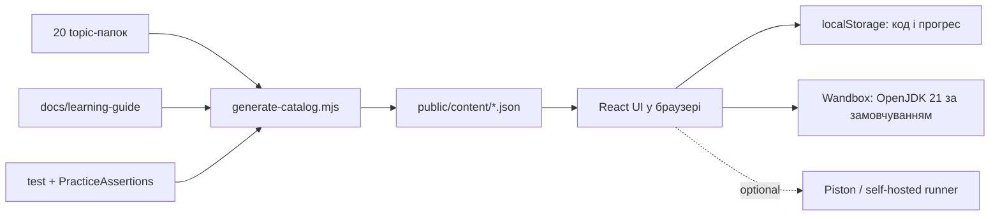

# Google Practice Lab — архітектура і запуск

Це повністю статична React-платформа для проходження 20 модулів Java DSA та Concurrency. Вона не має власного сервера, бази даних чи акаунтів: документація й задачі збираються з репозиторію, прогрес зберігається у браузері, а Java-код передається зовнішньому execution API.

## Швидкий старт

Потрібні Node.js 22+ та npm.

```powershell
npm install
npm run dev
```

Production-збірка:

```powershell
npm run build
npm run preview
```

`npm run build` спочатку виконує `scripts/generate-catalog.mjs`, тому після додавання задачі або документації вручну оновлювати JSON не треба.

## Як дані потрапляють у платформу



Генератор знаходить канонічні файли задач формату `Easy_01_Title.java`, п’ять дрілів `Easy_01_01_Title.java` … `Easy_01_05_Title.java`, `_Doc.md` і відповідний тест. У результаті створюються:

- `catalog.json` — легкий список тем для стартового екрана;
- `topics/topicNN.json` — ліниво завантажуваний вміст окремої теми;
- `harness.json` — спільні assertions і моделі `ListNode` / `TreeNode`.

Каталог `public/content/` є похідним артефактом і не комітиться. Він завжди відтворюється зі source-файлів.

### Основна задача і п’ять дрілів

У репозиторії є 320 основних задач і 1 600 дрілів. Дріли не заховані в документації: це окремі `.java`-файли у тій самій папці `src/<topic>/practice/`, що й основна задача. Суфікс `_01_` … `_05_` після номера задачі означає номер дрілу.

У платформі це видно у трьох місцях:

- біля кожної задачі в лівому дереві є значок гантелі та число `5`;
- над редактором є прямі перемикачі **TASK** і **D1–D5**;
- під перемикачами показано точний шлях активного source-файлу з кнопкою копіювання.

Чернетка зберігається окремо для основної задачі та кожного дрілу, тому перемикання між ними не перезаписує код.

## Виконання Java

`src/services/pistonRunner.ts` створює один execution-запит з такими файлами:

```text
Main.java                  reflection-based test runner
SelectedSolution.java      поточний текст із CodeMirror
SelectedSolutionTest.java  тест із репозиторію
Assertions.java            мінімальна JUnit-сумісна обгортка
PracticeAssertions.java    спільні сценарії задач 01–16
ListNode.java / TreeNode.java за потреби
```

Режим **Run code** компілює рішення і перевіряє, що клас завантажується. **Run tests** запускає всі методи з `@Test`, повертає окремі pass/fail результати й stdout/stderr.

### Execution providers

За замовчуванням платформа використовує **Wandbox** з `openjdk-jdk-21+35`. Для невеликої внутрішньої групи це найпростіший варіант: API підтримує CORS, не потребує ключа і компілює багатофайловий Java bundle. Це community-сервіс без SLA, а надісланий код обробляється зовнішнім сервером.

У runner settings можна перемкнутися на **Piston** і змінити endpoint, runtime, auth header та timeouts. Публічний `https://emkc.org/api/v2/piston/execute` більше не гарантує анонімний доступ, може вимагати token і не гарантує JDK 21. Для контрольованого середовища використовуйте власний Piston instance з Java 21.

Не вбудовуйте приватний API token у статичний frontend: будь-який відвідувач GitHub Pages може його прочитати. Введений у Settings token зберігається в `localStorage` лише цього браузера, але все одно доступний JavaScript-коду сторінки.

## Зберігання даних

У `localStorage` зберігаються:

- чернетка коду окремо для кожної задачі та ітерації;
- завершені задачі;
- остання відкрита тема;
- тема інтерфейсу;
- runner settings.

Дані локальні для конкретного браузера й origin. GitHub Pages не синхронізує їх між пристроями.

## GitHub Pages

Workflow `.github/workflows/deploy-pages.yml` запускається після push у `main` або `master`, збирає `dist` і публікує його через офіційний Pages artifact flow. У налаштуваннях репозиторію виберіть **Settings → Pages → Source → GitHub Actions**.

Vite використовує відносний `base: './'`, тому assets і content працюють і на кореневому домені, і в project subpath на кшталт `/google-practice/`.

## Основні модулі frontend

| Файл | Відповідальність |
|---|---|
| `src/App.tsx` | стан активної теми/задачі, autosave, progress, запуск коду |
| `src/components/WorkspaceLayout.tsx` | адаптивний трипанельний workspace |
| `src/components/Editor.tsx` | CodeMirror 6, Java parser, lint, ітерації |
| `src/components/DocViewer.tsx` | Markdown, GFM, KaTeX, Mermaid, TOC |
| `src/components/AlgorithmVisualizer.tsx` | D3 + React SVG анімації з fenced-блоків `algoviz` |
| `src/components/ResultsPanel.tsx` | execution state, тести, terminal, thread view |
| `src/services/pistonRunner.ts` | пакування Java source і робота з API |
| `src/services/storage.ts` | типізована робота з localStorage |

Правила створення навчальних анімацій і JSON-схема описані в [`docs/algoviz-authoring.md`](algoviz-authoring.md).

## Обмеження zero-backend підходу

CodeMirror/Lezer знаходить структурні синтаксичні проблеми, але не замінює `javac`: помилки типів, imports і Java semantics видно після **Run code/tests**. Зовнішній runner бачить надісланий код, тому не використовуйте у вправах секрети. Concurrency-тести залежать від планувальника і можуть потребувати повторного запуску, якщо зовнішній sandbox має сильне навантаження.

## Навчальний цикл

Права панель починається з вкладки **Coach**. Для кожної теми вона пояснює сигнали в умові, рекомендований інструмент, типову складність і випадки, коли цей підхід не підходить. Чотири підказки відкриваються по одній, щоб не показувати розв’язок завчасно. Окремо зберігаються кількість спроб, успішні запуски, відкриті підказки й самооцінка впевненості.

Після невдалого тесту `failureDiagnostics.ts` перетворює технічний stack trace на практичну підказку: наприклад, просить перевірити межі індексів, base case рекурсії, `null`, очікуване/фактичне значення або можливе зависання потоків. Сирий stdout/stderr завжди залишається доступним у Terminal.

Для дрілів runner використовує три чесні рівні перевірки:

- явний `testDrillNN` із репозиторію;
- згенерований executable assertion із конкретних JavaDoc `Input` / `Output`;
- compile-only, якщо з опису неможливо безпечно вивести очікувану поведінку.

Команда `npm run verify:runner` аудіює всі 1 600 дрілів і не дозволяє непомітно видати compile-only перевірку за correctness test.

## Перенесення прогресу та offline

У Settings можна експортувати JSON зі збереженим кодом, завершеними задачами, підказками та впевненістю, а потім імпортувати його в іншому браузері. Runner token навмисно не потрапляє до експорту. Імпорт перевіряє версію схеми та обмежує розмір файла.

Production-збірка реєструє service worker і має web app manifest. Після першого онлайн-відкриття оболонка, навчальні Markdown/JSON та assets кешуються для читання й редагування offline. Запуск Java все одно потребує мережі, бо Wandbox/Piston є зовнішніми execution services.

## Перевірка frontend

`npm run verify` послідовно перевіряє всі `algoviz` JSON-блоки, TypeScript, Vitest/Testing Library тести, Java runner bundle та production build. Тестовий набір також запускає `axe-core` для базової автоматичної перевірки accessibility. Workflow `.github/workflows/ci.yml` повторює ці перевірки на кожен push і pull request з Node 22 та Java 21.
